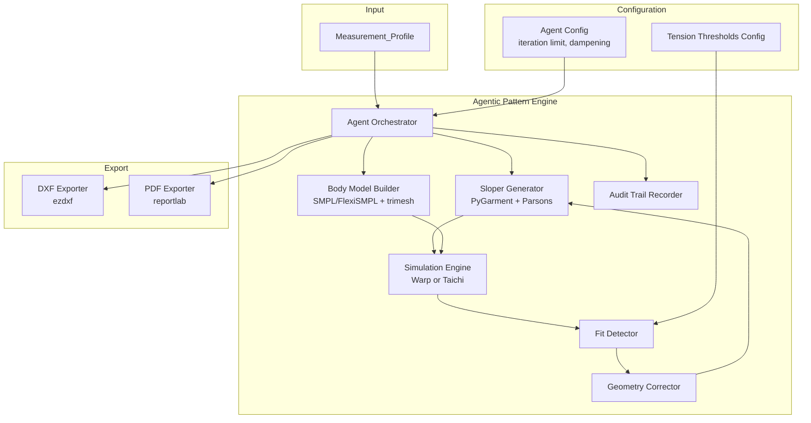
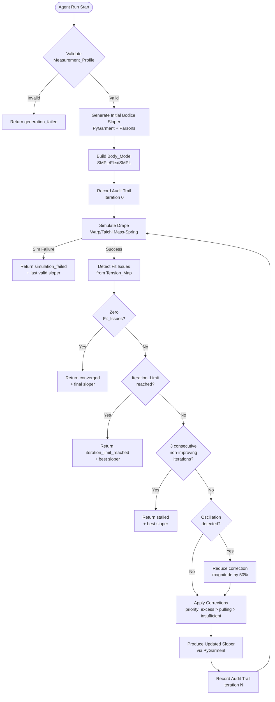
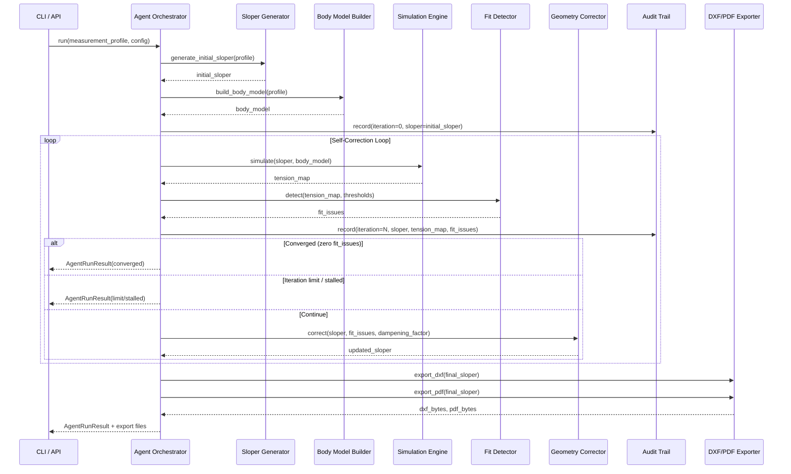
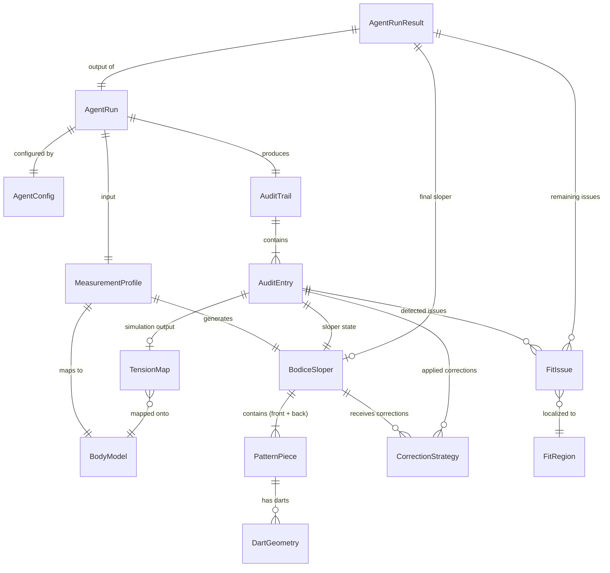

# Design Document — Agentic Pattern Engine POC

## Overview

The Agentic Pattern Engine is the core differentiating technology within the MANI platform. It replaces the single-pass Pattern Engine (defined in the custom-fashion-platform spec) with an autonomous self-correction loop that generates a bodice sloper, simulates its physical drape on a 3D digital twin, detects fit issues via tension analysis, and autonomously recalculates dart geometry and ease distribution until the fit converges — or a safety limit is reached.

The fundamental insight is "Geometry Blindness": generative AI can produce beautiful garment images (pixels) but cannot produce sewable topology. The Agentic Pattern Engine solves this by treating the AI agent as a Digital Design Engineer that operates CAD tools (PyGarment) and physics engines (Warp/Taichi) in a closed feedback loop, guaranteeing "Validation-before-Cutting" — no fabric is wasted on a garment that won't fit.

### Key Design Decisions

1. **Closed-loop self-correction over single-pass generation** — The agent iterates simulate → detect → correct → re-simulate until convergence, rather than generating a pattern once and hoping it fits. This is the core differentiator.
2. **Physics-based validation over heuristic fit rules** — Tension maps from GPU-accelerated cloth simulation provide objective, measurable fit data rather than subjective rules.
3. **Monotonic progress with oscillation dampening** — The correction loop tracks total stress magnitude and enforces monotonic decrease. When oscillation is detected (a region alternating between too-tight and too-loose), correction magnitude is halved to converge.
4. **Deterministic pipeline** — Same measurements → same body model → same initial sloper → same simulation → same corrections. Every stage is deterministic (within numerical precision) for reproducibility and testability.
5. **Full audit trail** — Every iteration is recorded with complete state (sloper geometry, tension map, fit issues, corrections applied, stress magnitude) for debugging and analysis.
6. **Headless, CLI/API only** — No UI dependencies. The engine runs as a Python module invocable from CLI or API. This keeps the POC focused on correctness.
7. **Bodice-only scope with extensible architecture** — Only bodice/top block patterns are in scope, but the component interfaces use protocols that can be extended to other garment types.

### POC Pipeline

```
Measurement_Profile → [SMPL Digital Twin] → Body_Model
                    → [PyGarment Sloper Gen] → Initial Sloper
                    → [Simulation Engine] → Tension_Map
                    → [Fit Detector] → Fit_Issues
                    → [Geometry Corrector] → Updated Sloper
                    → (loop back to Simulation Engine until converged)
                    → [DXF/PDF Exporter] → Production Files
```

## Architecture

### High-Level System Architecture



### Agentic Self-Correction Loop Flow



### Component Interaction Sequence



## Components and Interfaces

All interfaces are defined as Python `Protocol` classes for structural subtyping. This allows swapping implementations (e.g., Warp vs Taichi for simulation) without changing the orchestrator.

### 1. Measurement Profile (Shared Data)

```python
from dataclasses import dataclass, field
from typing import Optional

@dataclass(frozen=True)
class MeasurementProfile:
    """Customer body measurements for bodice sloper generation."""
    chest: float        # cm
    waist: float        # cm
    hip: float          # cm
    shoulder_width: float  # cm
    torso_length: float    # cm
    # Optional fields for future garment types
    arm_length: Optional[float] = None
    inseam: Optional[float] = None

    # Validation ranges (anatomically plausible, cm)
    RANGES = {
        "chest": (60.0, 180.0),
        "waist": (50.0, 170.0),
        "hip": (60.0, 180.0),
        "shoulder_width": (30.0, 65.0),
        "torso_length": (35.0, 75.0),
    }
```

### 2. Sloper Generator

```python
from typing import Protocol
from dataclasses import dataclass

@dataclass(frozen=True)
class Point2D:
    x: float
    y: float

@dataclass(frozen=True)
class Line2D:
    start: Point2D
    end: Point2D

@dataclass(frozen=True)
class DartGeometry:
    apex: Point2D
    angle: float       # degrees
    length: float      # cm

@dataclass(frozen=True)
class PatternPiece:
    piece_id: str
    label: str
    outline: tuple[Point2D, ...]    # Closed polygon (first == last)
    seam_lines: tuple[Line2D, ...]
    darts: tuple[DartGeometry, ...]
    grain_line: Line2D
    notch_marks: tuple[Point2D, ...]
    seam_allowance: float           # cm

@dataclass(frozen=True)
class BodiceSloper:
    sloper_id: str
    profile: MeasurementProfile
    front_bodice: PatternPiece
    back_bodice: PatternPiece
    bust_ease: float    # cm
    waist_ease: float   # cm
    metadata: dict      # engine_version, generated_at, etc.

class SloperGenerator(Protocol):
    def generate(self, profile: MeasurementProfile) -> BodiceSloper:
        """Generate initial bodice sloper using Parsons-method via PyGarment."""
        ...

    def apply_corrections(
        self,
        sloper: BodiceSloper,
        corrections: list["CorrectionStrategy"],
    ) -> BodiceSloper:
        """Apply geometry corrections and return updated sloper."""
        ...

    def validate_geometry(self, sloper: BodiceSloper) -> list[str]:
        """Return list of geometry errors (empty = valid)."""
        ...
```

### 3. Body Model Builder

```python
import numpy as np
from typing import Protocol

@dataclass
class FitRegionVertices:
    """Named vertex groups for each bodice fit region."""
    bust: np.ndarray        # vertex indices
    waist: np.ndarray
    shoulder: np.ndarray
    armhole: np.ndarray
    side_seam: np.ndarray
    center_front: np.ndarray
    center_back: np.ndarray

@dataclass
class BodyModel:
    """3D mesh representation of customer torso."""
    vertices: np.ndarray        # (N, 3) float64
    faces: np.ndarray           # (M, 3) int32
    fit_regions: FitRegionVertices
    smpl_shape_params: np.ndarray  # SMPL beta parameters
    profile: MeasurementProfile

class BodyModelBuilder(Protocol):
    def build(self, profile: MeasurementProfile) -> BodyModel:
        """Map measurements to SMPL shape params via FlexiSMPL, return 3D mesh."""
        ...

    def extract_measurements(self, body_model: BodyModel) -> MeasurementProfile:
        """Extract circumference/linear measurements from mesh geometry."""
        ...
```

### 4. Simulation Engine

```python
import numpy as np
from typing import Protocol
from enum import Enum

@dataclass
class TensionMap:
    """Per-vertex stress values from cloth simulation."""
    vertex_stresses: np.ndarray   # (N,) float64, Pascals
    collision_vertices: np.ndarray  # vertex indices with body collision

@dataclass
class SimulationResult:
    tension_map: TensionMap
    simulation_time_ms: float
    converged: bool  # simulation solver convergence (not fit convergence)

class SimulationEngine(Protocol):
    def simulate(
        self,
        sloper: BodiceSloper,
        body_model: BodyModel,
    ) -> SimulationResult:
        """Run mass-spring cloth drape simulation. Headless, GPU-accelerated."""
        ...
```

### 5. Fit Detector

```python
from enum import Enum
from typing import Protocol

class FitIssueType(Enum):
    EXCESS_TENSION = "excess_tension"
    INSUFFICIENT_TENSION = "insufficient_tension"
    PULLING = "pulling"

class FitRegion(Enum):
    BUST = "bust"
    WAIST = "waist"
    SHOULDER = "shoulder"
    ARMHOLE = "armhole"
    SIDE_SEAM = "side_seam"
    CENTER_FRONT = "center_front"
    CENTER_BACK = "center_back"

@dataclass(frozen=True)
class FitIssue:
    region: FitRegion
    issue_type: FitIssueType
    measured_stress: float      # Pa
    threshold: float            # Pa
    violation_magnitude: float  # Pa (measured - threshold)

@dataclass(frozen=True)
class TensionThresholds:
    """Per-region tension thresholds in Pascals."""
    bust: float = 500.0
    waist: float = 400.0
    shoulder: float = 600.0
    armhole: float = 550.0
    side_seam: float = 450.0
    center_front: float = 400.0
    center_back: float = 400.0

class FitDetector(Protocol):
    def detect(
        self,
        tension_map: TensionMap,
        body_model: BodyModel,
        thresholds: TensionThresholds,
    ) -> list[FitIssue]:
        """Analyze tension map and return classified fit issues."""
        ...
```

### 6. Geometry Corrector

```python
from enum import Enum
from typing import Protocol

class CorrectionType(Enum):
    ADJUST_DART_PLACEMENT = "adjust_dart_placement"
    ADJUST_DART_ANGLE = "adjust_dart_angle"
    ADJUST_DART_LENGTH = "adjust_dart_length"
    REDISTRIBUTE_EASE = "redistribute_ease"

@dataclass(frozen=True)
class CorrectionStrategy:
    target_region: FitRegion
    issue_type: FitIssueType
    correction_type: CorrectionType
    magnitude: float            # correction amount (degrees, cm, etc.)
    dampening_factor: float     # 1.0 = full, 0.5 = dampened

class GeometryCorrector(Protocol):
    def plan_corrections(
        self,
        fit_issues: list[FitIssue],
        current_sloper: BodiceSloper,
        profile: MeasurementProfile,
        dampening_factor: float = 1.0,
    ) -> list[CorrectionStrategy]:
        """Plan corrections for detected fit issues. Priority: excess > pulling > insufficient."""
        ...

    def validate_corrections(
        self,
        corrections: list[CorrectionStrategy],
        current_sloper: BodiceSloper,
        profile: MeasurementProfile,
        max_ease_tolerance: float = 2.0,  # cm
    ) -> list[str]:
        """Validate corrections won't violate max ease tolerance. Return errors."""
        ...
```

### 7. Audit Trail Recorder

```python
from typing import Protocol

@dataclass
class AuditEntry:
    iteration: int
    sloper: BodiceSloper
    tension_map: TensionMap | None       # None for iteration 0
    fit_issues: list[FitIssue]           # Empty for iteration 0
    corrections_applied: list[CorrectionStrategy]  # Empty for iteration 0
    total_stress_magnitude: float        # Sum of stress exceeding thresholds

@dataclass
class AuditTrail:
    entries: list[AuditEntry]

    @property
    def iteration_count(self) -> int:
        """Number of simulation iterations (excludes iteration 0)."""
        return max(0, len(self.entries) - 1)

class AuditTrailRecorder(Protocol):
    def record(self, entry: AuditEntry) -> None:
        """Append an iteration entry to the audit trail."""
        ...

    def get_trail(self) -> AuditTrail:
        """Return the complete audit trail."""
        ...
```

### 8. Agent Orchestrator

```python
from enum import Enum
from typing import Protocol

class ConvergenceStatus(Enum):
    CONVERGED = "converged"
    ITERATION_LIMIT_REACHED = "iteration_limit_reached"
    STALLED = "stalled"
    GENERATION_FAILED = "generation_failed"
    SIMULATION_FAILED = "simulation_failed"

@dataclass
class AgentConfig:
    iteration_limit: int = 20
    oscillation_dampening_factor: float = 0.5
    max_ease_tolerance: float = 2.0       # cm
    stall_threshold: int = 3              # consecutive non-improving iterations
    tension_thresholds: TensionThresholds = field(default_factory=TensionThresholds)

@dataclass
class AgentRunResult:
    run_id: str
    convergence_status: ConvergenceStatus
    final_sloper: BodiceSloper | None
    total_iterations: int
    audit_trail: AuditTrail
    remaining_fit_issues: list[FitIssue]
    elapsed_time_ms: float
    error_details: str | None = None
    failed_at_iteration: int | None = None
    dxf_bytes: bytes | None = None
    pdf_bytes: bytes | None = None

class AgentOrchestrator(Protocol):
    def run(
        self,
        profile: MeasurementProfile,
        config: AgentConfig | None = None,
    ) -> AgentRunResult:
        """Execute the full agentic self-correction loop."""
        ...
```

### 9. DXF/PDF Exporters

```python
from typing import Protocol

@dataclass
class ExportMetadata:
    profile_hash: str
    run_id: str
    iteration_count: int
    convergence_status: str

class DXFExporter(Protocol):
    def export(
        self,
        sloper: BodiceSloper,
        metadata: ExportMetadata,
    ) -> bytes:
        """Export sloper to DXF with pieces on named layers. Uses ezdxf."""
        ...

    def parse(self, dxf_bytes: bytes) -> BodiceSloper:
        """Parse DXF back to BodiceSloper for round-trip verification."""
        ...

class PDFExporter(Protocol):
    def export(
        self,
        sloper: BodiceSloper,
        metadata: ExportMetadata,
        profile: MeasurementProfile,
    ) -> bytes:
        """Export sloper to PDF at 1:1 scale with tiling and cover page. Uses reportlab."""
        ...
```

## Data Models

### Entity Relationship Diagram



### Core Data Structures

#### MeasurementProfile

| Field           | Type    | Description                          | Constraints                |
|-----------------|---------|--------------------------------------|----------------------------|
| chest           | float   | Chest circumference (cm)             | 60.0 – 180.0              |
| waist           | float   | Waist circumference (cm)             | 50.0 – 170.0              |
| hip             | float   | Hip circumference (cm)               | 60.0 – 180.0              |
| shoulder_width  | float   | Shoulder width (cm)                  | 30.0 – 65.0               |
| torso_length    | float   | Torso length (cm)                    | 35.0 – 75.0               |

#### BodyModel

| Field             | Type              | Description                                    |
|-------------------|-------------------|------------------------------------------------|
| vertices          | ndarray (N, 3)    | 3D vertex positions                            |
| faces             | ndarray (M, 3)    | Triangle face indices                          |
| fit_regions       | FitRegionVertices | Named vertex groups for each bodice region     |
| smpl_shape_params | ndarray           | SMPL beta parameters used for construction     |
| profile           | MeasurementProfile| Original measurements                          |

#### BodiceSloper

| Field        | Type              | Description                                    |
|--------------|-------------------|------------------------------------------------|
| sloper_id    | str               | Unique identifier                              |
| profile      | MeasurementProfile| Source measurements                            |
| front_bodice | PatternPiece      | Front bodice pattern piece                     |
| back_bodice  | PatternPiece      | Back bodice pattern piece                      |
| bust_ease    | float             | Bust ease value (cm)                           |
| waist_ease   | float             | Waist ease value (cm)                          |
| metadata     | dict              | engine_version, generated_at, etc.             |

#### PatternPiece

| Field          | Type                | Description                              |
|----------------|---------------------|------------------------------------------|
| piece_id       | str                 | Piece identifier                         |
| label          | str                 | Human-readable name                      |
| outline        | tuple[Point2D, ...] | Closed polygon (first == last)           |
| seam_lines     | tuple[Line2D, ...]  | Seam line segments                       |
| darts          | tuple[DartGeometry]  | Dart definitions                         |
| grain_line     | Line2D              | Grain line indicator                     |
| notch_marks    | tuple[Point2D, ...] | Notch positions                          |
| seam_allowance | float               | Seam allowance width (cm)               |

#### DartGeometry

| Field  | Type  | Description                    |
|--------|-------|--------------------------------|
| apex   | Point2D | Dart apex position           |
| angle  | float | Dart angle (degrees)           |
| length | float | Dart length (cm)               |

#### TensionMap

| Field             | Type           | Description                              |
|-------------------|----------------|------------------------------------------|
| vertex_stresses   | ndarray (N,)   | Per-vertex stress in Pascals             |
| collision_vertices| ndarray        | Vertex indices with body collision       |

#### FitIssue

| Field               | Type          | Description                              |
|---------------------|---------------|------------------------------------------|
| region              | FitRegion     | Affected body region                     |
| issue_type          | FitIssueType  | excess_tension / insufficient / pulling  |
| measured_stress     | float         | Measured stress value (Pa)               |
| threshold           | float         | Threshold for this region (Pa)           |
| violation_magnitude | float         | measured - threshold (Pa)                |

#### CorrectionStrategy

| Field             | Type            | Description                              |
|-------------------|-----------------|------------------------------------------|
| target_region     | FitRegion       | Region being corrected                   |
| issue_type        | FitIssueType    | Issue being addressed                    |
| correction_type   | CorrectionType  | Type of geometric adjustment             |
| magnitude         | float           | Correction amount                        |
| dampening_factor  | float           | 1.0 = full, 0.5 = dampened              |

#### AuditEntry

| Field                  | Type                   | Description                          |
|------------------------|------------------------|--------------------------------------|
| iteration              | int                    | Iteration number (0 = initial)       |
| sloper                 | BodiceSloper           | Sloper state at this iteration       |
| tension_map            | TensionMap or None     | None for iteration 0                 |
| fit_issues             | list[FitIssue]         | Detected issues (empty for iter 0)   |
| corrections_applied    | list[CorrectionStrategy]| Applied corrections (empty for iter 0)|
| total_stress_magnitude | float                  | Sum of stress exceeding thresholds   |

#### AgentRunResult

| Field               | Type              | Description                                  |
|---------------------|-------------------|----------------------------------------------|
| run_id              | str               | Unique run identifier                        |
| convergence_status  | ConvergenceStatus | converged / iteration_limit / stalled / etc. |
| final_sloper        | BodiceSloper or None | Best sloper (None if generation failed)    |
| total_iterations    | int               | Number of iterations executed                |
| audit_trail         | AuditTrail        | Complete iteration history                   |
| remaining_fit_issues| list[FitIssue]    | Unresolved issues (empty if converged)       |
| elapsed_time_ms     | float             | Total run time in milliseconds               |
| error_details       | str or None       | Error message if failed                      |
| failed_at_iteration | int or None       | Iteration where failure occurred             |
| dxf_bytes           | bytes or None     | Exported DXF file                            |
| pdf_bytes           | bytes or None     | Exported PDF file                            |

#### TensionThresholds

| Field        | Type  | Default | Description                          |
|--------------|-------|---------|--------------------------------------|
| bust         | float | 500.0   | Bust region threshold (Pa)           |
| waist        | float | 400.0   | Waist region threshold (Pa)          |
| shoulder     | float | 600.0   | Shoulder region threshold (Pa)       |
| armhole      | float | 550.0   | Armhole region threshold (Pa)        |
| side_seam    | float | 450.0   | Side seam region threshold (Pa)      |
| center_front | float | 400.0   | Center front region threshold (Pa)   |
| center_back  | float | 400.0   | Center back region threshold (Pa)    |

#### AgentConfig

| Field                        | Type               | Default | Description                          |
|------------------------------|---------------------|---------|--------------------------------------|
| iteration_limit              | int                 | 20      | Max iterations before halting        |
| oscillation_dampening_factor | float               | 0.5     | Correction reduction on oscillation  |
| max_ease_tolerance           | float               | 2.0     | Max deviation from profile (cm)      |
| stall_threshold              | int                 | 3       | Consecutive non-improving iters      |
| tension_thresholds           | TensionThresholds   | defaults| Per-region tension thresholds        |

## Correctness Properties

*A property is a characteristic or behavior that should hold true across all valid executions of a system — essentially, a formal statement about what the system should do. Properties serve as the bridge between human-readable specifications and machine-verifiable correctness guarantees.*

### Property 1: Sloper generation determinism

*For any* valid MeasurementProfile, calling the SloperGenerator's `generate` function twice with the same profile should produce identical BodiceSlopers — same piece outlines, same dart geometry, same ease values, same metadata (excluding timestamps).

**Validates: Requirements 1.1, 1.5**

### Property 2: Sloper structural completeness

*For any* valid MeasurementProfile, the generated BodiceSloper must contain exactly two pattern pieces (front_bodice, back_bodice), each with: a closed outline (first point == last point), at least one seam line, at least one dart, a grain line, at least one notch mark, a non-empty label, a positive seam allowance, and the sloper must have positive bust_ease and waist_ease values.

**Validates: Requirements 1.2, 1.3**

### Property 3: Invalid measurement rejection

*For any* MeasurementProfile where at least one required field is missing, non-numeric, or outside its anatomically plausible range, the SloperGenerator must reject the input with an error that identifies every invalid field by name and includes the acceptable range.

**Validates: Requirements 1.4**

### Property 4: Body model measurement round-trip

*For any* valid MeasurementProfile, constructing a BodyModel via `build(profile)` and then extracting measurements via `extract_measurements(body_model)` should produce values equivalent to the original profile within a tolerance of 3mm for each dimension (chest, waist, hip, shoulder_width, torso_length). Additionally, the BodyModel must define all 7 named FitRegion vertex groups (bust, waist, shoulder, armhole, side_seam, center_front, center_back) as non-empty arrays.

**Validates: Requirements 2.1, 2.2, 2.5**

### Property 5: Body model determinism

*For any* valid MeasurementProfile, calling the BodyModelBuilder's `build` function twice with the same profile should produce identical BodyModels — same vertices, same faces, same SMPL shape parameters.

**Validates: Requirements 2.4**

### Property 6: Simulation output completeness

*For any* valid BodiceSloper and BodyModel pair, the SimulationEngine's `simulate` function must return a SimulationResult containing: a TensionMap with per-vertex stress values (all non-negative, in Pascals) for every vertex in the garment mesh, a collision_vertices array (possibly empty), and a positive simulation_time_ms.

**Validates: Requirements 3.1, 3.3, 3.4**

### Property 7: Simulation determinism

*For any* valid BodiceSloper and BodyModel pair, running the SimulationEngine's `simulate` function twice with the same inputs should produce TensionMaps whose per-vertex stress values differ by no more than 1% (relative tolerance).

**Validates: Requirements 3.5**

### Property 8: Fit detection correctness

*For any* TensionMap, BodyModel, and TensionThresholds configuration: (a) every FitRegion where the mean stress exceeds the configured threshold must appear in the returned FitIssue list with the correct issue_type, measured_stress, threshold, and violation_magnitude; (b) no FitRegion where stress is within the threshold should appear; (c) each FitIssue must have a valid FitIssueType (excess_tension, insufficient_tension, or pulling); (d) calling detect twice with the same inputs must produce the same FitIssue list.

**Validates: Requirements 4.1, 4.2, 4.3, 4.4, 4.5**

### Property 9: Correction planning completeness and priority ordering

*For any* non-empty list of FitIssues, the GeometryCorrector's `plan_corrections` function must return at least one CorrectionStrategy per FitIssue, each with a valid CorrectionType (adjust_dart_placement, adjust_dart_angle, adjust_dart_length, or redistribute_ease). When multiple issue types are present, corrections for excess_tension issues must precede corrections for pulling issues, which must precede corrections for insufficient_tension issues.

**Validates: Requirements 5.1, 5.2, 5.5**

### Property 10: Correction geometric validity

*For any* valid BodiceSloper and any set of CorrectionStrategies applied to it, the resulting updated BodiceSloper must: (a) pass geometry validation (all pieces closed, no overlapping seam lines, seam allowances intact, dart geometry consistent), and (b) have all measurement dimensions within max_ease_tolerance (default 2cm) of the original MeasurementProfile.

**Validates: Requirements 5.3, 5.4**

### Property 11: Audit trail integrity

*For any* completed AgentRun (regardless of convergence status), the AuditTrail must satisfy: (a) the first entry has iteration=0 with the initial sloper, tension_map=None, empty fit_issues, and empty corrections_applied; (b) entries are strictly ordered by iteration number (entry[i].iteration < entry[i+1].iteration); (c) the number of entries equals total_iterations + 1; (d) every entry after iteration 0 has a non-null tension_map, a populated fit_issues list (unless converged on that iteration), and a total_stress_magnitude value.

**Validates: Requirements 7.1, 7.2, 7.3, 7.4, 7.5**

### Property 12: Iteration limit returns best sloper

*For any* AgentRun that reaches the iteration_limit without convergence, the returned final_sloper must be the sloper from the AuditTrail entry with the lowest total_stress_magnitude, the convergence_status must be ITERATION_LIMIT_REACHED, and remaining_fit_issues must be non-empty.

**Validates: Requirements 6.3, 6.4**

### Property 13: Convergence halts correctly

*For any* AgentRun that achieves convergence, the final AuditTrail entry must have zero FitIssues, the convergence_status must be CONVERGED, remaining_fit_issues must be empty, and total_iterations must be less than or equal to the configured iteration_limit.

**Validates: Requirements 6.2, 6.6**

### Property 14: Oscillation dampening

*For any* AgentRun where a FitRegion alternates between excess_tension and insufficient_tension across two consecutive iterations, the CorrectionStrategy applied in the subsequent iteration for that region must have a dampening_factor of 0.5 (or 0.5^n for the nth oscillation detection).

**Validates: Requirements 6.5**

### Property 15: Custom threshold usage

*For any* valid TensionThresholds configuration provided to the Agent, the FitDetector must use the custom threshold values (not defaults) when classifying FitIssues. Specifically, for any FitIssue detected, the threshold field must equal the custom-configured value for that FitRegion.

**Validates: Requirements 8.1, 8.3**

### Property 16: Invalid threshold rejection

*For any* TensionThresholds configuration containing at least one zero or negative value, the Agent must reject the configuration with a descriptive error before starting the run.

**Validates: Requirements 8.4**

### Property 17: Result completeness by convergence status

*For any* completed AgentRun: (a) if converged: final_sloper is non-null, convergence_status is CONVERGED, remaining_fit_issues is empty, audit_trail is non-null, elapsed_time_ms > 0; (b) if iteration_limit_reached: final_sloper is non-null (best sloper), remaining_fit_issues is non-empty, audit_trail is non-null; (c) if generation_failed: final_sloper is None, total_iterations is 0, error_details is non-null; (d) if simulation_failed: failed_at_iteration is non-null, error_details is non-null, final_sloper is the last valid sloper (or None if failed at iteration 1).

**Validates: Requirements 9.1, 9.2, 9.3, 9.4, 9.5**

### Property 18: Monotonic stress decrease

*For any* converged AgentRun, the sequence of total_stress_magnitude values across AuditTrail entries (excluding iteration 0 and any oscillation-dampened iterations) must be strictly monotonically decreasing.

**Validates: Requirements 10.1, 10.2, 10.4**

### Property 19: Stall detection and halt

*For any* AgentRun where three consecutive iterations fail to reduce total_stress_magnitude (and the run is not in an oscillation state), the Agent must halt the run with convergence_status STALLED and return the best sloper encountered.

**Validates: Requirements 10.3**

### Property 20: DXF export round-trip

*For any* valid BodiceSloper, exporting to DXF via `export(sloper)` and then parsing back via `parse(dxf_bytes)` must produce a BodiceSloper whose piece outlines are equivalent to the original within a tolerance of 0.1mm per coordinate.

**Validates: Requirements 11.5**

### Property 21: DXF export completeness

*For any* valid BodiceSloper and ExportMetadata, the exported DXF file must contain: (a) separate named layers for each pattern piece (front_bodice, back_bodice); (b) closed polyline outlines, seam lines, dart lines, grain lines, notch marks, seam allowance markings, and piece labels on each layer; (c) metadata (profile_hash, run_id, iteration_count, convergence_status) in the DXF custom properties.

**Validates: Requirements 11.3, 11.6**

### Property 22: Export availability

*For any* completed AgentRun with a non-null final_sloper (converged or iteration_limit_reached), the result must include non-null dxf_bytes and non-null pdf_bytes.

**Validates: Requirements 11.1, 11.2**

## Error Handling

### Error Categories

The Agentic Pattern Engine defines four error categories, each with a distinct handling strategy:

| Category | Examples | Handling Strategy |
|----------|----------|-------------------|
| Input Validation | Invalid measurements, invalid thresholds, missing fields | Reject immediately with descriptive error. Never start the loop. |
| Generation Failure | PyGarment fails to produce valid geometry | Return `AgentRunResult` with `generation_failed` status and error details. |
| Simulation Failure | GPU unavailable, Warp/Taichi crash, mesh degeneration | Return `AgentRunResult` with `simulation_failed` status, last valid sloper, and iteration number. |
| Loop Termination | Iteration limit, stall detection, oscillation without convergence | Return `AgentRunResult` with appropriate status and best sloper. |

### Error Handling Rules

1. **Fail fast on invalid input.** MeasurementProfile validation and TensionThresholds validation happen before any computation. Errors include the specific field names and acceptable ranges.

2. **Never lose work.** If the simulation engine fails mid-loop, the Agent returns the last valid sloper from the audit trail. The caller always gets the best available result.

3. **Structured errors, not exceptions.** All failure modes are represented as `ConvergenceStatus` enum values in `AgentRunResult`. The caller inspects `convergence_status` and `error_details` rather than catching exceptions.

4. **Audit trail survives failure.** Even on simulation failure, the audit trail up to the failure point is included in the result. This enables debugging.

5. **Stall detection prevents infinite non-progress.** Three consecutive non-improving iterations trigger a halt. This catches cases where the correction logic is ineffective without burning through the full iteration limit.

6. **Oscillation dampening prevents ping-pong.** When a region alternates between too-tight and too-loose, correction magnitude is halved. This prevents the loop from oscillating indefinitely between two states.

### Error Flow

```python
# Pseudocode for error handling in the Agent Orchestrator

def run(profile: MeasurementProfile, config: AgentConfig) -> AgentRunResult:
    # Phase 1: Input validation (fail fast)
    validation_errors = validate_profile(profile)
    if validation_errors:
        return AgentRunResult(
            convergence_status=ConvergenceStatus.GENERATION_FAILED,
            error_details=f"Invalid profile: {validation_errors}",
            total_iterations=0,
            ...
        )

    threshold_errors = validate_thresholds(config.tension_thresholds)
    if threshold_errors:
        return AgentRunResult(
            convergence_status=ConvergenceStatus.GENERATION_FAILED,
            error_details=f"Invalid thresholds: {threshold_errors}",
            total_iterations=0,
            ...
        )

    # Phase 2: Generation (may fail)
    try:
        sloper = sloper_generator.generate(profile)
        body_model = body_model_builder.build(profile)
    except GenerationError as e:
        return AgentRunResult(
            convergence_status=ConvergenceStatus.GENERATION_FAILED,
            error_details=str(e),
            total_iterations=0,
            ...
        )

    # Phase 3: Self-correction loop (simulation may fail)
    audit_recorder.record(AuditEntry(iteration=0, sloper=sloper, ...))
    for iteration in range(1, config.iteration_limit + 1):
        try:
            sim_result = simulation_engine.simulate(sloper, body_model)
        except SimulationError as e:
            return AgentRunResult(
                convergence_status=ConvergenceStatus.SIMULATION_FAILED,
                failed_at_iteration=iteration,
                final_sloper=best_sloper_so_far,
                error_details=str(e),
                ...
            )

        fit_issues = fit_detector.detect(sim_result.tension_map, ...)
        # ... convergence check, stall check, oscillation check ...
        # ... apply corrections, update sloper ...

    # Phase 4: Export (best-effort, errors logged but don't fail the run)
    try:
        dxf_bytes = dxf_exporter.export(final_sloper, metadata)
        pdf_bytes = pdf_exporter.export(final_sloper, metadata, profile)
    except ExportError as e:
        # Log error but still return the result with None export bytes
        pass
```

## Testing Strategy

### Overview

The testing strategy uses a dual approach: property-based tests (via `hypothesis`) for universal correctness guarantees, and unit tests (via `pytest`) for specific examples, edge cases, and integration points. Property-based tests are the primary correctness mechanism; unit tests complement them for concrete scenarios.

### Property-Based Testing Configuration

- **Library:** `hypothesis` (Python)
- **Minimum iterations:** 100 per property test (configured via `@settings(max_examples=100)`)
- **Tag format:** Each property test is tagged with a comment: `# Feature: agentic-pattern-engine, Property {N}: {title}`
- **Each correctness property is implemented by a single property-based test**
- **Custom strategies:** Hypothesis `@composite` strategies for generating valid MeasurementProfiles, BodiceSlopers, TensionMaps, FitIssues, and CorrectionStrategies

### Hypothesis Custom Strategies

```python
from hypothesis import strategies as st, given, settings
from hypothesis.strategies import composite

@composite
def measurement_profiles(draw):
    """Generate valid MeasurementProfiles within anatomical ranges."""
    return MeasurementProfile(
        chest=draw(st.floats(min_value=60.0, max_value=180.0)),
        waist=draw(st.floats(min_value=50.0, max_value=170.0)),
        hip=draw(st.floats(min_value=60.0, max_value=180.0)),
        shoulder_width=draw(st.floats(min_value=30.0, max_value=65.0)),
        torso_length=draw(st.floats(min_value=35.0, max_value=75.0)),
    )

@composite
def invalid_measurement_profiles(draw):
    """Generate MeasurementProfiles with at least one out-of-range field."""
    # Pick a field to make invalid
    field = draw(st.sampled_from(["chest", "waist", "hip", "shoulder_width", "torso_length"]))
    valid = draw(measurement_profiles())
    # Set the chosen field to an out-of-range value
    invalid_value = draw(st.one_of(
        st.floats(max_value=MeasurementProfile.RANGES[field][0] - 0.1),
        st.floats(min_value=MeasurementProfile.RANGES[field][1] + 0.1),
    ))
    return dataclasses.replace(valid, **{field: invalid_value})

@composite
def tension_thresholds(draw):
    """Generate valid TensionThresholds with positive values."""
    return TensionThresholds(
        bust=draw(st.floats(min_value=100.0, max_value=2000.0)),
        waist=draw(st.floats(min_value=100.0, max_value=2000.0)),
        shoulder=draw(st.floats(min_value=100.0, max_value=2000.0)),
        armhole=draw(st.floats(min_value=100.0, max_value=2000.0)),
        side_seam=draw(st.floats(min_value=100.0, max_value=2000.0)),
        center_front=draw(st.floats(min_value=100.0, max_value=2000.0)),
        center_back=draw(st.floats(min_value=100.0, max_value=2000.0)),
    )
```

### Property Test Mapping

Each correctness property maps to exactly one hypothesis test:

| Property | Test Function | Key Assertion |
|----------|---------------|---------------|
| 1: Sloper generation determinism | `test_sloper_generation_determinism` | `generate(p) == generate(p)` for all valid profiles |
| 2: Sloper structural completeness | `test_sloper_structural_completeness` | All pieces closed, darts present, ease > 0 |
| 3: Invalid measurement rejection | `test_invalid_measurement_rejection` | Error identifies invalid fields |
| 4: Body model measurement round-trip | `test_body_model_round_trip` | `extract(build(p)) ≈ p` within 3mm |
| 5: Body model determinism | `test_body_model_determinism` | `build(p) == build(p)` |
| 6: Simulation output completeness | `test_simulation_output_completeness` | TensionMap has all vertices, stresses ≥ 0 |
| 7: Simulation determinism | `test_simulation_determinism` | Two runs differ by ≤ 1% |
| 8: Fit detection correctness | `test_fit_detection_correctness` | Issues match threshold violations exactly |
| 9: Correction planning completeness | `test_correction_planning_completeness` | One correction per issue, priority ordered |
| 10: Correction geometric validity | `test_correction_geometric_validity` | Updated sloper passes validation, within ease tolerance |
| 11: Audit trail integrity | `test_audit_trail_integrity` | Entry count, ordering, iteration 0 structure |
| 12: Iteration limit returns best | `test_iteration_limit_best_sloper` | Returned sloper has min stress from trail |
| 13: Convergence halts correctly | `test_convergence_halts_correctly` | Zero issues, CONVERGED status |
| 14: Oscillation dampening | `test_oscillation_dampening` | Dampening factor halved on oscillation |
| 15: Custom threshold usage | `test_custom_threshold_usage` | FitIssue.threshold matches custom config |
| 16: Invalid threshold rejection | `test_invalid_threshold_rejection` | Error on zero/negative thresholds |
| 17: Result completeness by status | `test_result_completeness_by_status` | All fields present per status type |
| 18: Monotonic stress decrease | `test_monotonic_stress_decrease` | Stress sequence strictly decreasing |
| 19: Stall detection | `test_stall_detection` | Halt after 3 non-improving iterations |
| 20: DXF round-trip | `test_dxf_round_trip` | `parse(export(s)) ≈ s` within 0.1mm |
| 21: DXF export completeness | `test_dxf_export_completeness` | Named layers, all elements, metadata |
| 22: Export availability | `test_export_availability` | Non-null dxf/pdf bytes on success |

### Unit Test Coverage

Unit tests complement property tests for specific scenarios:

- **Edge cases:** Empty dart list, single-vertex collision, zero stress everywhere (convergence on first iteration), exactly-at-threshold stress values
- **Integration tests:** Full agent run with mock simulation engine returning predetermined tension maps to verify the loop orchestration end-to-end
- **Error path tests:** GPU unavailable mock, PyGarment generation failure mock, malformed mesh input
- **Export examples:** Verify a known sloper produces a DXF file parseable by ezdxf, verify PDF has expected page count for a known sloper size
- **Default config test:** Verify agent uses default TensionThresholds when no custom config is provided (Requirement 8.2)
- **PDF cover page test:** Verify exported PDF contains measurement summary and run summary text (Requirement 11.7)

### Test Organization

```
tests/
├── conftest.py                    # Shared fixtures, hypothesis strategies
├── test_sloper_generator.py       # Properties 1, 2, 3
├── test_body_model_builder.py     # Properties 4, 5
├── test_simulation_engine.py      # Properties 6, 7
├── test_fit_detector.py           # Properties 8, 15, 16
├── test_geometry_corrector.py     # Properties 9, 10
├── test_agent_orchestrator.py     # Properties 11, 12, 13, 14, 17, 18, 19
├── test_dxf_exporter.py           # Properties 20, 21, 22
└── test_pdf_exporter.py           # Unit tests for PDF export
```

### Example Property Test

```python
# Feature: agentic-pattern-engine, Property 20: DXF export round-trip
@given(sloper=bodice_slopers())
@settings(max_examples=100)
def test_dxf_round_trip(sloper: BodiceSloper):
    """For any valid BodiceSloper, export to DXF then parse back
    should produce equivalent geometry within 0.1mm tolerance."""
    metadata = ExportMetadata(
        profile_hash="test", run_id="test", iteration_count=1, convergence_status="converged"
    )
    dxf_bytes = dxf_exporter.export(sloper, metadata)
    parsed = dxf_exporter.parse(dxf_bytes)

    for orig_piece, parsed_piece in [
        (sloper.front_bodice, parsed.front_bodice),
        (sloper.back_bodice, parsed.back_bodice),
    ]:
        for orig_pt, parsed_pt in zip(orig_piece.outline, parsed_piece.outline):
            assert abs(orig_pt.x - parsed_pt.x) < 0.01  # 0.1mm = 0.01cm
            assert abs(orig_pt.y - parsed_pt.y) < 0.01
```
