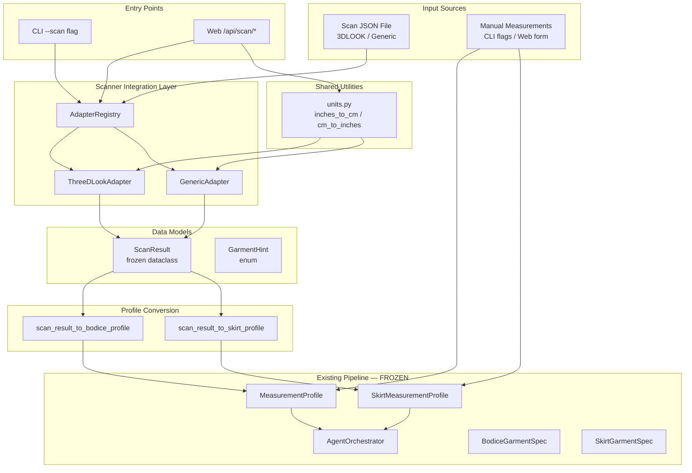
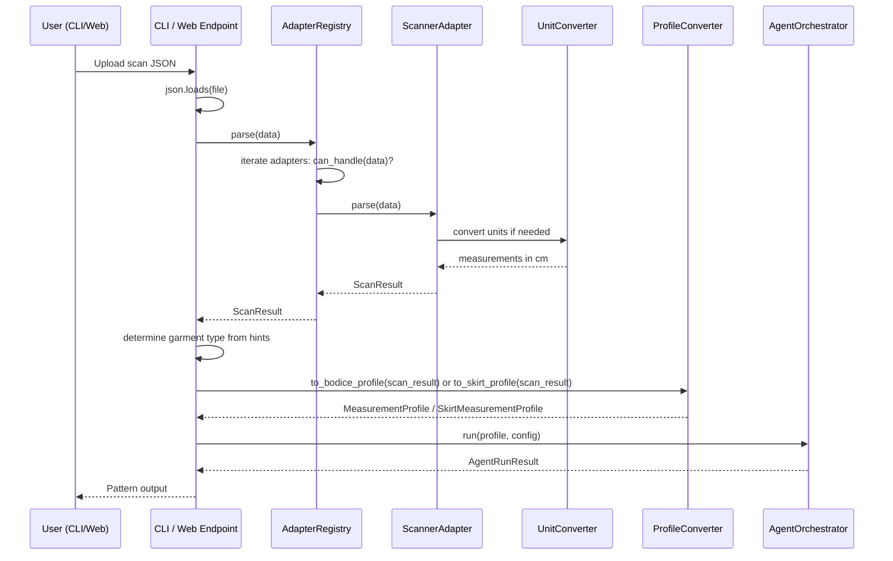
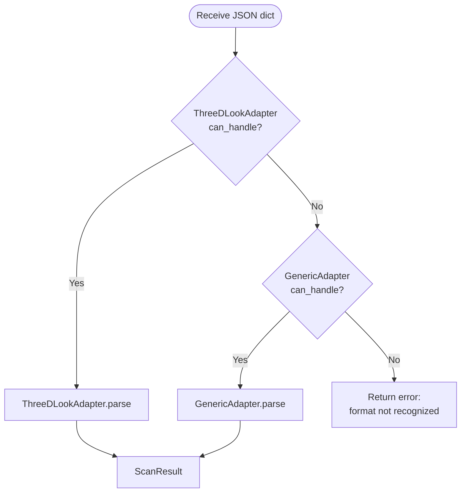
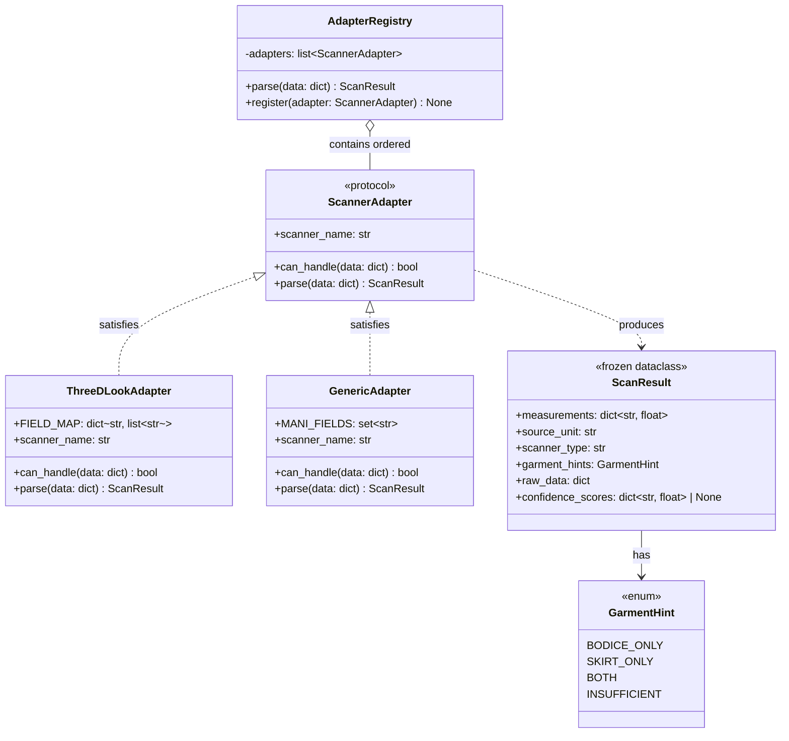
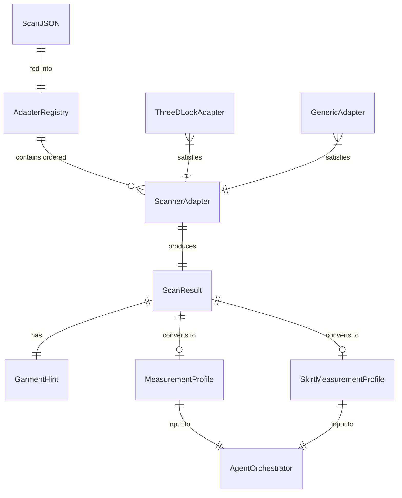
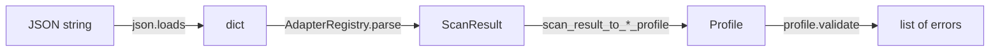

# Design Document — Body Scanner 3DLOOK Integration

## Overview

This feature integrates 3DLOOK Mobile Tailor body scanner JSON output into the MANI pattern engine, enabling customers to upload scan files instead of manually entering measurements. The architecture uses a pluggable adapter pattern (`typing.Protocol`) so future scanner vendors can be added without modifying existing code.

The system parses vendor-specific JSON, maps field names to MANI's internal measurement fields, converts units (inches ↔ cm), detects which garment types the scan supports, and feeds the resulting measurements into the existing pipeline via CLI (`--scan` flag) and web app (`/api/scan/upload`, `/api/scan/generate` endpoints).

### Key Design Decisions

1. **Protocol-based adapter interface** — `ScannerAdapter` uses `typing.Protocol` with `@runtime_checkable` for structural subtyping, consistent with the existing `GarmentSpec` pattern. No ABCs.
2. **Frozen ScanResult dataclass** — `@dataclass(frozen=True)` for immutability, matching `MeasurementProfile` and `SkirtMeasurementProfile` conventions.
3. **Ordered registry with auto-detection** — `AdapterRegistry` iterates vendor-specific adapters before the `GenericAdapter` fallback, using `can_handle()` to select the first match.
4. **No frozen file modifications** — All integration with the existing pipeline happens through new modules and wrapper functions. `sloper_generator.py`, `body_model_builder.py`, `html_visualizer.py`, `dxf_exporter.py`, `pdf_exporter.py`, and `audit_trail.py` remain untouched.
5. **Shared unit converter at package root** — `inches_to_cm`, `cm_to_inches`, and `convert_measurements` live in `agentic_pattern_engine/units.py` (not inside `scanner/`) so they can be shared by the scanner pipeline, the web app, and the CLI. The frontend `index.html` already has a JS `toCm()` helper for form UX; the backend module replaces the need for client-side-only conversion and enables server-side unit handling for any entry point.
6. **Composition over inheritance** — `ThreeDLookAdapter` and `GenericAdapter` are independent classes that satisfy the `ScannerAdapter` protocol structurally.

## Architecture

### High-Level System Architecture



### Data Flow — Scan File to Pattern



### Adapter Registry Selection Flow



## Components and Interfaces

### Component Class Diagram



### 1. ScannerAdapter Protocol

A `typing.Protocol` with `@runtime_checkable` defining the pluggable interface for scanner vendor JSON parsing. Any class that structurally implements the three members — `scanner_name` property, `can_handle(data)` method, and `parse(data)` method — satisfies the protocol without explicit inheritance.

### 2. ScanResult Data Model

A `@dataclass(frozen=True)` serving as the immutable container for parsed scan data. Fields: `measurements` (MANI field names → cm values), `source_unit` ("cm" or "in"), `scanner_type` (adapter identifier), `garment_hints` (GarmentHint enum), `raw_data` (original scanner JSON preserved), and optional `confidence_scores` (field → 0.0–1.0).

### 3. ThreeDLookAdapter

Implements `ScannerAdapter` for 3DLOOK Mobile Tailor JSON. Contains a `FIELD_MAP` dictionary mapping each MANI field name to a priority-ordered list of 3DLOOK aliases. The `can_handle` method returns True when the JSON contains `bust_girth`, `waist_girth`, or a `source` field containing "3dlook". The `parse` method maps fields using alias priority, calls `convert_measurements` for unit handling, detects garment hints based on which fields are present, and returns a `ScanResult`.

### 4. GenericAdapter

Fallback adapter for JSON files that use MANI's own field names directly. Contains a `MANI_FIELDS` set of recognized field names. The `can_handle` method returns True when the dict has both `waist` and `hip` with numeric values. The `parse` method extracts recognized MANI fields, ignores unknown keys, and detects garment hints.

### 5. AdapterRegistry

Ordered registry of `ScannerAdapter` instances. Defaults to `[ThreeDLookAdapter(), GenericAdapter()]`. The `parse` method iterates adapters and uses the first whose `can_handle` returns True, raising `ValueError` if none match. The `register` method inserts a new adapter before the GenericAdapter (last position).

### 6. Unit Converter — Shared Module

Three standalone pure functions in `agentic_pattern_engine/units.py` (package root, not inside `scanner/`):
- `inches_to_cm(value)` — returns `value * 2.54`
- `cm_to_inches(value)` — returns `value / 2.54`
- `convert_measurements(measurements, source_unit)` — converts all values to cm based on source_unit. Recognized values: "in"/"inches" → multiply by 2.54; "cm"/"centimeters"/absent → pass through.

This module is shared across the codebase: the scanner adapters import it for scan file parsing, the web app can use it for server-side unit conversion on API requests, and the CLI can use it if `--units` support is added later. The frontend JS `toCm()` in `index.html` remains for client-side form UX but is no longer the sole conversion path.

### 7. Profile Conversion Functions

Three functions in `profile_converter.py`:
- `scan_result_to_bodice_profile(result)` → `MeasurementProfile` — raises `ValueError` if garment_hints doesn't support bodice or required fields (chest, waist, hip, shoulder_width, torso_length) are missing.
- `scan_result_to_skirt_profile(result)` → `SkirtMeasurementProfile` — raises `ValueError` if garment_hints doesn't support skirt or required fields (waist, hip, hip_depth, desired_length) are missing.
- `scan_result_to_dict(result)` → dict — serializes a ScanResult to a JSON-compatible dictionary.

Both profile conversion functions validate the resulting profile via the existing `validate()` method.

### 8. CLI Integration

The `--scan` argument is added to the existing mutually exclusive group in `cli.py` (alongside `--chest`, `--waist-primary`, `--profile`). When provided, the CLI reads the JSON file, passes it through `AdapterRegistry.parse()`, prints the detected scanner type/units/measurements, uses garment_hints (or `--garment` override) to select the profile type, converts to the appropriate profile, and runs the engine.

### 9. Web App Endpoints

Two new endpoints added to `web/app.py`:

| Endpoint | Method | Request Body | Response | Description |
|---|---|---|---|---|
| `/api/scan/upload` | POST | scan_data (dict), output_unit ("cm"/"in") | measurements, scanner_type, garment_hints, confidence_scores, source_unit | Parse scan data, return mapped measurements in requested unit |
| `/api/scan/generate` | POST | scan_data (dict), garment_type (optional) | run_id, status, iterations, garment_type, elapsed_ms, scanner_type, measurements | Parse scan, build profile, run engine in one request |

Both endpoints return HTTP 400 with descriptive messages on `ValueError`.

## Data Models

### Entity Relationship Diagram



### ScanResult

| Field             | Type                        | Description                                              |
|-------------------|-----------------------------|----------------------------------------------------------|
| measurements      | dict[str, float]            | MANI field names → values in cm                          |
| source_unit       | str                         | Original unit: "cm" or "in"                              |
| scanner_type      | str                         | Adapter identifier (e.g. "3dlook", "generic")            |
| garment_hints     | GarmentHint                 | Which garment types the measurements support             |
| raw_data          | dict                        | Original scanner JSON preserved                          |
| confidence_scores | dict[str, float] \| None    | Optional per-field confidence 0.0–1.0                    |

### GarmentHint Enum

| Value        | Meaning                                                    |
|--------------|------------------------------------------------------------|
| BODICE_ONLY  | Has chest, waist, hip, shoulder_width, torso_length only   |
| SKIRT_ONLY   | Has waist, hip, hip_depth, desired_length but not bodice   |
| BOTH         | Has all bodice and skirt fields                            |
| INSUFFICIENT | Lacks enough fields for either garment type                |

### ThreeDLookAdapter Field Mapping

| MANI Field       | 3DLOOK Aliases (priority order)          |
|------------------|------------------------------------------|
| chest            | bust_girth, chest                        |
| waist            | waist_girth, natural_waist               |
| hip              | hip_girth, hips                          |
| shoulder_width   | across_shoulder, shoulder_width          |
| torso_length     | back_length, center_back_length          |
| hip_depth        | hip_depth, waist_to_hip                  |
| desired_length   | outseam, side_seam_length                |

### New Module Layout

```
agentic_pattern_engine/
├── units.py                  # inches_to_cm, cm_to_inches, convert_measurements (shared)
├── scanner/
│   ├── __init__.py           # re-exports
│   ├── models.py             # ScanResult, GarmentHint
│   ├── protocol.py           # ScannerAdapter protocol
│   ├── adapters.py           # ThreeDLookAdapter, GenericAdapter (imports from units.py)
│   ├── registry.py           # AdapterRegistry
│   └── profile_converter.py  # scan_result_to_bodice_profile, scan_result_to_skirt_profile, scan_result_to_dict
tests/
├── fixtures/
│   ├── 3dlook_full_body.json
│   ├── 3dlook_upper_only.json
│   ├── 3dlook_inches.json
│   ├── 3dlook_minimal.json
│   └── generic_mani.json
├── test_units.py
├── test_scanner_models.py
├── test_scanner_adapters.py
├── test_scanner_registry.py
├── test_profile_converter.py
├── test_scanner_cli.py
└── web/
    └── test_scan_endpoints.py
```


## Correctness Properties

*A property is a characteristic or behavior that should hold true across all valid executions of a system — essentially, a formal statement about what the system should do. Properties serve as the bridge between human-readable specifications and machine-verifiable correctness guarantees.*

### Property 1: Unit conversion round-trip

*For any* positive float value, converting from inches to centimeters via `inches_to_cm` and back to inches via `cm_to_inches` shall produce a value within 0.01 of the original.

**Validates: Requirements 4.6**

### Property 2: inches_to_cm correctness

*For any* positive float value `v`, `inches_to_cm(v)` shall equal `v * 2.54` (within floating-point precision).

**Validates: Requirements 4.1, 4.4**

### Property 3: 3DLOOK field mapping

*For any* MANI measurement field and *for any* of its defined 3DLOOK aliases, if a 3DLOOK JSON dictionary contains that alias with a positive float value, then `ThreeDLookAdapter.parse()` shall produce a `ScanResult` whose `measurements` dictionary maps the MANI field name to the correct value (converted to cm if needed).

**Validates: Requirements 3.1, 3.2, 3.3, 3.4, 3.5, 3.6, 3.7**

### Property 4: Alias priority ordering

*For any* MANI measurement field that has multiple 3DLOOK aliases, if a JSON dictionary contains values for more than one alias of the same field, the `ThreeDLookAdapter` shall use the value from the first alias in the defined priority order.

**Validates: Requirements 3.8**

### Property 5: Missing alias omission

*For any* MANI measurement field, if no alias for that field is present in the 3DLOOK JSON input, then the field shall be absent from the `ScanResult.measurements` dictionary (no default value inserted).

**Validates: Requirements 3.9**

### Property 6: Garment hint detection

*For any* set of MANI measurement field names present in a `ScanResult.measurements`, the `garment_hints` value shall be: `BOTH` if all bodice fields (chest, waist, hip, shoulder_width, torso_length) and all skirt fields (waist, hip, hip_depth, desired_length) are present; `BODICE_ONLY` if all bodice fields are present but skirt-specific fields (hip_depth or desired_length) are missing; `SKIRT_ONLY` if all skirt fields are present but bodice-specific fields (chest or shoulder_width) are missing; `INSUFFICIENT` otherwise.

**Validates: Requirements 5.1, 5.2, 5.3, 5.4**

### Property 7: Profile conversion validity

*For any* valid `ScanResult` whose `garment_hints` is `BODICE_ONLY` or `BOTH` and whose measurement values are within anatomically plausible ranges, `scan_result_to_bodice_profile()` shall produce a `MeasurementProfile` that passes `validate()` with zero errors. Symmetrically, *for any* valid `ScanResult` whose `garment_hints` is `SKIRT_ONLY` or `BOTH` with plausible values, `scan_result_to_skirt_profile()` shall produce a `SkirtMeasurementProfile` that passes `validate()` with zero errors.

**Validates: Requirements 6.1, 6.2, 6.4**

### Property 8: Profile conversion round-trip

*For any* valid `ScanResult` containing all bodice fields with values in plausible ranges, converting to `MeasurementProfile` via `scan_result_to_bodice_profile()` and reading back the fields (chest, waist, hip, shoulder_width, torso_length) shall produce values equal to the corresponding `ScanResult.measurements` entries.

**Validates: Requirements 6.5**

### Property 9: ScanResult serialization round-trip

*For any* valid `ScanResult`, calling `scan_result_to_dict()` to serialize it and then parsing the resulting dictionary through `GenericAdapter.parse()` shall produce a `ScanResult` whose `measurements` dictionary has the same keys and values (within floating-point precision) as the original.

**Validates: Requirements 11.3**

### Property 10: GenericAdapter can_handle

*For any* JSON dictionary, `GenericAdapter.can_handle()` shall return `True` if and only if the dictionary contains both a `waist` key and a `hip` key with numeric values.

**Validates: Requirements 7.3**

### Property 11: GenericAdapter ignores unknown fields

*For any* JSON dictionary containing MANI field names plus arbitrary extra keys, `GenericAdapter.parse()` shall produce a `ScanResult` whose `measurements` dictionary contains only recognized MANI field names — no extra keys appear.

**Validates: Requirements 7.4**

### Property 12: ThreeDLook can_handle detection

*For any* JSON dictionary, `ThreeDLookAdapter.can_handle()` shall return `True` if and only if the dictionary contains a `bust_girth` key, a `waist_girth` key, or a `source` key whose string value contains "3dlook" (case-insensitive).

**Validates: Requirements 8.4**

### Property 13: ScanResult invariants

*For any* `ScanResult` produced by any adapter, the `measurements` dictionary shall contain only keys from the MANI field name set, all values shall be positive floats, `confidence_scores` (if not None) shall have all values in [0.0, 1.0], and `raw_data` shall be a non-empty dictionary preserving the original input.

**Validates: Requirements 2.1, 2.4, 2.7**

### Property 14: Incompatible garment request error

*For any* `ScanResult` whose `garment_hints` is `BODICE_ONLY`, calling `scan_result_to_skirt_profile()` shall raise `ValueError`. Symmetrically, *for any* `ScanResult` whose `garment_hints` is `SKIRT_ONLY`, calling `scan_result_to_bodice_profile()` shall raise `ValueError`. For `INSUFFICIENT` hints, both conversion functions shall raise `ValueError`.

**Validates: Requirements 6.3**

## Error Handling

### Scanner Parsing Errors

| Error Condition | Behavior | HTTP Status (Web) | CLI Exit Code |
|---|---|---|---|
| Scan file not found | Descriptive error with file path | N/A | 1 |
| Invalid JSON syntax | Error message with parse details | 400 | 1 |
| No adapter can handle format | "Scan format not recognized" | 400 | 1 |
| Missing required measurements for garment | List missing fields by name | 400 | 1 |
| Measurement values out of plausible range | Validation errors from profile.validate() | 400 | 1 |
| Unknown unit string in scan data | Default to cm, log warning | 200 (proceed) | 0 (proceed) |

### Error Propagation Strategy

- **Adapter layer**: `ThreeDLookAdapter.parse()` and `GenericAdapter.parse()` raise `ValueError` with descriptive messages for malformed input.
- **Registry layer**: `AdapterRegistry.parse()` raises `ValueError` when no adapter matches.
- **Profile conversion layer**: `scan_result_to_bodice_profile()` and `scan_result_to_skirt_profile()` raise `ValueError` when garment hints are incompatible or measurements are missing.
- **CLI layer**: Catches all `ValueError` and `FileNotFoundError`, prints the message, exits with code 1.
- **Web layer**: Catches `ValueError` and returns `HTTPException(400, detail=str(e))`.

### Validation Chain



Each stage validates its input and raises early with a descriptive error. No silent failures or default substitutions for missing measurement data.

## Testing Strategy

### Dual Testing Approach

This feature uses both unit tests and property-based tests for comprehensive coverage:

- **Unit tests** (`pytest`): Verify specific examples, edge cases, fixture file parsing, CLI argument handling, web endpoint responses, and error conditions.
- **Property-based tests** (`hypothesis`): Verify universal properties across randomly generated inputs — field mapping, unit conversion, garment hint detection, profile conversion, serialization round-trips.

### Property-Based Testing Configuration

- Library: `hypothesis` (already in `pyproject.toml` dev dependencies)
- Minimum iterations: `@settings(max_examples=100)` per property test
- Each property test references its design document property with a comment tag
- Each correctness property is implemented by a single property-based test function

### Test File Organization

| Test File | Scope | Type |
|---|---|---|
| `tests/test_units.py` | Unit conversion functions, round-trip | Property + Unit |
| `tests/test_scanner_adapters.py` | ThreeDLookAdapter, GenericAdapter field mapping, can_handle | Property + Unit |
| `tests/test_scanner_models.py` | ScanResult invariants, GarmentHint, immutability | Property + Unit |
| `tests/test_scanner_registry.py` | AdapterRegistry ordering, auto-detection | Unit |
| `tests/test_profile_converter.py` | Profile conversion, round-trip, error cases | Property + Unit |
| `tests/test_scanner_cli.py` | CLI --scan flag, mutual exclusivity, auto-select | Unit |
| `tests/web/test_scan_endpoints.py` | /api/scan/upload, /api/scan/generate endpoints | Unit |

### Test Fixtures

Five JSON fixture files in `tests/fixtures/`:

1. `3dlook_full_body.json` — Complete 3DLOOK scan, all fields, cm units
2. `3dlook_upper_only.json` — Bodice fields only, no skirt fields
3. `3dlook_inches.json` — All fields in inches
4. `3dlook_minimal.json` — Only waist_girth and hip_girth (insufficient)
5. `generic_mani.json` — MANI native field names

### Property-to-Test Mapping

| Property | Test Function | File |
|---|---|---|
| Property 1: Unit conversion round-trip | `test_unit_conversion_round_trip` | `test_units.py` |
| Property 2: inches_to_cm correctness | `test_inches_to_cm_correctness` | `test_units.py` |
| Property 3: 3DLOOK field mapping | `test_threedlook_field_mapping` | `test_scanner_adapters.py` |
| Property 4: Alias priority ordering | `test_threedlook_alias_priority` | `test_scanner_adapters.py` |
| Property 5: Missing alias omission | `test_threedlook_missing_alias_omission` | `test_scanner_adapters.py` |
| Property 6: Garment hint detection | `test_garment_hint_detection` | `test_scanner_adapters.py` |
| Property 7: Profile conversion validity | `test_profile_conversion_validity` | `test_profile_converter.py` |
| Property 8: Profile conversion round-trip | `test_profile_conversion_round_trip` | `test_profile_converter.py` |
| Property 9: ScanResult serialization round-trip | `test_scan_result_serialization_round_trip` | `test_profile_converter.py` |
| Property 10: GenericAdapter can_handle | `test_generic_adapter_can_handle` | `test_scanner_adapters.py` |
| Property 11: GenericAdapter ignores unknown fields | `test_generic_adapter_ignores_unknown` | `test_scanner_adapters.py` |
| Property 12: ThreeDLook can_handle detection | `test_threedlook_can_handle` | `test_scanner_adapters.py` |
| Property 13: ScanResult invariants | `test_scan_result_invariants` | `test_scanner_models.py` |
| Property 14: Incompatible garment request error | `test_incompatible_garment_error` | `test_profile_converter.py` |
