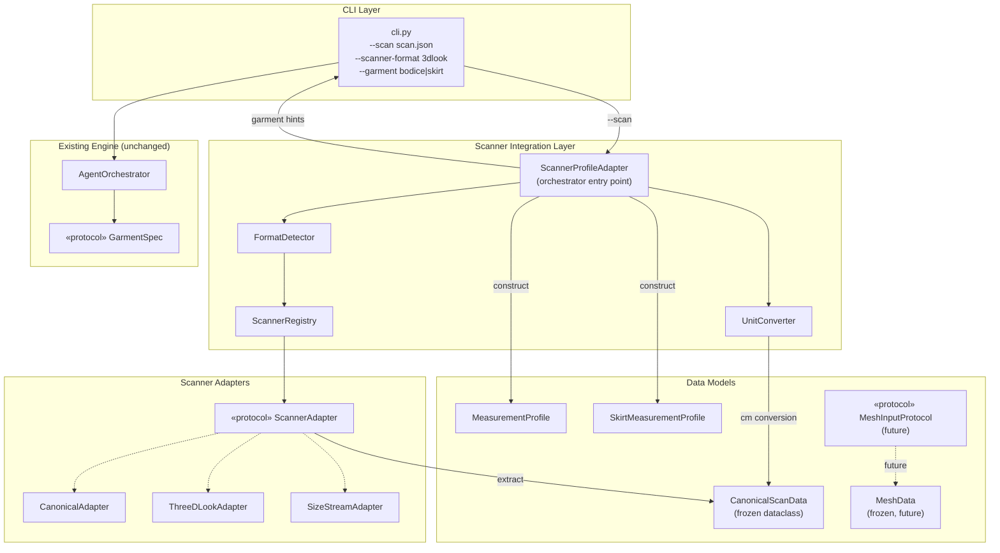
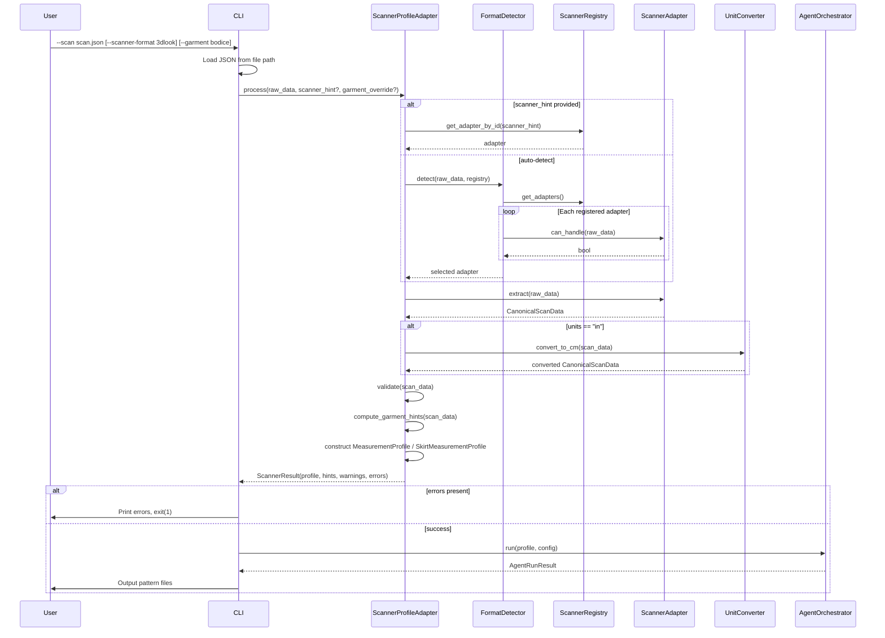
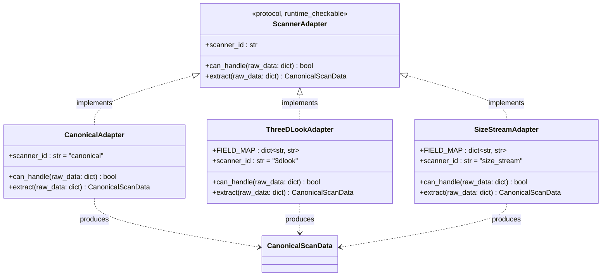
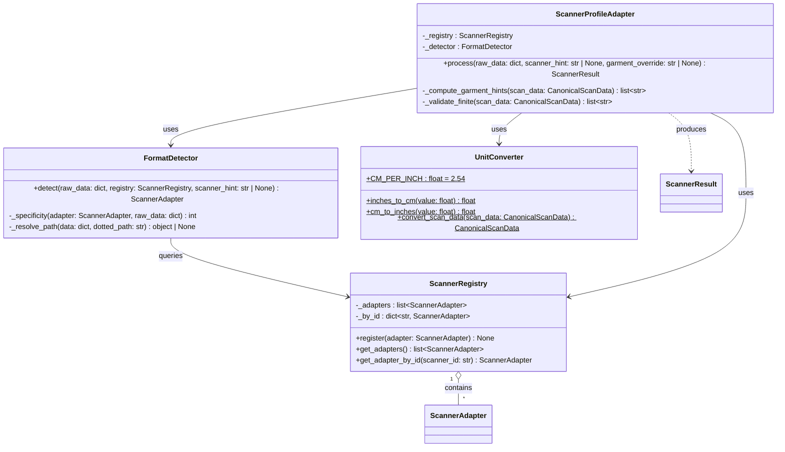
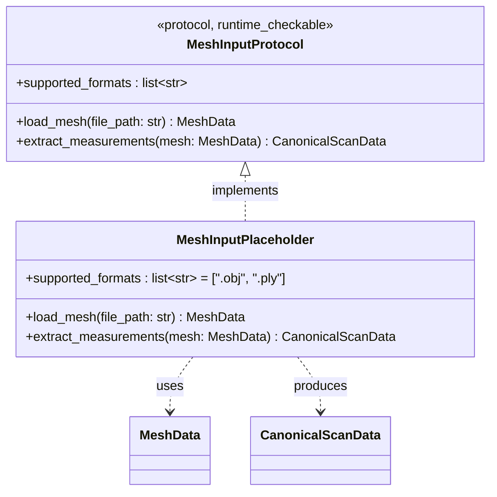

# Design Document: Body Scanner Integration

## Overview

This design covers the body scanner integration feature for the MANI Agentic Pattern Engine. The engine currently accepts body measurements via hardcoded CLI arguments (`--chest`, `--waist`, etc.) or JSON profile files (`--profile`). This feature adds a pluggable adapter architecture that ingests scanner-specific JSON output from commercial 3D body scanners (3DLOOK, Size Stream, Fit3D) and maps it to the engine's existing `MeasurementProfile` and `SkirtMeasurementProfile` dataclasses.

The integration introduces five new components:
1. **CanonicalScanData** — a frozen dataclass defining the engine-owned canonical scanner JSON schema that all adapters target.
2. **ScannerAdapter protocol** — a `typing.Protocol` interface for pluggable scanner format adapters.
3. **ScannerRegistry** — an ordered registry of adapter instances with auto-registration at module load.
4. **FormatDetector** — auto-detects which scanner produced a JSON file by probing registered adapters.
5. **ScannerProfileAdapter** — the single entry-point orchestrator that chains format detection → extraction → unit conversion → validation → garment hinting → profile construction.

The CLI gains a `--scan` flag (mutually exclusive with `--chest`/`--waist-primary`/`--profile`) and an optional `--scanner-format` hint flag. The adapter interface also defines a `MeshInputProtocol` for future OBJ/PLY mesh input, with a `MeshData` dataclass defined but no concrete implementation in this milestone.

### Key Design Decisions

- **Protocol, not ABC**: `ScannerAdapter` uses `typing.Protocol` with `@runtime_checkable` for structural subtyping, consistent with the existing `GarmentSpec` pattern.
- **Canonical intermediate format**: All commercial adapters map to `CanonicalScanData` first, then a single code path converts to `MeasurementProfile`/`SkirtMeasurementProfile`. This avoids N×M adapter-to-profile mapping.
- **Registry pattern**: New scanners are added by implementing `ScannerAdapter` and calling `registry.register()`. No existing code changes required.
- **Frozen dataclasses**: `CanonicalScanData`, `MeshData`, and all result types use `@dataclass(frozen=True)` per coding standards.
- **Frozen files untouched**: `sloper_generator.py`, `body_model_builder.py`, `html_visualizer.py`, `dxf_exporter.py`, `pdf_exporter.py`, `audit_trail.py` are NOT modified.
- **Unit conversion deferred**: Raw scanner values are stored in their original units in `CanonicalScanData`; conversion happens once in `ScannerProfileAdapter` before profile construction.

---

## High-Level Design (HLD)

### System Architecture



### Component Overview

| Component | Responsibility | New/Modified/Frozen |
|---|---|---|
| `CanonicalScanData` | Engine-owned canonical scanner JSON schema | New (models.py) |
| `ScannerAdapter` | Protocol for pluggable scanner format adapters | New (scanner_adapter.py) |
| `CanonicalAdapter` | Handles JSON already in canonical format | New (scanner_adapter.py) |
| `ThreeDLookAdapter` | Maps 3DLOOK JSON to canonical format | New (scanner_adapter.py) |
| `SizeStreamAdapter` | Maps Size Stream JSON to canonical format | New (scanner_adapter.py) |
| `ScannerRegistry` | Ordered registry of adapter instances | New (scanner_adapter.py) |
| `FormatDetector` | Auto-detects scanner format from JSON structure | New (scanner_adapter.py) |
| `UnitConverter` | Converts inches ↔ centimeters | New (scanner_adapter.py) |
| `ScannerProfileAdapter` | Orchestrates detection → extraction → conversion → validation → hinting | New (scanner_adapter.py) |
| `MeshData` | Frozen dataclass for future 3D mesh input | New (models.py) |
| `MeshInputProtocol` | Protocol for future OBJ/PLY mesh adapters | New (scanner_adapter.py) |
| `models.py` | Add `CanonicalScanData`, `MeshData`, `ScannerResult` | Modified |
| `cli.py` | Add `--scan` and `--scanner-format` flags | Modified |
| `sloper_generator.py` | — | Frozen |
| `body_model_builder.py` | — | Frozen |
| `html_visualizer.py` | — | Frozen |
| `dxf_exporter.py` | — | Frozen |
| `pdf_exporter.py` | — | Frozen |
| `audit_trail.py` | — | Frozen |

### Data Flow



### Error Handling

| Category | Error Condition | Component | Behavior |
|---|---|---|---|
| Input | Scanner JSON file not found | `cli.py` | Prints error, exits with code 1 |
| Input | Scanner JSON is not valid JSON | `cli.py` | Prints parse error, exits with code 1 |
| Input | `--scan` combined with `--chest`/`--profile` | `argparse` | Mutual exclusion error, exits with code 2 |
| Detection | No adapter matches JSON structure | `FormatDetector` | Returns error listing all registered scanner IDs |
| Detection | Multiple adapters match (ambiguous) | `FormatDetector` | Selects highest specificity; ties broken by registration order |
| Extraction | Scanner JSON missing required fields | `ScannerAdapter.extract()` | Raises `ValueError` listing missing fields |
| Conversion | Non-finite measurement value (NaN/Inf) | `ScannerProfileAdapter` | Returns error identifying the field |
| Validation | Measurement out of anatomical range | `ScannerProfileAdapter` | Returns error with field, value, and valid range |
| Validation | Missing fields for target profile type | `ScannerProfileAdapter` | Returns error listing missing fields and profile type |
| Hinting | Insufficient measurements for any garment | `ScannerProfileAdapter` | Returns error listing present vs. required measurements |
| Future | `MeshInputProtocol` method called | Placeholder class | Raises `NotImplementedError` |

### File Organization

New files to create:
- `agentic_pattern_engine/scanner_adapter.py` — `ScannerAdapter` protocol, `CanonicalAdapter`, `ThreeDLookAdapter`, `SizeStreamAdapter`, `ScannerRegistry`, `FormatDetector`, `UnitConverter`, `ScannerProfileAdapter`, `MeshInputProtocol`

New test files:
- `tests/test_scanner_adapter.py` — all scanner adapter unit + property tests

Files modified:
- `agentic_pattern_engine/models.py` — add `CanonicalScanData`, `MeshData`, `ScannerResult`
- `agentic_pattern_engine/cli.py` — add `--scan` and `--scanner-format` flags

---

## Low-Level Design (LLD)

### Data Models

```mermaid
classDiagram
    class CanonicalScanData {
        <<frozen dataclass>>
        +chest : float
        +waist : float
        +hip : float
        +shoulder_width : float
        +torso_length : float
        +hip_depth : float
        +desired_length : float
        +units : str
        +source_scanner : str
        +arm_length : float | None
        +inseam : float | None
        +garment_type_hint : str | None
        +scanner_metadata : dict | None
        +validate() list~str~
        +to_dict() dict
        +from_dict(data: dict)$ CanonicalScanData
    }

    class MeshData {
        <<frozen dataclass>>
        +vertices : ndarray  &#40;N,3&#41; float64
        +faces : ndarray  &#40;M,3&#41; int32
    }

    class ScannerResult {
        <<frozen dataclass>>
        +profile : MeasurementProfile | SkirtMeasurementProfile | None
        +bodice_profile : MeasurementProfile | None
        +skirt_profile : SkirtMeasurementProfile | None
        +garment_hints : list~str~
        +canonical_data : CanonicalScanData | None
        +warnings : list~str~
        +errors : list~str~
    }

    class MeasurementProfile {
        <<frozen dataclass>>
        +chest : float
        +waist : float
        +hip : float
        +shoulder_width : float
        +torso_length : float
        +validate() list~str~
    }

    class SkirtMeasurementProfile {
        <<frozen dataclass>>
        +waist : float
        +hip : float
        +hip_depth : float
        +desired_length : float
        +validate() list~str~
    }

    ScannerResult --> CanonicalScanData : canonical_data
    ScannerResult --> MeasurementProfile : bodice_profile
    ScannerResult --> SkirtMeasurementProfile : skirt_profile
```



### Scanner Adapter Protocol & Implementations



### Adapter Field Mappings

#### ThreeDLookAdapter

| Canonical Field | 3DLOOK JSON Path | Notes |
|---|---|---|
| `chest` | `front_params.chest` | Direct mapping |
| `waist` | `front_params.waist` | Direct mapping |
| `hip` | `front_params.hips` | Note plural "hips" |
| `shoulder_width` | `front_params.shoulder_width` | Direct mapping |
| `torso_length` | `front_params.torso_height` | Renamed: height → length |
| `hip_depth` | `front_params.hip_depth` | Direct mapping |
| `units` | `unit` | Top-level key, default "cm" |

Detection signature: `front_params` key with nested `chest` field.

#### SizeStreamAdapter

| Canonical Field | Size Stream JSON Path | Notes |
|---|---|---|
| `chest` | `measurements.bust_girth` | Renamed: bust_girth → chest |
| `waist` | `measurements.waist_girth` | Renamed: waist_girth → waist |
| `hip` | `measurements.hip_girth` | Renamed: hip_girth → hip |
| `shoulder_width` | `measurements.shoulder_breadth` | Renamed: breadth → width |
| `torso_length` | `measurements.torso_length` | Direct mapping |
| `hip_depth` | `measurements.hip_depth_length` | Renamed: hip_depth_length → hip_depth |
| `units` | `header.units` | Nested in header, default "in" |

Detection signature: `measurements` key with nested `bust_girth` field AND `header` key.

#### CanonicalAdapter

Handles JSON already in the engine's canonical format. Detection signature: `source_scanner` field set to `"canonical"`. Passes through directly via `CanonicalScanData.from_dict()`.

### Registry, Detection & Conversion



### Default Registry Initialization

The module-level singleton `default_registry` is built at import time via `_build_default_registry()`, which registers the three built-in adapters in order:

1. `CanonicalAdapter` (scanner_id: `"canonical"`)
2. `ThreeDLookAdapter` (scanner_id: `"3dlook"`)
3. `SizeStreamAdapter` (scanner_id: `"size_stream"`)

### ScannerProfileAdapter Orchestration Flow

The `process()` method chains these steps in order:

1. **Detect format** — via `FormatDetector.detect()` (uses `scanner_hint` if provided, otherwise iterates adapters)
2. **Extract** — calls selected adapter's `extract()` → produces `CanonicalScanData`
3. **Validate canonical data** — calls `CanonicalScanData.validate()` for schema-level errors
4. **Unit conversion** — if `units == "in"`, calls `UnitConverter.convert_scan_data()` → new `CanonicalScanData` with `units="cm"`
5. **Validate finiteness** — checks all numeric fields are finite (not NaN/Inf)
6. **Compute garment hints** — determines `["bodice"]`, `["skirt"]`, or both based on available measurements; `garment_override` from CLI takes precedence
7. **Construct profiles** — builds `MeasurementProfile` and/or `SkirtMeasurementProfile`, runs their `validate()` methods

Errors at any step are collected into `ScannerResult.errors`. Steps 1–2 short-circuit on failure (return immediately). Steps 3–5 accumulate errors and short-circuit before profile construction. Steps 6–7 accumulate errors into the final result.

### Mesh Input Protocol (Future)



`MeshInputPlaceholder` raises `NotImplementedError` on all method calls. Defined in this milestone for interface stability; no concrete implementation provided.

### CLI Modifications

| Flag | Type | Mutual Exclusion Group | Default | Description |
|---|---|---|---|---|
| `--scan` | `str` (file path) | Yes (with `--chest`, `--waist-primary`, `--profile`) | None | Path to scanner JSON file for auto-detection |
| `--scanner-format` | `str` | No | None | Scanner format hint (e.g. `"3dlook"`, `"size_stream"`) to bypass auto-detection |

#### CLI `--scan` Behavior

| Condition | Behavior |
|---|---|
| `--scan` provided | Load JSON file, pass to `ScannerProfileAdapter.process()` |
| `--scan` + `--scanner-format` | Pass `scanner_hint` to `FormatDetector`, skip auto-detection |
| `--scan` without `--garment` | Use first garment hint from `ScannerProfileAdapter` |
| `--scan` + `--garment` | Use user-specified garment type, override scanner hint |
| `--scan` + `--verbose` | Print detected scanner format, extracted measurements, unit conversion details, garment hint |
| `ScannerResult.errors` non-empty | Print each error to stderr, exit with code 1 |
| `--scan` + `--chest`/`--profile`/`--waist-primary` | argparse mutual exclusion error, exit with code 2 |

### Hypothesis Custom Strategies

The following Hypothesis strategies are used for property-based testing. All strategies generate values within anatomically plausible ranges.

| Strategy | Description | Key Ranges |
|---|---|---|
| `valid_canonical_scan_data(units="cm")` | Generates valid `CanonicalScanData` in cm | chest: 60–180, waist: 50–170, hip: 60–180, shoulder_width: 30–65, torso_length: 35–75, hip_depth: 15–30, desired_length: 40–130 |
| `valid_canonical_scan_data_inches()` | Generates valid `CanonicalScanData` in inches | Same ranges converted to inches (÷ 2.54) |
| `valid_3dlook_json()` | Generates valid 3DLOOK-format JSON dicts | Same cm ranges, `unit` sampled from `["cm", "in"]` |
| `valid_size_stream_json()` | Generates valid Size Stream-format JSON dicts | Same cm ranges, `header.units` sampled from `["cm", "in"]` |

Optional fields (`arm_length`, `inseam`, `garment_type_hint`) are generated as `None` or within plausible ranges. `scanner_metadata` is always `None` in test strategies.

---

## Correctness Properties

*A property is a characteristic or behavior that should hold true across all valid executions of a system — essentially, a formal statement about what the system should do. Properties serve as the bridge between human-readable specifications and machine-verifiable correctness guarantees.*

### Property 1: Unit Conversion Round Trip

*For any* finite float value representing a measurement in inches, converting to centimeters via `UnitConverter.inches_to_cm` and back to inches via `UnitConverter.cm_to_inches` should produce a value within 0.001 inches of the original.

**Validates: Requirements 5.1, 5.2, 5.5**

### Property 2: CanonicalScanData Serialization Round Trip

*For any* valid `CanonicalScanData` instance, calling `to_dict()` then `CanonicalScanData.from_dict()` on the result should produce a `CanonicalScanData` instance with all fields equal to the original.

**Validates: Requirements 8.7**

### Property 3: CanonicalScanData Validation Completeness

*For any* `CanonicalScanData` instance where at least one required field is `None`, non-numeric, or non-finite (NaN/Inf), the `validate()` method should return a non-empty error list containing the name of every invalid field. For any instance where all required fields are valid finite numbers and `units` is "cm" or "in", `validate()` should return an empty list.

**Validates: Requirements 1.3, 1.4**

### Property 4: Adapter Extraction Field Mapping

*For any* valid 3DLOOK-format JSON dict, the `ThreeDLookAdapter.extract()` result should have `chest` equal to `front_params.chest`, `hip` equal to `front_params.hips`, `shoulder_width` equal to `front_params.shoulder_width`, and `torso_length` equal to `front_params.torso_height`. *For any* valid Size Stream-format JSON dict, the `SizeStreamAdapter.extract()` result should have `chest` equal to `measurements.bust_girth`, `hip` equal to `measurements.hip_girth`, `shoulder_width` equal to `measurements.shoulder_breadth`, and `hip_depth` equal to `measurements.hip_depth_length`.

**Validates: Requirements 4.1, 4.2**

### Property 5: Adapter can_handle Correctness

*For any* dict containing `front_params` with a nested `chest` key, `ThreeDLookAdapter.can_handle` should return True. *For any* dict containing `measurements` with a nested `bust_girth` key and a `header` key, `SizeStreamAdapter.can_handle` should return True. *For any* dict with `source_scanner` set to `"canonical"`, `CanonicalAdapter.can_handle` should return True. *For any* dict lacking the respective signature keys, each adapter's `can_handle` should return False.

**Validates: Requirements 4.3, 4.4, 4.5**

### Property 6: Adapter Extract Raises on Missing Fields

*For any* scanner adapter and *any* raw_data dict that is missing one or more fields required by that adapter's format, calling `extract(raw_data)` should raise a `ValueError` whose message contains the name of every missing field.

**Validates: Requirements 2.4**

### Property 7: Format Detection Selects Correct Adapter

*For any* `ScannerRegistry` with N registered adapters and *any* JSON input where exactly one adapter's `can_handle` returns True, the `FormatDetector.detect()` should return that adapter. When no adapter matches, it should raise a `ValueError` listing all registered scanner IDs.

**Validates: Requirements 3.1, 3.3**

### Property 8: Format Detection Specificity Tiebreaker

*For any* JSON input where multiple registered adapters' `can_handle` returns True, the `FormatDetector.detect()` should select the adapter with the highest specificity score (most scanner-specific marker fields matched in the input).

**Validates: Requirements 3.4**

### Property 9: Scanner Hint Bypasses Auto-Detection

*For any* valid scanner_id string present in the registry, calling `FormatDetector.detect()` with that `scanner_hint` should return the adapter with that ID without calling `can_handle` on any adapter.

**Validates: Requirements 3.5**

### Property 10: ScannerProfileAdapter Unit Conversion

*For any* valid `CanonicalScanData` with `units="in"`, the `ScannerProfileAdapter.process()` result should contain a profile whose measurement values equal the original inch values multiplied by 2.54. *For any* valid `CanonicalScanData` with `units="cm"`, the profile values should equal the original values exactly.

**Validates: Requirements 5.3, 5.4**

### Property 11: ScannerProfileAdapter Validation Propagation

*For any* scanner JSON that produces a `MeasurementProfile` or `SkirtMeasurementProfile` with out-of-range values, the `ScannerResult.errors` list should contain the validation errors from the respective profile's `validate()` method, including the field name, the converted value, and the valid range.

**Validates: Requirements 6.1, 6.2, 6.4**

### Property 12: Garment Hint Computation

*For any* `CanonicalScanData` where chest, waist, hip, shoulder_width, and torso_length are all present and positive, the garment hints should include "bodice". *For any* `CanonicalScanData` where waist, hip, hip_depth, and desired_length are all present and positive, the garment hints should include "skirt". When a `garment_type_hint` field is set, it should override measurement-based detection.

**Validates: Requirements 7.1, 7.2, 7.3, 7.4**

### Property 13: Scanner Registry Ordering

*For any* sequence of `register()` calls on a `ScannerRegistry`, `get_adapters()` should return adapters in registration order, and `get_adapter_by_id(id)` should return the adapter with that ID. For any ID not in the registry, `get_adapter_by_id` should raise `KeyError` with a message listing all registered IDs.

**Validates: Requirements 10.1, 10.3, 10.4, 10.5**

### Property 14: Adapter Units Passthrough

*For any* commercial scanner JSON that specifies inches as the unit (3DLOOK `"unit": "in"` or Size Stream `"header.units": "in"`), the extracted `CanonicalScanData` should have `units="in"`, preserving raw inch values for downstream conversion.

**Validates: Requirements 4.6**

### Property 15: CLI Garment Selection Priority

*For any* scanner JSON input, when `--garment` is specified on the CLI, the engine should use that garment type regardless of the scanner's garment hint. When `--garment` is not specified, the engine should use the first garment hint from the `ScannerProfileAdapter`.

**Validates: Requirements 9.4, 9.5**

---

## Error Handling

### Error Categories and Responses

| Layer | Error | Response |
|---|---|---|
| CLI | Scanner JSON file not found | Print `"Error: file not found: {path}"`, exit(1) |
| CLI | Scanner JSON parse failure | Print `"Error: invalid JSON: {details}"`, exit(1) |
| CLI | `--scan` with `--chest`/`--profile`/`--waist-primary` | argparse mutual exclusion error, exit(2) |
| FormatDetector | No adapter matches | `ValueError` with message listing all registered scanner IDs |
| FormatDetector | `scanner_hint` not in registry | `KeyError` with message listing all registered IDs |
| ScannerAdapter | Missing required scanner fields | `ValueError` listing each missing field name |
| CanonicalScanData | Invalid `units` value | `validate()` returns error: `"units must be 'cm' or 'in'"` |
| CanonicalScanData | Non-finite value (NaN/Inf) | `validate()` returns error: `"{field}={val} is not a finite number"` |
| ScannerProfileAdapter | Profile validation failure | Collects all errors from `MeasurementProfile.validate()` / `SkirtMeasurementProfile.validate()` into `ScannerResult.errors` |
| ScannerProfileAdapter | Insufficient measurements for any garment | Returns error listing present measurements and required fields per garment type |
| MeshInputPlaceholder | Any method called | Raises `NotImplementedError` with descriptive message |

### Error Propagation Strategy

Errors are collected, not thrown. The `ScannerProfileAdapter.process()` method catches `ValueError` and `KeyError` from detection and extraction, and collects validation errors from `CanonicalScanData.validate()` and profile `validate()` methods. All errors are returned in `ScannerResult.errors` as a flat list of strings. The CLI prints each error to stderr and exits with code 1.

The only exceptions that propagate are:
- `KeyError` from `ScannerRegistry.get_adapter_by_id()` when called directly (not through `ScannerProfileAdapter`)
- `ValueError` from `ScannerAdapter.extract()` when called directly
- `NotImplementedError` from `MeshInputPlaceholder` methods

---

## Testing Strategy

### Testing Framework

- **Unit tests**: `pytest` (already configured)
- **Property-based tests**: `hypothesis` (already in dev dependencies)
- **Minimum iterations**: 100 per property test (via `@settings(max_examples=100)`)

### Dual Testing Approach

Unit tests and property tests are complementary:
- **Unit tests** verify specific examples, edge cases, integration points, and error conditions (CLI flag parsing, specific scanner JSON samples, MeshInputPlaceholder raises NotImplementedError)
- **Property tests** verify universal properties across randomly generated inputs (round-trip conversion, field mapping correctness, validation completeness, garment hint logic)
- Together they provide comprehensive coverage — unit tests catch concrete bugs, property tests verify general correctness

### Property-Based Testing Configuration

- Library: `hypothesis` (Python)
- Each property test runs minimum 100 iterations via `@settings(max_examples=100)`
- Each property test must NOT implement property-based testing from scratch — use `hypothesis` strategies
- Each property test must include a comment referencing the design property:

```python
# Feature: body-scanner-integration, Property 1: Unit Conversion Round Trip
@given(value=st.floats(min_value=0.1, max_value=1000.0, allow_nan=False, allow_infinity=False))
@settings(max_examples=100)
def test_unit_conversion_round_trip(value):
    converted = UnitConverter.inches_to_cm(value)
    back = UnitConverter.cm_to_inches(converted)
    assert abs(back - value) < 0.001
```

### Property Test Tagging

Tag format: **Feature: body-scanner-integration, Property {number}: {property_text}**

### Test Organization

All scanner adapter tests in a single file:
- `tests/test_scanner_adapter.py` — Properties 1–15, plus unit tests for:
  - CLI `--scan` flag parsing and mutual exclusion (Req 9.1, 9.2, 9.6, 9.7, 9.8)
  - `MeshInputPlaceholder` raises `NotImplementedError` (Req 11.6)
  - `MeshData` is frozen dataclass in models module (Req 11.5)
  - `ScannerAdapter` protocol is `@runtime_checkable` (Req 2.5)
  - Default registry contains 3 adapters (Req 10.6)
  - `CanonicalScanData` required/optional field structure (Req 1.1, 1.2, 1.5)

### Property-to-Test Mapping

| Property | Test Function | Validates |
|---|---|---|
| 1 | `test_unit_conversion_round_trip` | 5.1, 5.2, 5.5 |
| 2 | `test_canonical_scan_data_serialization_round_trip` | 8.7 |
| 3 | `test_canonical_scan_data_validation_completeness` | 1.3, 1.4 |
| 4 | `test_adapter_extraction_field_mapping` | 4.1, 4.2 |
| 5 | `test_adapter_can_handle_correctness` | 4.3, 4.4, 4.5 |
| 6 | `test_adapter_extract_raises_on_missing_fields` | 2.4 |
| 7 | `test_format_detection_selects_correct_adapter` | 3.1, 3.3 |
| 8 | `test_format_detection_specificity_tiebreaker` | 3.4 |
| 9 | `test_scanner_hint_bypasses_auto_detection` | 3.5 |
| 10 | `test_scanner_profile_adapter_unit_conversion` | 5.3, 5.4 |
| 11 | `test_scanner_profile_adapter_validation_propagation` | 6.1, 6.2, 6.4 |
| 12 | `test_garment_hint_computation` | 7.1, 7.2, 7.3, 7.4 |
| 13 | `test_scanner_registry_ordering` | 10.1, 10.3, 10.4, 10.5 |
| 14 | `test_adapter_units_passthrough` | 4.6 |
| 15 | `test_cli_garment_selection_priority` | 9.4, 9.5 |
