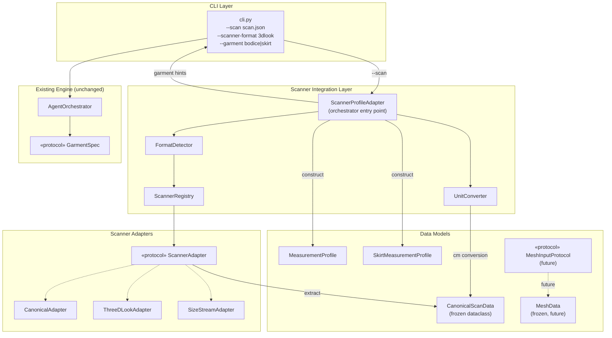
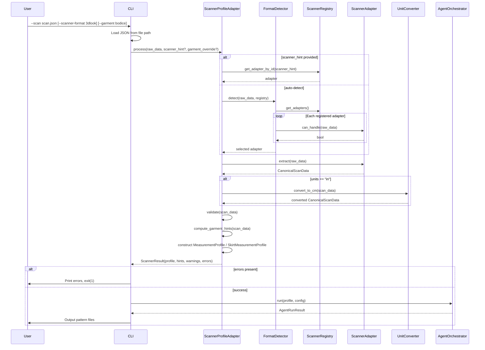

# Design Document: Body Scanner Integration

## Overview

This design covers the body scanner integration feature for the MANI Agentic Pattern Engine. The engine currently accepts body measurements via hardcoded CLI arguments (`--chest`, `--waist`, etc.) or JSON profile files (`--profile`). This feature adds a pluggable adapter architecture that ingests scanner-specific JSON output from commercial 3D body scanners (3DLOOK, Size Stream, Fit3D) and maps it to the engine's existing `MeasurementProfile` and `SkirtMeasurementProfile` dataclasses.

The integration introduces five new components:
1. **CanonicalScanData** — a frozen dataclass defining the engine-owned canonical scanner JSON schema that all adapters target.
2. **ScannerAdapter protocol** — a `typing.Protocol` interface for pluggable scanner format adapters.
3. **ScannerRegistry** — an ordered registry of adapter instances with auto-registration at module load.
4. **FormatDetector** — auto-detects which scanner produced a JSON file by probing registered adapters.
5. **ScannerProfileAdapter** — the single entry-point orchestrator that chains format detection → extraction → unit conversion → validation → garment hinting → profile construction.

The CLI gains a `--scan` flag (mutually exclusive with `--chest`/`--waist-primary`/`--profile`) and an optional `--scanner-format` hint flag. The adapter interface also defines a `MeshInputProtocol` for future OBJ/PLY mesh input, with a `MeshData` dataclass defined but no concrete implementation in this milestone.

### Key Design Decisions

- **Protocol, not ABC**: `ScannerAdapter` uses `typing.Protocol` with `@runtime_checkable` for structural subtyping, consistent with the existing `GarmentSpec` pattern.
- **Canonical intermediate format**: All commercial adapters map to `CanonicalScanData` first, then a single code path converts to `MeasurementProfile`/`SkirtMeasurementProfile`. This avoids N×M adapter-to-profile mapping.
- **Registry pattern**: New scanners are added by implementing `ScannerAdapter` and calling `registry.register()`. No existing code changes required.
- **Frozen dataclasses**: `CanonicalScanData`, `MeshData`, and all result types use `@dataclass(frozen=True)` per coding standards.
- **Frozen files untouched**: `sloper_generator.py`, `body_model_builder.py`, `html_visualizer.py`, `dxf_exporter.py`, `pdf_exporter.py`, `audit_trail.py` are NOT modified.
- **Unit conversion deferred**: Raw scanner values are stored in their original units in `CanonicalScanData`; conversion happens once in `ScannerProfileAdapter` before profile construction.

---

## High-Level Design (HLD)

### System Architecture



### Component Overview

| Component | Responsibility | New/Modified/Frozen |
|---|---|---|
| `CanonicalScanData` | Engine-owned canonical scanner JSON schema | New (models.py) |
| `ScannerAdapter` | Protocol for pluggable scanner format adapters | New (scanner_adapter.py) |
| `CanonicalAdapter` | Handles JSON already in canonical format | New (scanner_adapter.py) |
| `ThreeDLookAdapter` | Maps 3DLOOK JSON to canonical format | New (scanner_adapter.py) |
| `SizeStreamAdapter` | Maps Size Stream JSON to canonical format | New (scanner_adapter.py) |
| `ScannerRegistry` | Ordered registry of adapter instances | New (scanner_adapter.py) |
| `FormatDetector` | Auto-detects scanner format from JSON structure | New (scanner_adapter.py) |
| `UnitConverter` | Converts inches ↔ centimeters | New (scanner_adapter.py) |
| `ScannerProfileAdapter` | Orchestrates detection → extraction → conversion → validation → hinting | New (scanner_adapter.py) |
| `MeshData` | Frozen dataclass for future 3D mesh input | New (models.py) |
| `MeshInputProtocol` | Protocol for future OBJ/PLY mesh adapters | New (scanner_adapter.py) |
| `models.py` | Add `CanonicalScanData`, `MeshData`, `ScannerResult` | Modified |
| `cli.py` | Add `--scan` and `--scanner-format` flags | Modified |
| `sloper_generator.py` | — | Frozen |
| `body_model_builder.py` | — | Frozen |
| `html_visualizer.py` | — | Frozen |
| `dxf_exporter.py` | — | Frozen |
| `pdf_exporter.py` | — | Frozen |
| `audit_trail.py` | — | Frozen |

### Data Flow



### Error Handling

| Category | Error Condition | Component | Behavior |
|---|---|---|---|
| Input | Scanner JSON file not found | `cli.py` | Prints error, exits with code 1 |
| Input | Scanner JSON is not valid JSON | `cli.py` | Prints parse error, exits with code 1 |
| Input | `--scan` combined with `--chest`/`--profile` | `argparse` | Mutual exclusion error, exits with code 2 |
| Detection | No adapter matches JSON structure | `FormatDetector` | Returns error listing all registered scanner IDs |
| Detection | Multiple adapters match (ambiguous) | `FormatDetector` | Selects highest specificity; ties broken by registration order |
| Extraction | Scanner JSON missing required fields | `ScannerAdapter.extract()` | Raises `ValueError` listing missing fields |
| Conversion | Non-finite measurement value (NaN/Inf) | `ScannerProfileAdapter` | Returns error identifying the field |
| Validation | Measurement out of anatomical range | `ScannerProfileAdapter` | Returns error with field, value, and valid range |
| Validation | Missing fields for target profile type | `ScannerProfileAdapter` | Returns error listing missing fields and profile type |
| Hinting | Insufficient measurements for any garment | `ScannerProfileAdapter` | Returns error listing present vs. required measurements |
| Future | `MeshInputProtocol` method called | Placeholder class | Raises `NotImplementedError` |

### File Organization

New files to create:
- `agentic_pattern_engine/scanner_adapter.py` — `ScannerAdapter` protocol, `CanonicalAdapter`, `ThreeDLookAdapter`, `SizeStreamAdapter`, `ScannerRegistry`, `FormatDetector`, `UnitConverter`, `ScannerProfileAdapter`, `MeshInputProtocol`

New test files:
- `tests/test_scanner_adapter.py` — all scanner adapter unit + property tests

Files modified:
- `agentic_pattern_engine/models.py` — add `CanonicalScanData`, `MeshData`, `ScannerResult`
- `agentic_pattern_engine/cli.py` — add `--scan` and `--scanner-format` flags

---

## Low-Level Design (LLD)

### CanonicalScanData

```python
@dataclass(frozen=True)
class CanonicalScanData:
    """Engine-owned canonical scanner JSON schema.
    
    All scanner adapters map their format to this intermediate
    representation before conversion to MeasurementProfile or
    SkirtMeasurementProfile.
    """
    # Required fields
    chest: float
    waist: float
    hip: float
    shoulder_width: float
    torso_length: float
    hip_depth: float
    desired_length: float
    units: str                          # "cm" or "in"
    source_scanner: str                 # scanner ID or "canonical"

    # Optional fields
    arm_length: float | None = None
    inseam: float | None = None
    garment_type_hint: str | None = None  # "bodice", "skirt", or None
    scanner_metadata: dict | None = None  # opaque scanner-specific data

    def validate(self) -> list[str]:
        """Return error strings for missing required fields and
        out-of-range values."""
        errors: list[str] = []
        if self.units not in ("cm", "in"):
            errors.append(
                f"units must be 'cm' or 'in', got '{self.units}'"
            )
        required = [
            "chest", "waist", "hip", "shoulder_width",
            "torso_length", "hip_depth", "desired_length",
        ]
        for fld in required:
            val = getattr(self, fld)
            if val is None:
                errors.append(f"{fld} is missing")
            elif not isinstance(val, (int, float)):
                errors.append(
                    f"{fld} must be numeric, got {type(val).__name__}"
                )
            elif np.isnan(val) or np.isinf(val):
                errors.append(f"{fld}={val} is not a finite number")
        return errors

    def to_dict(self) -> dict:
        """Serialize to dict for round-trip testing."""
        return dataclasses.asdict(self)

    @classmethod
    def from_dict(cls, data: dict) -> CanonicalScanData:
        """Deserialize from dict."""
        return cls(**{
            k: v for k, v in data.items()
            if k in {f.name for f in dataclasses.fields(cls)}
        })
```

### MeshData

```python
@dataclass(frozen=True)
class MeshData:
    """3D mesh data for future body model fitting.
    
    Defined in this milestone but no concrete implementation provided.
    """
    vertices: np.ndarray   # (N, 3) float64
    faces: np.ndarray      # (M, 3) int32
```

### ScannerResult

```python
@dataclass(frozen=True)
class ScannerResult:
    """Result of scanner profile adapter processing."""
    profile: MeasurementProfile | SkirtMeasurementProfile | None
    bodice_profile: MeasurementProfile | None
    skirt_profile: SkirtMeasurementProfile | None
    garment_hints: list[str]          # ["bodice"], ["skirt"], or ["bodice", "skirt"]
    canonical_data: CanonicalScanData | None
    warnings: list[str]
    errors: list[str]
```

### ScannerAdapter Protocol

```python
from typing import Protocol, runtime_checkable

@runtime_checkable
class ScannerAdapter(Protocol):
    """Pluggable adapter for converting scanner JSON to canonical format."""

    @property
    def scanner_id(self) -> str:
        """Unique identifier, e.g. '3dlook', 'size_stream', 'canonical'."""
        ...

    def can_handle(self, raw_data: dict) -> bool:
        """Return True if raw_data matches this scanner's format."""
        ...

    def extract(self, raw_data: dict) -> CanonicalScanData:
        """Map scanner fields to CanonicalScanData.
        
        Raises ValueError if required scanner-specific fields are missing.
        """
        ...
```

### CanonicalAdapter

```python
class CanonicalAdapter:
    """Handles JSON already in the engine's canonical format."""

    @property
    def scanner_id(self) -> str:
        return "canonical"

    def can_handle(self, raw_data: dict) -> bool:
        return raw_data.get("source_scanner") == "canonical"

    def extract(self, raw_data: dict) -> CanonicalScanData:
        required = [
            "chest", "waist", "hip", "shoulder_width",
            "torso_length", "hip_depth", "desired_length", "units",
        ]
        missing = [f for f in required if f not in raw_data]
        if missing:
            raise ValueError(
                f"Canonical format missing fields: {', '.join(missing)}"
            )
        return CanonicalScanData.from_dict(raw_data)
```

### ThreeDLookAdapter

```python
class ThreeDLookAdapter:
    """Maps 3DLOOK JSON output to canonical format.
    
    3DLOOK JSON structure:
    {
        "front_params": {
            "chest": 91.5,
            "waist": 73.5,
            "hips": 98.0,
            "shoulder_width": 40.0,
            "torso_height": 42.5,
            "hip_depth": 20.0,
            ...
        },
        "unit": "cm"
    }
    """

    FIELD_MAP = {
        "chest": "front_params.chest",
        "waist": "front_params.waist",
        "hip": "front_params.hips",
        "shoulder_width": "front_params.shoulder_width",
        "torso_length": "front_params.torso_height",
        "hip_depth": "front_params.hip_depth",
    }

    @property
    def scanner_id(self) -> str:
        return "3dlook"

    def can_handle(self, raw_data: dict) -> bool:
        fp = raw_data.get("front_params", {})
        return isinstance(fp, dict) and "chest" in fp

    def extract(self, raw_data: dict) -> CanonicalScanData:
        fp = raw_data.get("front_params", {})
        missing = [
            k for k, path in self.FIELD_MAP.items()
            if path.split(".")[-1] not in fp
        ]
        if missing:
            raise ValueError(
                f"3DLOOK format missing fields: {', '.join(missing)}"
            )
        units = raw_data.get("unit", "cm")
        return CanonicalScanData(
            chest=fp["chest"],
            waist=fp["waist"],
            hip=fp["hips"],
            shoulder_width=fp["shoulder_width"],
            torso_length=fp["torso_height"],
            hip_depth=fp["hip_depth"],
            desired_length=fp.get("desired_length", 60.0),
            units=units,
            source_scanner="3dlook",
            arm_length=fp.get("arm_length"),
            inseam=fp.get("inseam"),
            garment_type_hint=raw_data.get("garment_type_hint"),
            scanner_metadata=raw_data.get("metadata"),
        )
```

### SizeStreamAdapter

```python
class SizeStreamAdapter:
    """Maps Size Stream JSON output to canonical format.
    
    Size Stream JSON structure:
    {
        "header": {"units": "in", "version": "2.0", ...},
        "measurements": {
            "bust_girth": 36.0,
            "waist_girth": 29.0,
            "hip_girth": 38.5,
            "shoulder_breadth": 15.7,
            "torso_length": 16.7,
            "hip_depth_length": 7.9,
            ...
        }
    }
    """

    FIELD_MAP = {
        "chest": "bust_girth",
        "waist": "waist_girth",
        "hip": "hip_girth",
        "shoulder_width": "shoulder_breadth",
        "torso_length": "torso_length",
        "hip_depth": "hip_depth_length",
    }

    @property
    def scanner_id(self) -> str:
        return "size_stream"

    def can_handle(self, raw_data: dict) -> bool:
        m = raw_data.get("measurements", {})
        return (
            isinstance(m, dict)
            and "bust_girth" in m
            and "header" in raw_data
        )

    def extract(self, raw_data: dict) -> CanonicalScanData:
        m = raw_data.get("measurements", {})
        missing = [
            canon for canon, scanner in self.FIELD_MAP.items()
            if scanner not in m
        ]
        if missing:
            raise ValueError(
                f"Size Stream format missing fields: {', '.join(missing)}"
            )
        header = raw_data.get("header", {})
        units = header.get("units", "in")
        return CanonicalScanData(
            chest=m["bust_girth"],
            waist=m["waist_girth"],
            hip=m["hip_girth"],
            shoulder_width=m["shoulder_breadth"],
            torso_length=m["torso_length"],
            hip_depth=m["hip_depth_length"],
            desired_length=m.get("desired_length", 60.0),
            units=units,
            source_scanner="size_stream",
            arm_length=m.get("arm_length"),
            inseam=m.get("inseam"),
            garment_type_hint=raw_data.get("garment_type_hint"),
            scanner_metadata=raw_data.get("metadata"),
        )
```

### ScannerRegistry

```python
class ScannerRegistry:
    """Ordered registry of ScannerAdapter instances."""

    def __init__(self) -> None:
        self._adapters: list[ScannerAdapter] = []
        self._by_id: dict[str, ScannerAdapter] = {}

    def register(self, adapter: ScannerAdapter) -> None:
        """Add adapter to registry. Replaces existing with same ID."""
        self._adapters = [
            a for a in self._adapters
            if a.scanner_id != adapter.scanner_id
        ]
        self._adapters.append(adapter)
        self._by_id[adapter.scanner_id] = adapter

    def get_adapters(self) -> list[ScannerAdapter]:
        """Return all adapters in registration order."""
        return list(self._adapters)

    def get_adapter_by_id(self, scanner_id: str) -> ScannerAdapter:
        """Return adapter by ID. Raises KeyError if not found."""
        if scanner_id not in self._by_id:
            registered = list(self._by_id.keys())
            raise KeyError(
                f"Unknown scanner '{scanner_id}'. "
                f"Registered: {registered}"
            )
        return self._by_id[scanner_id]


def _build_default_registry() -> ScannerRegistry:
    """Create registry pre-loaded with built-in adapters."""
    reg = ScannerRegistry()
    reg.register(CanonicalAdapter())
    reg.register(ThreeDLookAdapter())
    reg.register(SizeStreamAdapter())
    return reg


# Module-level singleton
default_registry = _build_default_registry()
```

### FormatDetector

```python
class FormatDetector:
    """Auto-detects scanner format from JSON structure."""

    def detect(
        self,
        raw_data: dict,
        registry: ScannerRegistry,
        scanner_hint: str | None = None,
    ) -> ScannerAdapter:
        """Select the appropriate adapter for the given JSON.
        
        If scanner_hint is provided, skips auto-detection and
        directly selects the named adapter.
        
        If multiple adapters match, selects the one with highest
        specificity (number of scanner-specific marker fields matched).
        
        Raises ValueError if no adapter matches.
        """
        if scanner_hint is not None:
            return registry.get_adapter_by_id(scanner_hint)

        matches: list[ScannerAdapter] = []
        for adapter in registry.get_adapters():
            if adapter.can_handle(raw_data):
                matches.append(adapter)

        if not matches:
            ids = [a.scanner_id for a in registry.get_adapters()]
            raise ValueError(
                f"Unrecognized scanner format. "
                f"Registered formats: {ids}"
            )

        if len(matches) == 1:
            return matches[0]

        # Multiple matches: select highest specificity
        # Specificity = number of scanner-specific keys present
        return max(
            matches,
            key=lambda a: self._specificity(a, raw_data),
        )

    def _specificity(
        self, adapter: ScannerAdapter, raw_data: dict,
    ) -> int:
        """Count scanner-specific marker fields present in raw_data."""
        if hasattr(adapter, "FIELD_MAP"):
            return sum(
                1 for path in adapter.FIELD_MAP.values()
                if self._resolve_path(raw_data, path) is not None
            )
        return 0

    def _resolve_path(
        self, data: dict, dotted_path: str,
    ) -> object | None:
        """Resolve a dotted path like 'front_params.chest'."""
        current = data
        for key in dotted_path.split("."):
            if isinstance(current, dict) and key in current:
                current = current[key]
            else:
                return None
        return current
```

### UnitConverter

```python
class UnitConverter:
    """Converts measurement values between inches and centimeters."""

    CM_PER_INCH: float = 2.54

    @classmethod
    def inches_to_cm(cls, value: float) -> float:
        return value * cls.CM_PER_INCH

    @classmethod
    def cm_to_inches(cls, value: float) -> float:
        return value / cls.CM_PER_INCH

    @classmethod
    def convert_scan_data(
        cls, scan_data: CanonicalScanData,
    ) -> CanonicalScanData:
        """Convert all measurement fields from inches to cm.
        
        Returns a new CanonicalScanData with units='cm'.
        Only converts if units == 'in'; passes through if already 'cm'.
        """
        if scan_data.units == "cm":
            return scan_data

        measurement_fields = [
            "chest", "waist", "hip", "shoulder_width",
            "torso_length", "hip_depth", "desired_length",
            "arm_length", "inseam",
        ]
        updates: dict = {"units": "cm"}
        for fld in measurement_fields:
            val = getattr(scan_data, fld)
            if val is not None:
                updates[fld] = cls.inches_to_cm(val)

        return dataclasses.replace(scan_data, **updates)
```

### ScannerProfileAdapter

```python
class ScannerProfileAdapter:
    """Single entry-point for scanner integration.
    
    Orchestrates: format detection → extraction → unit conversion →
    validation → garment hinting → profile construction.
    """

    def __init__(
        self,
        registry: ScannerRegistry | None = None,
    ) -> None:
        self._registry = registry or default_registry
        self._detector = FormatDetector()

    def process(
        self,
        raw_data: dict,
        scanner_hint: str | None = None,
        garment_override: str | None = None,
    ) -> ScannerResult:
        """Process raw scanner JSON and return profiles + hints.
        
        Args:
            raw_data: Parsed JSON dict from scanner file.
            scanner_hint: Optional scanner format ID to skip auto-detection.
            garment_override: Optional garment type override from CLI.
        
        Returns:
            ScannerResult with profiles, garment hints, warnings, errors.
        """
        errors: list[str] = []
        warnings: list[str] = []

        # 1. Detect format
        try:
            adapter = self._detector.detect(
                raw_data, self._registry, scanner_hint,
            )
        except (ValueError, KeyError) as e:
            return ScannerResult(
                profile=None, bodice_profile=None,
                skirt_profile=None, garment_hints=[],
                canonical_data=None, warnings=[], errors=[str(e)],
            )

        # 2. Extract to canonical format
        try:
            scan_data = adapter.extract(raw_data)
        except ValueError as e:
            return ScannerResult(
                profile=None, bodice_profile=None,
                skirt_profile=None, garment_hints=[],
                canonical_data=None, warnings=[], errors=[str(e)],
            )

        # 3. Validate canonical data
        canon_errors = scan_data.validate()
        if canon_errors:
            errors.extend(canon_errors)

        # 4. Unit conversion
        if scan_data.units == "in":
            scan_data = UnitConverter.convert_scan_data(scan_data)

        # 5. Validate finiteness
        finite_errors = self._validate_finite(scan_data)
        errors.extend(finite_errors)

        if errors:
            return ScannerResult(
                profile=None, bodice_profile=None,
                skirt_profile=None, garment_hints=[],
                canonical_data=scan_data, warnings=warnings,
                errors=errors,
            )

        # 6. Compute garment hints
        hints = self._compute_garment_hints(scan_data)
        if garment_override:
            hints = [garment_override]

        if not hints:
            errors.append(
                "Insufficient measurements for any garment type. "
                f"Present: chest={scan_data.chest}, waist={scan_data.waist}, "
                f"hip={scan_data.hip}, shoulder_width={scan_data.shoulder_width}, "
                f"torso_length={scan_data.torso_length}, "
                f"hip_depth={scan_data.hip_depth}, "
                f"desired_length={scan_data.desired_length}"
            )
            return ScannerResult(
                profile=None, bodice_profile=None,
                skirt_profile=None, garment_hints=[],
                canonical_data=scan_data, warnings=warnings,
                errors=errors,
            )

        # 7. Construct profiles
        bodice_profile = None
        skirt_profile = None
        if "bodice" in hints:
            bodice_profile = MeasurementProfile(
                chest=scan_data.chest,
                waist=scan_data.waist,
                hip=scan_data.hip,
                shoulder_width=scan_data.shoulder_width,
                torso_length=scan_data.torso_length,
            )
            bp_errors = bodice_profile.validate()
            errors.extend(bp_errors)

        if "skirt" in hints:
            skirt_profile = SkirtMeasurementProfile(
                waist=scan_data.waist,
                hip=scan_data.hip,
                hip_depth=scan_data.hip_depth,
                desired_length=scan_data.desired_length,
            )
            sp_errors = skirt_profile.validate()
            errors.extend(sp_errors)

        primary = bodice_profile or skirt_profile

        return ScannerResult(
            profile=primary,
            bodice_profile=bodice_profile,
            skirt_profile=skirt_profile,
            garment_hints=hints,
            canonical_data=scan_data,
            warnings=warnings,
            errors=errors,
        )

    def _compute_garment_hints(
        self, scan_data: CanonicalScanData,
    ) -> list[str]:
        """Determine which garment types are supported."""
        if scan_data.garment_type_hint:
            return [scan_data.garment_type_hint]

        hints: list[str] = []
        bodice_fields = [
            scan_data.chest, scan_data.waist, scan_data.hip,
            scan_data.shoulder_width, scan_data.torso_length,
        ]
        if all(v is not None and v > 0 for v in bodice_fields):
            hints.append("bodice")

        skirt_fields = [
            scan_data.waist, scan_data.hip,
            scan_data.hip_depth, scan_data.desired_length,
        ]
        if all(v is not None and v > 0 for v in skirt_fields):
            hints.append("skirt")

        return hints

    def _validate_finite(
        self, scan_data: CanonicalScanData,
    ) -> list[str]:
        """Validate all numeric fields are finite."""
        errors: list[str] = []
        fields = [
            "chest", "waist", "hip", "shoulder_width",
            "torso_length", "hip_depth", "desired_length",
            "arm_length", "inseam",
        ]
        for fld in fields:
            val = getattr(scan_data, fld)
            if val is not None and (np.isnan(val) or np.isinf(val)):
                errors.append(f"{fld}={val} is not a finite number")
        return errors
```

### MeshInputProtocol (Future)

```python
@runtime_checkable
class MeshInputProtocol(Protocol):
    """Protocol for future 3D mesh input adapters.
    
    Defined in this milestone but no concrete implementation provided.
    """

    @property
    def supported_formats(self) -> list[str]:
        """Supported file extensions, e.g. ['.obj', '.ply']."""
        ...

    def load_mesh(self, file_path: str) -> MeshData:
        """Load a 3D mesh file and return MeshData."""
        ...

    def extract_measurements(
        self, mesh: MeshData,
    ) -> CanonicalScanData:
        """Derive body measurements from a 3D mesh."""
        ...


class MeshInputPlaceholder:
    """Placeholder implementation that raises NotImplementedError."""

    @property
    def supported_formats(self) -> list[str]:
        return [".obj", ".ply"]

    def load_mesh(self, file_path: str) -> MeshData:
        raise NotImplementedError(
            "Mesh input is not implemented in this milestone"
        )

    def extract_measurements(
        self, mesh: MeshData,
    ) -> CanonicalScanData:
        raise NotImplementedError(
            "Mesh measurement extraction is not implemented "
            "in this milestone"
        )
```

### CLI Modifications

```python
# In _parse_args():
# Add --scan to the mutually exclusive group
g = p.add_mutually_exclusive_group(required=True)
g.add_argument("--profile", type=str, help="Path to JSON measurement file")
g.add_argument("--chest", type=float, help="Chest circumference (cm)")
g.add_argument("--waist-primary", type=float, dest="waist_primary",
               help="Waist circumference (cm) — skirt primary")
g.add_argument("--scan", type=str,
               help="Path to scanner JSON file for auto-detection")

# Add optional scanner format hint
p.add_argument("--scanner-format", type=str, default=None,
               help="Scanner format hint (e.g. '3dlook', 'size_stream')")


# In main():
if args.scan:
    import json
    raw_data = json.loads(pathlib.Path(args.scan).read_text())
    
    from agentic_pattern_engine.scanner_adapter import (
        ScannerProfileAdapter,
    )
    spa = ScannerProfileAdapter()
    garment_override = args.garment if args.garment != "bodice" else None
    result = spa.process(
        raw_data,
        scanner_hint=args.scanner_format,
        garment_override=garment_override,
    )

    if result.errors:
        for err in result.errors:
            print(f"Error: {err}", file=sys.stderr)
        return 1

    if args.verbose:
        print(f"Scanner format: {result.canonical_data.source_scanner}")
        print(f"Garment hints: {result.garment_hints}")
        # Print extracted measurements...

    # Select garment type from hints or --garment override
    garment_type = args.garment
    if not garment_override and result.garment_hints:
        garment_type = result.garment_hints[0]

    if garment_type == "skirt":
        profile = result.skirt_profile
    else:
        profile = result.bodice_profile

    # Continue with existing engine flow...
```

### Hypothesis Custom Strategies

```python
from hypothesis import strategies as st

def valid_canonical_scan_data(units: str = "cm"):
    """Generate valid CanonicalScanData instances."""
    return st.builds(
        CanonicalScanData,
        chest=st.floats(min_value=60.0, max_value=180.0),
        waist=st.floats(min_value=50.0, max_value=170.0),
        hip=st.floats(min_value=60.0, max_value=180.0),
        shoulder_width=st.floats(min_value=30.0, max_value=65.0),
        torso_length=st.floats(min_value=35.0, max_value=75.0),
        hip_depth=st.floats(min_value=15.0, max_value=30.0),
        desired_length=st.floats(min_value=40.0, max_value=130.0),
        units=st.just(units),
        source_scanner=st.just("canonical"),
        arm_length=st.one_of(st.none(), st.floats(min_value=50.0, max_value=90.0)),
        inseam=st.one_of(st.none(), st.floats(min_value=60.0, max_value=100.0)),
        garment_type_hint=st.one_of(
            st.none(), st.sampled_from(["bodice", "skirt"]),
        ),
        scanner_metadata=st.none(),
    )


def valid_canonical_scan_data_inches():
    """Generate valid CanonicalScanData in inches."""
    return st.builds(
        CanonicalScanData,
        chest=st.floats(min_value=23.6, max_value=70.9),   # 60-180 cm
        waist=st.floats(min_value=19.7, max_value=66.9),   # 50-170 cm
        hip=st.floats(min_value=23.6, max_value=70.9),     # 60-180 cm
        shoulder_width=st.floats(min_value=11.8, max_value=25.6),
        torso_length=st.floats(min_value=13.8, max_value=29.5),
        hip_depth=st.floats(min_value=5.9, max_value=11.8),
        desired_length=st.floats(min_value=15.7, max_value=51.2),
        units=st.just("in"),
        source_scanner=st.just("canonical"),
        arm_length=st.none(),
        inseam=st.none(),
        garment_type_hint=st.none(),
        scanner_metadata=st.none(),
    )


def valid_3dlook_json():
    """Generate valid 3DLOOK-format JSON dicts."""
    return st.builds(
        lambda chest, waist, hips, sw, th, hd, unit: {
            "front_params": {
                "chest": chest,
                "waist": waist,
                "hips": hips,
                "shoulder_width": sw,
                "torso_height": th,
                "hip_depth": hd,
            },
            "unit": unit,
        },
        chest=st.floats(min_value=60.0, max_value=180.0),
        waist=st.floats(min_value=50.0, max_value=170.0),
        hips=st.floats(min_value=60.0, max_value=180.0),
        sw=st.floats(min_value=30.0, max_value=65.0),
        th=st.floats(min_value=35.0, max_value=75.0),
        hd=st.floats(min_value=15.0, max_value=30.0),
        unit=st.sampled_from(["cm", "in"]),
    )


def valid_size_stream_json():
    """Generate valid Size Stream-format JSON dicts."""
    return st.builds(
        lambda bg, wg, hg, sb, tl, hdl, units: {
            "header": {"units": units, "version": "2.0"},
            "measurements": {
                "bust_girth": bg,
                "waist_girth": wg,
                "hip_girth": hg,
                "shoulder_breadth": sb,
                "torso_length": tl,
                "hip_depth_length": hdl,
            },
        },
        bg=st.floats(min_value=60.0, max_value=180.0),
        wg=st.floats(min_value=50.0, max_value=170.0),
        hg=st.floats(min_value=60.0, max_value=180.0),
        sb=st.floats(min_value=30.0, max_value=65.0),
        tl=st.floats(min_value=35.0, max_value=75.0),
        hdl=st.floats(min_value=15.0, max_value=30.0),
        units=st.sampled_from(["cm", "in"]),
    )
```

---

## Correctness Properties

*A property is a characteristic or behavior that should hold true across all valid executions of a system — essentially, a formal statement about what the system should do. Properties serve as the bridge between human-readable specifications and machine-verifiable correctness guarantees.*

### Property 1: Unit Conversion Round Trip

*For any* finite float value representing a measurement in inches, converting to centimeters via `UnitConverter.inches_to_cm` and back to inches via `UnitConverter.cm_to_inches` should produce a value within 0.001 inches of the original.

**Validates: Requirements 5.1, 5.2, 5.5**

### Property 2: CanonicalScanData Serialization Round Trip

*For any* valid `CanonicalScanData` instance, calling `to_dict()` then `CanonicalScanData.from_dict()` on the result should produce a `CanonicalScanData` instance with all fields equal to the original.

**Validates: Requirements 8.7**

### Property 3: CanonicalScanData Validation Completeness

*For any* `CanonicalScanData` instance where at least one required field is `None`, non-numeric, or non-finite (NaN/Inf), the `validate()` method should return a non-empty error list containing the name of every invalid field. For any instance where all required fields are valid finite numbers and `units` is "cm" or "in", `validate()` should return an empty list.

**Validates: Requirements 1.3, 1.4**

### Property 4: Adapter Extraction Field Mapping

*For any* valid 3DLOOK-format JSON dict, the `ThreeDLookAdapter.extract()` result should have `chest` equal to `front_params.chest`, `hip` equal to `front_params.hips`, `shoulder_width` equal to `front_params.shoulder_width`, and `torso_length` equal to `front_params.torso_height`. *For any* valid Size Stream-format JSON dict, the `SizeStreamAdapter.extract()` result should have `chest` equal to `measurements.bust_girth`, `hip` equal to `measurements.hip_girth`, `shoulder_width` equal to `measurements.shoulder_breadth`, and `hip_depth` equal to `measurements.hip_depth_length`.

**Validates: Requirements 4.1, 4.2**

### Property 5: Adapter can_handle Correctness

*For any* dict containing `front_params` with a nested `chest` key, `ThreeDLookAdapter.can_handle` should return True. *For any* dict containing `measurements` with a nested `bust_girth` key and a `header` key, `SizeStreamAdapter.can_handle` should return True. *For any* dict with `source_scanner` set to `"canonical"`, `CanonicalAdapter.can_handle` should return True. *For any* dict lacking the respective signature keys, each adapter's `can_handle` should return False.

**Validates: Requirements 4.3, 4.4, 4.5**

### Property 6: Adapter Extract Raises on Missing Fields

*For any* scanner adapter and *any* raw_data dict that is missing one or more fields required by that adapter's format, calling `extract(raw_data)` should raise a `ValueError` whose message contains the name of every missing field.

**Validates: Requirements 2.4**

### Property 7: Format Detection Selects Correct Adapter

*For any* `ScannerRegistry` with N registered adapters and *any* JSON input where exactly one adapter's `can_handle` returns True, the `FormatDetector.detect()` should return that adapter. When no adapter matches, it should raise a `ValueError` listing all registered scanner IDs.

**Validates: Requirements 3.1, 3.3**

### Property 8: Format Detection Specificity Tiebreaker

*For any* JSON input where multiple registered adapters' `can_handle` returns True, the `FormatDetector.detect()` should select the adapter with the highest specificity score (most scanner-specific marker fields matched in the input).

**Validates: Requirements 3.4**

### Property 9: Scanner Hint Bypasses Auto-Detection

*For any* valid scanner_id string present in the registry, calling `FormatDetector.detect()` with that `scanner_hint` should return the adapter with that ID without calling `can_handle` on any adapter.

**Validates: Requirements 3.5**

### Property 10: ScannerProfileAdapter Unit Conversion

*For any* valid `CanonicalScanData` with `units="in"`, the `ScannerProfileAdapter.process()` result should contain a profile whose measurement values equal the original inch values multiplied by 2.54. *For any* valid `CanonicalScanData` with `units="cm"`, the profile values should equal the original values exactly.

**Validates: Requirements 5.3, 5.4**

### Property 11: ScannerProfileAdapter Validation Propagation

*For any* scanner JSON that produces a `MeasurementProfile` or `SkirtMeasurementProfile` with out-of-range values, the `ScannerResult.errors` list should contain the validation errors from the respective profile's `validate()` method, including the field name, the converted value, and the valid range.

**Validates: Requirements 6.1, 6.2, 6.4**

### Property 12: Garment Hint Computation

*For any* `CanonicalScanData` where chest, waist, hip, shoulder_width, and torso_length are all present and positive, the garment hints should include "bodice". *For any* `CanonicalScanData` where waist, hip, hip_depth, and desired_length are all present and positive, the garment hints should include "skirt". When a `garment_type_hint` field is set, it should override measurement-based detection.

**Validates: Requirements 7.1, 7.2, 7.3, 7.4**

### Property 13: Scanner Registry Ordering

*For any* sequence of `register()` calls on a `ScannerRegistry`, `get_adapters()` should return adapters in registration order, and `get_adapter_by_id(id)` should return the adapter with that ID. For any ID not in the registry, `get_adapter_by_id` should raise `KeyError` with a message listing all registered IDs.

**Validates: Requirements 10.1, 10.3, 10.4, 10.5**

### Property 14: Adapter Units Passthrough

*For any* commercial scanner JSON that specifies inches as the unit (3DLOOK `"unit": "in"` or Size Stream `"header.units": "in"`), the extracted `CanonicalScanData` should have `units="in"`, preserving raw inch values for downstream conversion.

**Validates: Requirements 4.6**

### Property 15: CLI Garment Selection Priority

*For any* scanner JSON input, when `--garment` is specified on the CLI, the engine should use that garment type regardless of the scanner's garment hint. When `--garment` is not specified, the engine should use the first garment hint from the `ScannerProfileAdapter`.

**Validates: Requirements 9.4, 9.5**

---

## Error Handling

### Error Categories and Responses

| Layer | Error | Response |
|---|---|---|
| CLI | Scanner JSON file not found | Print `"Error: file not found: {path}"`, exit(1) |
| CLI | Scanner JSON parse failure | Print `"Error: invalid JSON: {details}"`, exit(1) |
| CLI | `--scan` with `--chest`/`--profile`/`--waist-primary` | argparse mutual exclusion error, exit(2) |
| FormatDetector | No adapter matches | `ValueError` with message listing all registered scanner IDs |
| FormatDetector | `scanner_hint` not in registry | `KeyError` with message listing all registered IDs |
| ScannerAdapter | Missing required scanner fields | `ValueError` listing each missing field name |
| CanonicalScanData | Invalid `units` value | `validate()` returns error: `"units must be 'cm' or 'in'"` |
| CanonicalScanData | Non-finite value (NaN/Inf) | `validate()` returns error: `"{field}={val} is not a finite number"` |
| ScannerProfileAdapter | Profile validation failure | Collects all errors from `MeasurementProfile.validate()` / `SkirtMeasurementProfile.validate()` into `ScannerResult.errors` |
| ScannerProfileAdapter | Insufficient measurements for any garment | Returns error listing present measurements and required fields per garment type |
| MeshInputPlaceholder | Any method called | Raises `NotImplementedError` with descriptive message |

### Error Propagation Strategy

Errors are collected, not thrown. The `ScannerProfileAdapter.process()` method catches `ValueError` and `KeyError` from detection and extraction, and collects validation errors from `CanonicalScanData.validate()` and profile `validate()` methods. All errors are returned in `ScannerResult.errors` as a flat list of strings. The CLI prints each error to stderr and exits with code 1.

The only exceptions that propagate are:
- `KeyError` from `ScannerRegistry.get_adapter_by_id()` when called directly (not through `ScannerProfileAdapter`)
- `ValueError` from `ScannerAdapter.extract()` when called directly
- `NotImplementedError` from `MeshInputPlaceholder` methods

---

## Testing Strategy

### Testing Framework

- **Unit tests**: `pytest` (already configured)
- **Property-based tests**: `hypothesis` (already in dev dependencies)
- **Minimum iterations**: 100 per property test (via `@settings(max_examples=100)`)

### Dual Testing Approach

Unit tests and property tests are complementary:
- **Unit tests** verify specific examples, edge cases, integration points, and error conditions (CLI flag parsing, specific scanner JSON samples, MeshInputPlaceholder raises NotImplementedError)
- **Property tests** verify universal properties across randomly generated inputs (round-trip conversion, field mapping correctness, validation completeness, garment hint logic)
- Together they provide comprehensive coverage — unit tests catch concrete bugs, property tests verify general correctness

### Property-Based Testing Configuration

- Library: `hypothesis` (Python)
- Each property test runs minimum 100 iterations via `@settings(max_examples=100)`
- Each property test must NOT implement property-based testing from scratch — use `hypothesis` strategies
- Each property test must include a comment referencing the design property:

```python
# Feature: body-scanner-integration, Property 1: Unit Conversion Round Trip
@given(value=st.floats(min_value=0.1, max_value=1000.0, allow_nan=False, allow_infinity=False))
@settings(max_examples=100)
def test_unit_conversion_round_trip(value):
    converted = UnitConverter.inches_to_cm(value)
    back = UnitConverter.cm_to_inches(converted)
    assert abs(back - value) < 0.001
```

### Property Test Tagging

Tag format: **Feature: body-scanner-integration, Property {number}: {property_text}**

### Test Organization

All scanner adapter tests in a single file:
- `tests/test_scanner_adapter.py` — Properties 1–15, plus unit tests for:
  - CLI `--scan` flag parsing and mutual exclusion (Req 9.1, 9.2, 9.6, 9.7, 9.8)
  - `MeshInputPlaceholder` raises `NotImplementedError` (Req 11.6)
  - `MeshData` is frozen dataclass in models module (Req 11.5)
  - `ScannerAdapter` protocol is `@runtime_checkable` (Req 2.5)
  - Default registry contains 3 adapters (Req 10.6)
  - `CanonicalScanData` required/optional field structure (Req 1.1, 1.2, 1.5)

### Property-to-Test Mapping

| Property | Test Function | Validates |
|---|---|---|
| 1 | `test_unit_conversion_round_trip` | 5.1, 5.2, 5.5 |
| 2 | `test_canonical_scan_data_serialization_round_trip` | 8.7 |
| 3 | `test_canonical_scan_data_validation_completeness` | 1.3, 1.4 |
| 4 | `test_adapter_extraction_field_mapping` | 4.1, 4.2 |
| 5 | `test_adapter_can_handle_correctness` | 4.3, 4.4, 4.5 |
| 6 | `test_adapter_extract_raises_on_missing_fields` | 2.4 |
| 7 | `test_format_detection_selects_correct_adapter` | 3.1, 3.3 |
| 8 | `test_format_detection_specificity_tiebreaker` | 3.4 |
| 9 | `test_scanner_hint_bypasses_auto_detection` | 3.5 |
| 10 | `test_scanner_profile_adapter_unit_conversion` | 5.3, 5.4 |
| 11 | `test_scanner_profile_adapter_validation_propagation` | 6.1, 6.2, 6.4 |
| 12 | `test_garment_hint_computation` | 7.1, 7.2, 7.3, 7.4 |
| 13 | `test_scanner_registry_ordering` | 10.1, 10.3, 10.4, 10.5 |
| 14 | `test_adapter_units_passthrough` | 4.6 |
| 15 | `test_cli_garment_selection_priority` | 9.4, 9.5 |
