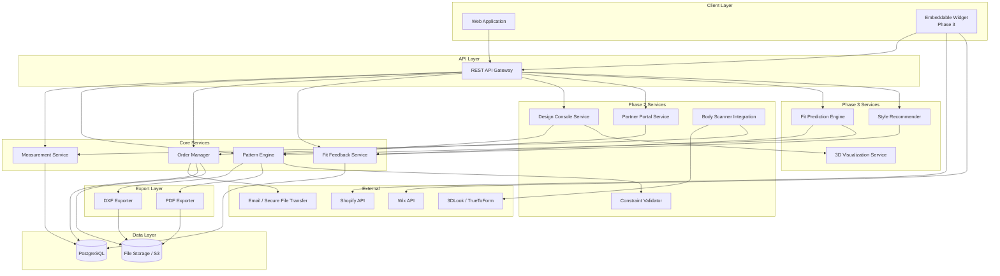
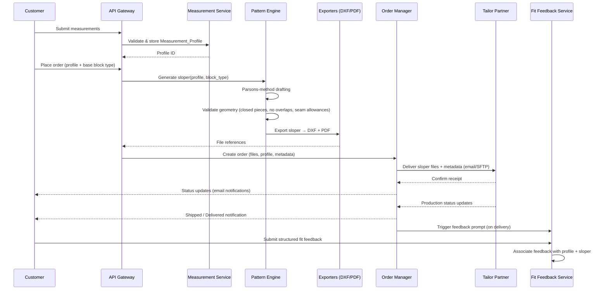
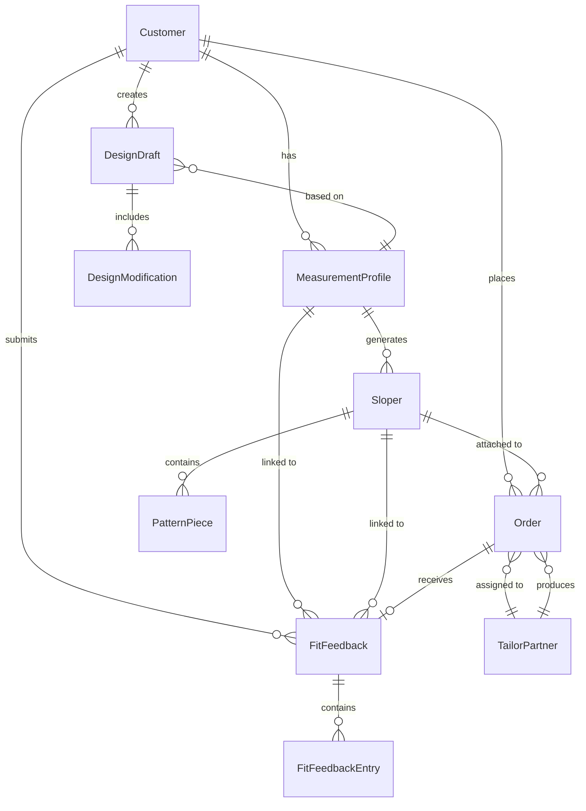

# Design Document — MANI Custom Fashion Platform

## Overview

MANI is a direct-to-consumer custom fashion platform built around a deterministic Parsons-method pattern engine. The system takes customer body measurements, generates mathematically precise slopers (base pattern blocks), delivers them to tailor partners for production, and collects structured fit feedback to close the loop.

The platform is delivered in three phases:

- **Phase 1 (POC):** Core measurement → sloper → tailor → feedback loop. Manual measurement input, Parsons-based sloper generation with DXF/PDF export, tailor partner delivery, basic order tracking, and fit feedback collection.
- **Phase 2:** Visual Design Console with constrained modifications, body scanning integration, Partner Portal for tailor workflow management, and full order tracking with delivery estimates.
- **Phase 3:** ML-based Fit Prediction Engine, style recommendations, 3D garment visualization, Shopify/Wix embeddable widgets, beta testing program, and sustainability tracking.

### Key Design Decisions

1. **Deterministic pattern engine** — Parsons-method formulas are pure functions: same measurements always produce the same sloper. This makes the system testable, reproducible, and auditable.
2. **Phase-gated architecture** — Each phase builds on the previous one. Phase 1 components (Pattern Engine, Order Manager, Fit Feedback System) are designed as standalone modules that Phase 2 and 3 extend without modification.
3. **Sloper as the single source of truth** — All downstream operations (export, visualization, modification) derive from the internal sloper representation. Export formats (DXF, PDF) are projections of this representation.
4. **Feedback-driven improvement** — Fit feedback is structured and quantitative from day one, enabling the Phase 3 Fit Predictor to operate on clean historical data.

## Architecture

### High-Level Architecture



### Phase 1 Data Flow




## Components and Interfaces

### 1. Measurement Service

**Responsibility:** Validates, stores, and versions customer body measurements.

**Interface:**

```typescript
interface MeasurementProfile {
  id: string;
  customerId: string;
  version: number;
  measurements: {
    chest: number;       // cm
    waist: number;       // cm
    hip: number;         // cm
    shoulderWidth: number; // cm
    armLength: number;   // cm
    inseam: number;      // cm
    torsoLength: number; // cm
  };
  source: 'manual' | 'body_scanner';
  createdAt: Date;
}

interface MeasurementService {
  // Validate measurements against plausible anatomical ranges
  validate(input: MeasurementInput): ValidationResult;

  // Store a new profile, auto-incrementing version
  create(customerId: string, input: MeasurementInput): MeasurementProfile;

  // Retrieve current profile
  getCurrent(customerId: string): MeasurementProfile | null;

  // Retrieve all profile versions for a customer
  getHistory(customerId: string): MeasurementProfile[];
}

interface ValidationResult {
  valid: boolean;
  errors: Array<{
    field: string;
    value: number;
    message: string;
    acceptableRange: { min: number; max: number };
  }>;
}
```

**Validation Ranges (anatomically plausible, in cm):**

| Measurement    | Min  | Max  |
|----------------|------|------|
| chest          | 60   | 180  |
| waist          | 50   | 170  |
| hip            | 60   | 180  |
| shoulderWidth  | 30   | 65   |
| armLength      | 40   | 90   |
| inseam         | 55   | 100  |
| torsoLength    | 35   | 75   |

### 2. Pattern Engine

**Responsibility:** Core computational component. Generates slopers from measurements using deterministic Parsons-method drafting formulas. Validates geometric integrity of output.

**Interface:**

```typescript
type BaseBlockType = 'bodice_top' | 'trouser_bottom' | 'sleeve';

interface PatternPiece {
  id: string;
  label: string;
  outline: Point2D[];       // Closed polygon (first point == last point)
  seamLines: Line2D[];
  cutLines: Line2D[];
  grainLine: Line2D;
  notchMarks: Point2D[];
  seamAllowance: number;    // cm
}

interface Sloper {
  id: string;
  profileId: string;
  blockType: BaseBlockType;
  pieces: PatternPiece[];
  metadata: {
    generatedAt: Date;
    engineVersion: string;
    measurements: MeasurementProfile['measurements'];
  };
}

interface SloperValidation {
  valid: boolean;
  errors: Array<{
    pieceId: string;
    issue: 'not_closed' | 'overlapping_seams' | 'missing_seam_allowance'
           | 'missing_grain_line' | 'missing_notches' | 'missing_label';
    detail: string;
  }>;
}

interface PatternEngine {
  // Generate a sloper from a measurement profile
  generate(profile: MeasurementProfile, blockType: BaseBlockType): Sloper;

  // Validate geometric integrity of a sloper
  validate(sloper: Sloper): SloperValidation;

  // Extract measurements back from sloper geometry (for round-trip verification)
  extractMeasurements(sloper: Sloper): MeasurementProfile['measurements'];

  // Apply a constrained modification (Phase 2)
  applyModification(sloper: Sloper, modification: DesignModification): Sloper;
}
```

**Parsons-Method Drafting:** The engine implements standard Parsons drafting formulas where each measurement maps to specific construction points on the sloper. For example, the bodice front draft uses chest/2 + ease for the width, waist-to-shoulder for the vertical, and shoulder width for the shoulder slope. All formulas are pure functions — no randomness, no external state.

### 3. Export Layer (DXF Exporter + PDF Exporter)

**Responsibility:** Converts internal sloper representation to industry-standard output formats.

**Interface:**

```typescript
interface ExportOptions {
  seamAllowance: boolean;
  scale: '1:1' | 'scaled';
  includeAssemblyInstructions: boolean;
}

interface DXFExporter {
  // Export sloper to DXF with each piece as a separate layer
  export(sloper: Sloper, options: ExportOptions): Buffer;

  // Parse DXF back to internal representation (for round-trip verification)
  parse(dxfContent: Buffer): Sloper;
}

interface PDFExporter {
  // Export sloper to multi-page PDF with full-scale layout,
  // measurement reference table, and assembly instructions
  export(sloper: Sloper, options: ExportOptions): Buffer;
}
```

### 4. Order Manager

**Responsibility:** Tracks orders from submission through delivery. Manages status transitions and notifications.

**Interface:**

```typescript
type OrderStatus =
  | 'measurement_submitted'
  | 'sloper_generated'
  | 'sent_to_tailor'
  | 'received_by_tailor'
  | 'in_production'
  | 'quality_check'
  | 'shipped'
  | 'delivered';

interface Order {
  id: string;
  customerId: string;
  profileId: string;
  sloperId: string;
  blockType: BaseBlockType;
  status: OrderStatus;
  statusHistory: Array<{ status: OrderStatus; timestamp: Date }>;
  tailorPartnerId: string;
  fabricSpecifications?: string;
  specialInstructions?: string;
  estimatedDeliveryDate?: Date;    // Phase 2
  trackingInfo?: { carrier: string; trackingNumber: string }; // Phase 2
  createdAt: Date;
  updatedAt: Date;
}

interface OrderManager {
  create(params: CreateOrderParams): Order;
  updateStatus(orderId: string, status: OrderStatus, metadata?: object): Order;
  getOrder(orderId: string): Order;
  getCustomerOrders(customerId: string): Order[];
  deliverToTailor(orderId: string): DeliveryResult;
}
```

### 5. Fit Feedback Service

**Responsibility:** Collects, stores, and retrieves structured fit feedback linked to measurement profiles and slopers.

**Interface:**

```typescript
type FitRating = 'too_tight' | 'slightly_tight' | 'perfect' | 'slightly_loose' | 'too_loose';

interface FitFeedbackEntry {
  bodyRegion: string;          // e.g., 'chest', 'waist', 'hip'
  rating: FitRating;
  adjustmentCm: number;       // Numeric adjustment in cm
  comment?: string;
}

interface FitFeedback {
  id: string;
  orderId: string;
  customerId: string;
  profileId: string;
  sloperId: string;
  blockType: BaseBlockType;
  entries: FitFeedbackEntry[];
  submittedAt: Date;
}

interface FitFeedbackService {
  submit(orderId: string, entries: FitFeedbackEntry[]): FitFeedback;
  getByOrder(orderId: string): FitFeedback | null;
  getByCustomer(customerId: string): FitFeedback[];
  getByBlockType(blockType: BaseBlockType): FitFeedback[];
  promptCustomer(orderId: string): void; // Trigger feedback prompt
}
```

### 6. Design Console Service (Phase 2)

**Responsibility:** Manages visual design modifications and validates them against pattern engine constraints.

**Interface:**

```typescript
type ModificationType =
  | 'neckline_shape'
  | 'hem_length'
  | 'sleeve_length'
  | 'silhouette'
  | 'pocket_placement';

type Silhouette = 'fitted' | 'regular' | 'relaxed';

interface DesignModification {
  type: ModificationType;
  value: string | number;
}

interface DesignDraft {
  id: string;
  customerId: string;
  name: string;
  profileId: string;
  blockType: BaseBlockType;
  modifications: DesignModification[];
  sloperId: string;
  createdAt: Date;
  updatedAt: Date;
}

interface DesignConsoleService {
  // Validate a modification against pattern constraints
  validateModification(sloperId: string, mod: DesignModification): ConstraintResult;

  // Apply modification and return updated sloper
  applyModification(sloperId: string, mod: DesignModification): Sloper;

  // Save a named design draft
  saveDraft(customerId: string, draft: Partial<DesignDraft>): DesignDraft;

  // List customer's saved drafts
  getDrafts(customerId: string): DesignDraft[];

  // Generate design specification summary
  generateSpecSummary(draftId: string): DesignSpecSummary;
}

interface ConstraintResult {
  allowed: boolean;
  reason?: string;  // Explanation if not allowed
}
```

### 7. Partner Portal Service (Phase 2)

**Responsibility:** Provides tailor partners with order management, status updates, and communication tools.

**Interface:**

```typescript
interface PartnerPortalService {
  getAssignedOrders(tailorPartnerId: string): Order[];
  updateProductionStatus(orderId: string, status: OrderStatus): Order;
  submitQuestion(orderId: string, message: string): void;
  submitIssueReport(orderId: string, report: IssueReport): void;
  recordProductionCost(orderId: string, cost: MoneyAmount): void;
}
```

### 8. Body Scanner Integration (Phase 2)

**Responsibility:** Integrates with third-party body scanning services and normalizes output to MeasurementProfile format.

**Interface:**

```typescript
interface BodyScannerIntegration {
  initiateScan(customerId: string): ScanSession;
  getScanResult(sessionId: string): ScanResult;
  convertToProfile(scanResult: ScanResult): MeasurementProfile['measurements'];
}

interface ScanResult {
  success: boolean;
  measurements?: MeasurementProfile['measurements'];
  error?: string;
}
```

### 9. Fit Prediction Engine (Phase 3)

**Responsibility:** Analyzes accumulated fit feedback to generate adjustment recommendations and predict fit outcomes.

**Interface:**

```typescript
interface AdjustmentRecommendation {
  blockType: BaseBlockType;
  bodyRegion: string;
  adjustmentCm: number;
  condition: string;           // e.g., "chest > 100cm"
  confidenceScore: number;     // 0-100
  supportingFeedbackCount: number;
}

interface FitPredictionEngine {
  generateRecommendations(blockType: BaseBlockType): AdjustmentRecommendation[];
  identifySystematicIssues(blockType: BaseBlockType): SystematicIssue[];
  flagMeasurements(profile: MeasurementProfile): FitWarning[];
}
```

### 10. Style Recommender (Phase 3)

**Responsibility:** Suggests garment types and design modifications based on body proportions and aggregated feedback from similar profiles.

### 11. 3D Visualization Service (Phase 3)

**Responsibility:** Renders 3D garment previews on body models scaled to customer measurements. Falls back to 2D illustration on error.

### 12. E-Commerce Integration (Phase 3)

**Responsibility:** Provides embeddable Design Console widgets for Shopify and Wix storefronts with checkout flow integration.


## Data Models

### Entity Relationship Diagram



### Core Entities

#### Customer

| Field       | Type   | Description                        |
|-------------|--------|------------------------------------|
| id          | UUID   | Primary key                        |
| email       | string | Unique, used for notifications     |
| name        | string | Display name                       |
| createdAt   | Date   | Account creation timestamp         |

#### MeasurementProfile

| Field         | Type    | Description                                  |
|---------------|---------|----------------------------------------------|
| id            | UUID    | Primary key                                  |
| customerId    | UUID    | FK → Customer                                |
| version       | integer | Auto-incrementing per customer               |
| chest         | decimal | cm                                           |
| waist         | decimal | cm                                           |
| hip           | decimal | cm                                           |
| shoulderWidth | decimal | cm                                           |
| armLength     | decimal | cm                                           |
| inseam        | decimal | cm                                           |
| torsoLength   | decimal | cm                                           |
| source        | enum    | 'manual' or 'body_scanner'                   |
| createdAt     | Date    | Timestamp                                    |

#### Sloper

| Field          | Type   | Description                                |
|----------------|--------|--------------------------------------------|
| id             | UUID   | Primary key                                |
| profileId      | UUID   | FK → MeasurementProfile                    |
| blockType      | enum   | 'bodice_top', 'trouser_bottom', 'sleeve'   |
| pieces         | JSON   | Array of PatternPiece objects              |
| engineVersion  | string | Pattern engine version used                |
| generatedAt    | Date   | Timestamp                                  |

#### PatternPiece

| Field         | Type     | Description                              |
|---------------|----------|------------------------------------------|
| id            | string   | Piece identifier within sloper           |
| label         | string   | Human-readable piece name                |
| outline       | JSON     | Array of Point2D forming closed polygon  |
| seamLines     | JSON     | Array of Line2D                          |
| cutLines      | JSON     | Array of Line2D                          |
| grainLine     | JSON     | Line2D                                   |
| notchMarks    | JSON     | Array of Point2D                         |
| seamAllowance | decimal  | cm                                       |

#### Order

| Field                 | Type    | Description                                  |
|-----------------------|---------|----------------------------------------------|
| id                    | UUID    | Primary key                                  |
| customerId            | UUID    | FK → Customer                                |
| profileId             | UUID    | FK → MeasurementProfile                      |
| sloperId              | UUID    | FK → Sloper                                  |
| blockType             | enum    | Base block type                              |
| status                | enum    | Current order status                         |
| tailorPartnerId       | UUID    | FK → TailorPartner                           |
| fabricSpecifications  | text    | Optional fabric details                      |
| specialInstructions   | text    | Optional notes                               |
| estimatedDeliveryDate | Date    | Phase 2: computed from production timeline   |
| trackingCarrier       | string  | Phase 2: shipping carrier                    |
| trackingNumber        | string  | Phase 2: tracking number                     |
| productionCost        | decimal | Phase 2: tailor-quoted cost                  |
| createdAt             | Date    | Timestamp                                    |
| updatedAt             | Date    | Timestamp                                    |

#### OrderStatusHistory

| Field     | Type   | Description                |
|-----------|--------|----------------------------|
| id        | UUID   | Primary key                |
| orderId   | UUID   | FK → Order                 |
| status    | enum   | Status at this point       |
| timestamp | Date   | When status changed        |

#### FitFeedback

| Field       | Type   | Description                        |
|-------------|--------|------------------------------------|
| id          | UUID   | Primary key                        |
| orderId     | UUID   | FK → Order                         |
| customerId  | UUID   | FK → Customer                      |
| profileId   | UUID   | FK → MeasurementProfile            |
| sloperId    | UUID   | FK → Sloper                        |
| blockType   | enum   | Base block type                    |
| submittedAt | Date   | Timestamp                          |

#### FitFeedbackEntry

| Field        | Type    | Description                                    |
|--------------|---------|------------------------------------------------|
| id           | UUID    | Primary key                                    |
| feedbackId   | UUID    | FK → FitFeedback                               |
| bodyRegion   | string  | e.g., 'chest', 'waist', 'hip'                 |
| rating       | enum    | too_tight, slightly_tight, perfect, etc.       |
| adjustmentCm | decimal | Numeric adjustment in cm                       |
| comment      | text    | Optional free-text                             |

#### DesignDraft (Phase 2)

| Field       | Type   | Description                        |
|-------------|--------|------------------------------------|
| id          | UUID   | Primary key                        |
| customerId  | UUID   | FK → Customer                      |
| name        | string | User-assigned draft name           |
| profileId   | UUID   | FK → MeasurementProfile            |
| blockType   | enum   | Base block type                    |
| sloperId    | UUID   | FK → current sloper state          |
| createdAt   | Date   | Timestamp                          |
| updatedAt   | Date   | Timestamp                          |

#### DesignModification (Phase 2)

| Field    | Type   | Description                                |
|----------|--------|--------------------------------------------|
| id       | UUID   | Primary key                                |
| draftId  | UUID   | FK → DesignDraft                           |
| type     | enum   | neckline_shape, hem_length, etc.           |
| value    | string | Modification value                         |

#### TailorPartner

| Field                  | Type    | Description                              |
|------------------------|---------|------------------------------------------|
| id                     | UUID    | Primary key                              |
| name                   | string  | Workshop name                            |
| email                  | string  | Contact email                            |
| fairLaborCertified     | boolean | Phase 3: certification status            |
| workingConditionsSummary | text  | Phase 3: conditions description          |

#### SustainabilityInfo (Phase 3)

| Field                  | Type    | Description                              |
|------------------------|---------|------------------------------------------|
| fabricId               | UUID    | FK → Fabric                              |
| materialOrigin         | string  | Country/region of origin                 |
| certifications         | JSON    | Array of certification names             |
| environmentalImpact    | string  | Impact rating                            |

### Technology Choices

| Concern              | Choice                          | Rationale                                                    |
|----------------------|---------------------------------|--------------------------------------------------------------|
| Language             | TypeScript (Node.js)            | Full-stack consistency, strong typing for complex geometry    |
| API Framework        | Express or Fastify              | Lightweight, well-supported REST API                         |
| Database             | PostgreSQL                      | Relational integrity for orders, profiles, feedback linkages |
| File Storage         | S3-compatible (AWS S3 / MinIO)  | Sloper files (DXF, PDF) stored as objects                    |
| DXF Generation       | dxf-writer / custom             | Generate DXF from internal geometry representation           |
| PDF Generation       | PDFKit                          | Programmatic PDF with 1:1 scale pattern rendering            |
| Email Notifications  | Nodemailer + SES                | Transactional emails for order status updates                |
| 3D Visualization     | Three.js (Phase 3)             | Browser-based 3D rendering                                   |
| Frontend             | React                           | Component-based UI for Design Console and customer portal    |
| Testing              | Vitest + fast-check             | Unit + property-based testing                                |


## Correctness Properties

*A property is a characteristic or behavior that should hold true across all valid executions of a system — essentially, a formal statement about what the system should do. Properties serve as the bridge between human-readable specifications and machine-verifiable correctness guarantees.*

### Property 1: Measurement validation correctness

*For any* measurement input object, the validation function should accept it if and only if all required fields (chest, waist, hip, shoulderWidth, armLength, inseam, torsoLength) are present, numeric, and within their respective anatomically plausible ranges. When a field is out of range, the returned error should identify that specific field and include the acceptable min/max range.

**Validates: Requirements 1.2, 1.3**

### Property 2: Measurement profile versioning

*For any* customer and any sequence of measurement profile submissions, the profile history should contain all previously submitted profiles in chronological order, and the current profile should equal the most recently submitted one. The history length should equal the number of submissions.

**Validates: Requirements 1.4, 1.5**

### Property 3: Sloper generation determinism

*For any* valid Measurement_Profile and any Base_Block type, calling the Pattern Engine's generate function twice with the same inputs should produce identical slopers (same pieces, same coordinates, same metadata).

**Validates: Requirements 2.1**

### Property 4: Sloper geometric completeness invariant

*For any* valid Measurement_Profile and any Base_Block type, the generated sloper should satisfy all of the following: every pattern piece has a closed outline (first point equals last point), no two pieces have overlapping seam lines, every piece has seam allowance markings, every piece has a grain line indicator, every piece has at least one notch mark, and every piece has a non-empty label.

**Validates: Requirements 2.3, 2.6**

### Property 5: Measurement-to-sloper round trip

*For any* valid Measurement_Profile, generating a sloper and then extracting measurements back from the sloper geometry should produce values equivalent to the original measurements within a tolerance of 2mm for each dimension.

**Validates: Requirements 2.4**

### Property 6: Single-measurement metamorphic property

*For any* valid Measurement_Profile and any single measurement field changed by a delta, the resulting sloper should differ from the original sloper only in the pattern regions geometrically affected by that measurement. All unaffected pattern pieces should remain identical.

**Validates: Requirements 2.5**

### Property 7: PDF export completeness

*For any* valid sloper, exporting to PDF should produce a document containing: a full-scale (1:1) pattern layout with alignment marks for tiled printing, a measurement reference table listing all input measurements, and assembly instructions.

**Validates: Requirements 3.1, 3.3**

### Property 8: DXF export structure

*For any* valid sloper, exporting to DXF should produce a file where each pattern piece is encoded as a separate named layer, and each layer contains labeled seam lines, cut lines, and notch points. The DXF file should parse as valid DXF.

**Validates: Requirements 3.2, 3.4**

### Property 9: DXF round trip

*For any* valid sloper, exporting to DXF and then parsing the DXF file back into the internal sloper representation should produce a sloper equivalent to the original (same piece count, same geometry within floating-point tolerance).

**Validates: Requirements 3.5**

### Property 10: Sloper delivery payload completeness

*For any* order with an associated sloper, the delivery payload sent to the Tailor_Partner should include: the customer's order identifier, the Base_Block type, fabric specifications (if present), special instructions (if present), and both DXF and PDF file references.

**Validates: Requirements 4.2**

### Property 11: Order ID uniqueness

*For any* set of orders created in the system, all order identifiers should be unique. No two orders should share the same ID.

**Validates: Requirements 5.1**

### Property 12: Email notification on status transition

*For any* order and any valid status transition, the Order Manager should trigger an email notification to the customer. The notification should reference the correct order ID and the new status.

**Validates: Requirements 5.3, 11.3**

### Property 13: Fit feedback structure and association

*For any* submitted fit feedback, it should contain entries for each body region relevant to the Base_Block type, each entry should have a valid fit rating and a numeric adjustment value in centimeters, optional comments should be preserved, and the feedback record should be correctly associated with the original Measurement_Profile and the generated sloper.

**Validates: Requirements 6.2, 6.3, 6.4, 6.5**

### Property 14: Design modification recalculates sloper

*For any* valid sloper and any valid design modification (neckline, hem length, sleeve length, silhouette, pocket placement), applying the modification should produce a new sloper that differs from the original in the regions affected by the modification type.

**Validates: Requirements 7.3**

### Property 15: Constrained modification preserves geometric validity

*For any* valid sloper and any modification that passes constraint validation, the resulting sloper after applying the modification should remain geometrically valid: all pieces closed, no overlapping seam lines, seam allowances intact.

**Validates: Requirements 8.1, 8.4**

### Property 16: Invalid modification rejection with explanation

*For any* modification that would violate the sloper's structural integrity, the constraint validator should reject the modification and return a non-empty explanation string describing why the modification is not allowed.

**Validates: Requirements 8.2**

### Property 17: Source-agnostic measurement processing

*For any* two Measurement_Profiles with identical measurement values but different sources (one 'manual', one 'body_scanner'), the Pattern Engine should generate identical slopers.

**Validates: Requirements 9.4**

### Property 18: Partner production status updates propagate

*For any* order assigned to a Tailor_Partner and any valid production status (received, in-progress, quality-check, shipped), when the partner updates the status, the Order Manager should reflect the new status on the order record.

**Validates: Requirements 10.2**

### Property 19: Estimated delivery date computation

*For any* order with a known production timeline and shipping estimate, the Order Manager should compute an estimated delivery date that equals or exceeds the sum of the production time and shipping time from the current date.

**Validates: Requirements 11.1**

### Property 20: Fit predictor threshold activation

*For any* Base_Block type, the Fit Predictor should generate adjustment recommendations only when the number of Fit_Feedback records for that block type is at least 50. Below that threshold, no recommendations should be produced.

**Validates: Requirements 12.1**

### Property 21: Systematic fit issue detection

*For any* dataset of Fit_Feedback records containing a consistent directional bias (e.g., >60% of records for a body region report "too tight"), the Fit Predictor should identify and report that systematic issue with the affected block type, body region, and direction.

**Validates: Requirements 12.2**

### Property 22: Fit predictor measurement flagging

*For any* new Measurement_Profile with values in ranges that historically correlate with fit issues (based on accumulated feedback), the Fit Predictor should flag those measurements and suggest preemptive adjustments. Each recommendation should include a confidence score between 0 and 100.

**Validates: Requirements 12.3, 12.4**

### Property 23: Style recommendations validity

*For any* customer with a stored Measurement_Profile, the style recommender should return recommendations that reference valid Base_Block types and include a non-empty rationale string explaining the recommendation basis.

**Validates: Requirements 13.1, 13.3**

### Property 24: Sustainability data completeness

*For any* fabric option with sustainability data, the displayed information should include material origin, at least one certification, and an environmental impact rating. *For any* Tailor_Partner, the displayed information should include fair labor certification status and a working conditions summary.

**Validates: Requirements 17.1, 17.2**

### Property 25: Sustainability score computation

*For any* garment order with a selected fabric and production partner, the system should compute and include a sustainability score derived from the fabric's environmental impact rating and the partner's certification status.

**Validates: Requirements 17.3**

### Property 26: Design draft persistence

*For any* customer who saves multiple named design drafts, all drafts should be retrievable by customer ID, each with its correct name, modifications, and associated sloper parameters.

**Validates: Requirements 7.4**

### Property 27: Design specification summary completeness

*For any* finalized design draft with one or more modifications, the generated specification summary should list every selected design option and its corresponding sloper parameter value.

**Validates: Requirements 7.5**


## Error Handling

### Measurement Service Errors

| Error Condition | Handling Strategy |
|----------------|-------------------|
| Missing required measurement field | Return `ValidationResult` with `valid: false` and error identifying the missing field |
| Non-numeric measurement value | Return `ValidationResult` with error identifying the field and expected type |
| Out-of-range measurement value | Return `ValidationResult` with error identifying the field, the submitted value, and the acceptable range (min/max) |
| Customer not found | Return 404 with descriptive message |

### Pattern Engine Errors

| Error Condition | Handling Strategy |
|----------------|-------------------|
| Invalid Measurement_Profile passed to generate | Reject with validation error before attempting generation |
| Generated sloper fails geometric validation | Log the failure with full context (profile, block type, engine version), return error to caller. Do not persist invalid slopers |
| Unsupported Base_Block type | Return 400 with list of supported block types |
| Modification violates structural integrity | Return `ConstraintResult` with `allowed: false` and human-readable explanation |

### Export Layer Errors

| Error Condition | Handling Strategy |
|----------------|-------------------|
| DXF generation fails | Log error with sloper ID, return 500 with retry suggestion |
| PDF generation fails | Log error with sloper ID, return 500 with retry suggestion |
| DXF parse failure (round-trip) | Log discrepancy for engineering review, flag sloper for manual verification |

### Order Manager Errors

| Error Condition | Handling Strategy |
|----------------|-------------------|
| Invalid status transition (e.g., "delivered" → "measurement_submitted") | Reject with 400 and message listing valid transitions from current status |
| Tailor delivery failure (email/SFTP) | Retry up to 3 times with exponential backoff. If all retries fail, flag order for manual intervention and notify founder |
| Tailor reports sloper issue | Flag order for founder review, attach tailor feedback, pause production workflow |
| Email notification failure | Log failure, retry asynchronously. Do not block status transition on notification failure |

### Fit Feedback Service Errors

| Error Condition | Handling Strategy |
|----------------|-------------------|
| Feedback submitted for non-delivered order | Reject with 400 — feedback only accepted for orders with status "delivered" |
| Invalid fit rating value | Reject with 400 listing valid rating options |
| Missing body region entries | Reject with 400 identifying which required regions are missing for the block type |

### Body Scanner Integration Errors (Phase 2)

| Error Condition | Handling Strategy |
|----------------|-------------------|
| Third-party scan service unavailable | Display error message, offer manual input fallback |
| Scan fails to capture valid measurements | Display clear error, allow retry or fallback to manual input |
| Scan returns measurements outside plausible ranges | Run through standard measurement validation; reject with same error messages as manual input |

### 3D Visualization Errors (Phase 3)

| Error Condition | Handling Strategy |
|----------------|-------------------|
| Rendering engine error | Display fallback 2D garment illustration, notify customer that 3D preview is temporarily unavailable |
| WebGL not supported in browser | Display 2D fallback with message suggesting a compatible browser |

### E-Commerce Integration Errors (Phase 3)

| Error Condition | Handling Strategy |
|----------------|-------------------|
| Host platform authentication failure | Return clear error to widget, prompt re-authentication |
| Checkout flow handoff failure | Retry once, then display error with manual order instructions |

## Testing Strategy

### Dual Testing Approach

MANI uses both unit tests and property-based tests for comprehensive coverage:

- **Unit tests** verify specific examples, edge cases, integration points, and error conditions
- **Property-based tests** verify universal properties across randomly generated inputs

Both are complementary and necessary. Unit tests catch concrete bugs at specific values; property tests verify general correctness across the input space.

### Property-Based Testing Configuration

- **Library:** [fast-check](https://github.com/dubzzz/fast-check) for TypeScript
- **Framework:** Vitest as the test runner
- **Minimum iterations:** 100 per property test (configured via `numRuns: 100`)
- **Tag format:** Each property test must include a comment: `// Feature: custom-fashion-platform, Property {N}: {title}`
- **One test per property:** Each correctness property from the design document is implemented by a single property-based test

### Test Organization

```
tests/
├── unit/
│   ├── measurement-service.test.ts
│   ├── pattern-engine.test.ts
│   ├── dxf-exporter.test.ts
│   ├── pdf-exporter.test.ts
│   ├── order-manager.test.ts
│   ├── fit-feedback-service.test.ts
│   ├── design-console.test.ts          # Phase 2
│   ├── constraint-validator.test.ts     # Phase 2
│   ├── partner-portal.test.ts           # Phase 2
│   ├── fit-predictor.test.ts            # Phase 3
│   └── style-recommender.test.ts        # Phase 3
├── property/
│   ├── measurement-validation.prop.ts   # Properties 1, 2
│   ├── sloper-generation.prop.ts        # Properties 3, 4, 5, 6
│   ├── export.prop.ts                   # Properties 7, 8, 9
│   ├── order-management.prop.ts         # Properties 10, 11, 12
│   ├── fit-feedback.prop.ts             # Property 13
│   ├── design-console.prop.ts           # Properties 14, 15, 16, 26, 27  # Phase 2
│   ├── source-agnostic.prop.ts          # Property 17                     # Phase 2
│   ├── partner-portal.prop.ts           # Property 18                     # Phase 2
│   ├── order-delivery.prop.ts           # Property 19                     # Phase 2
│   ├── fit-predictor.prop.ts            # Properties 20, 21, 22           # Phase 3
│   ├── style-recommender.prop.ts        # Property 23                     # Phase 3
│   └── sustainability.prop.ts           # Properties 24, 25               # Phase 3
└── generators/
    ├── measurement-generators.ts        # Random valid/invalid MeasurementProfiles
    ├── sloper-generators.ts             # Random valid slopers
    ├── order-generators.ts              # Random orders with valid state
    ├── feedback-generators.ts           # Random FitFeedback entries
    └── modification-generators.ts       # Random DesignModifications
```

### Custom Generators

Property-based tests require custom generators for domain objects:

- **MeasurementProfile generator:** Produces random measurements within plausible ranges, with variants for out-of-range values, missing fields, and non-numeric values
- **Sloper generator:** Uses the Pattern Engine to generate slopers from random valid profiles (ensures generated slopers are always valid)
- **FitFeedback generator:** Produces random feedback entries with valid ratings, adjustment values, and optional comments
- **DesignModification generator:** Produces random valid and invalid modifications for constraint testing

### Unit Test Focus Areas

- **Specific examples:** Known measurement sets that produce expected sloper geometry
- **Edge cases:** Measurements at the boundary of plausible ranges, empty inputs, maximum-size profiles
- **Error conditions:** All error handling paths from the Error Handling section above
- **Integration points:** Tailor delivery flow, email notification triggering, body scanner adapter, e-commerce checkout handoff
- **State machine transitions:** Valid and invalid order status transitions

### Phase-Gated Testing

Tests are organized by phase so that Phase 1 tests can run independently:

- **Phase 1 tests:** Properties 1–13, all core unit tests
- **Phase 2 tests:** Properties 14–19, 26–27, design console and partner portal unit tests
- **Phase 3 tests:** Properties 20–25, fit predictor and recommender unit tests
