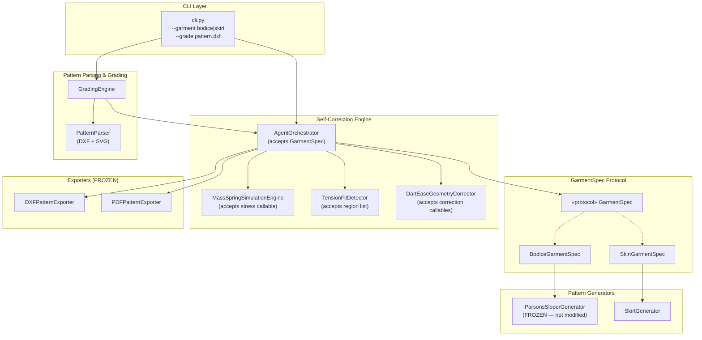
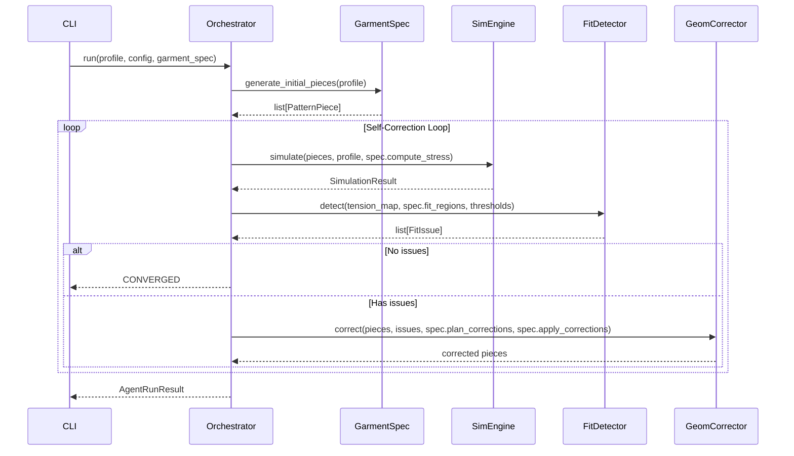

# Design Document: Skirt Block Pattern Grading

## Overview

This design covers Milestone 2 of the MANI Agentic Pattern Engine: adding a long A-line skirt block generator and a pattern grading system, while preserving all existing bodice functionality through a garment-agnostic abstraction layer.

The core insight is that the existing self-correction loop (Orchestrator → Simulation → Fit Detection → Geometry Correction) is garment-agnostic in structure but bodice-specific in implementation. We introduce a `GarmentSpec` protocol that encapsulates all garment-specific behavior, allowing the engine components to operate on any garment type through delegation rather than conditionals.

The implementation proceeds in three phases:
1. **Regression safety net + GarmentSpec abstraction** — lock down bodice behavior with snapshot/regression tests, then extract garment-specific logic behind the protocol. `BodiceGarmentSpec` wraps existing code; engine components accept callables from the spec.
2. **Skirt block generation + self-correction** — implement `SkirtGarmentSpec` with a 2-piece A-line skirt generator, skirt-specific stress model, and skirt correction strategies. The orchestrator runs the same loop with zero new branching.
3. **Pattern parsing + grading** — add DXF/SVG parsers that extract pattern pieces from uploaded files, and a grading engine that computes measurement deltas and re-grades through the self-correction loop.

### Key Design Decisions

- **Protocol, not ABC**: `GarmentSpec` is a `typing.Protocol` (structural subtyping) so existing classes can conform without inheritance changes. This avoids touching `sloper_generator.py`.
- **Delegation over modification**: `BodiceGarmentSpec` delegates to the existing `ParsonsSloperGenerator`, bodice stress formulas, and bodice correction logic. The original classes remain unmodified.
- **Callables over enums**: Engine components accept stress-computation callables and correction callables from the spec, rather than switching on garment type enums. This keeps the engine truly garment-agnostic.
- **Frozen files**: `sloper_generator.py`, `body_model_builder.py`, `html_visualizer.py`, `dxf_exporter.py`, `pdf_exporter.py`, and `audit_trail.py` are NOT modified.

---

## High-Level Design (HLD)

### System Architecture



### Component Overview

| Component | Responsibility | New/Modified/Frozen |
|---|---|---|
| `GarmentSpec` | Protocol defining garment-specific behavior for the engine | New |
| `BodiceGarmentSpec` | Wraps existing bodice logic behind GarmentSpec protocol | New |
| `SkirtGarmentSpec` | Skirt-specific stress model, corrections, and generation | New |
| `SkirtGenerator` | Drafts 2-piece A-line skirt block from measurements | New |
| `PatternParser` | Parses DXF/SVG files into PatternPiece lists | New |
| `GradingEngine` | Re-grades parsed patterns to new body measurements | New |
| `AgentOrchestrator` | Accepts optional GarmentSpec, defaults to bodice for backward compat | Modified |
| `MassSpringSimulationEngine` | Accepts stress callable from spec instead of hardcoded bodice formulas | Modified |
| `TensionFitDetector` | Accepts region list from spec instead of iterating FitRegion enum | Modified |
| `DartEaseGeometryCorrector` | Accepts correction callables from spec instead of hardcoded bodice logic | Modified |
| `models.py` | New dataclasses for skirt, parsing, grading | Modified |
| `cli.py` | New `--garment` and `--grade` flags | Modified |
| `sloper_generator.py` | — | Frozen |
| `body_model_builder.py` | — | Frozen |
| `html_visualizer.py` | — | Frozen |
| `dxf_exporter.py` | — | Frozen |
| `pdf_exporter.py` | — | Frozen |
| `audit_trail.py` | — | Frozen |

### Refactoring Strategy

The orchestrator currently directly calls `ParsonsSloperGenerator`, hardcoded bodice stress formulas in `MassSpringSimulationEngine._compute_regional_stresses`, bodice `FitRegion` enum members in `TensionFitDetector`, and bodice dart/ease correction logic in `DartEaseGeometryCorrector`.

After refactoring:
- `AgentOrchestrator` accepts an optional `GarmentSpec` parameter. When `None`, it defaults to `BodiceGarmentSpec` for backward compatibility.
- `AgentOrchestrator.run` calls `spec.generate_initial_pieces()` instead of `self._sloper_gen.generate()`.
- `MassSpringSimulationEngine.simulate` accepts a `stress_fn` callable (provided by the spec) instead of calling `self._compute_regional_stresses` directly. The existing bodice method remains as-is for `BodiceGarmentSpec` to delegate to.
- `TensionFitDetector.detect` accepts a `regions` list parameter instead of iterating `FitRegion` enum members.
- `DartEaseGeometryCorrector` gains a `plan_corrections_fn` and `apply_corrections_fn` callable interface. `BodiceGarmentSpec` passes the existing methods; `SkirtGarmentSpec` passes skirt-specific logic.

### Data Flow



### Skirt Block Generation

The `SkirtGenerator` drafts a 2-piece (front + back) A-line skirt block from waist, hip, hip_depth, and desired_length measurements. Each piece includes:
- Waist darts proportional to the waist-hip differential
- A-line hem flare distributed evenly between front and back
- Seam lines: waist, side, hem, center front/back
- Vertical grain line + notch marks at waist and hip level
- Default 1.5 cm seam allowance

The `SkirtGarmentSpec` wraps the generator and provides a skirt-specific stress model with four fit regions (hip, waist, hem, side_seam) and correction strategies that adjust dart angle, dart length, and hem flare.

### Pattern Parsing & Grading

The `PatternParser` reads DXF or SVG pattern files and extracts pattern pieces with outlines, seam lines, darts, grain lines, notch marks, and seam allowance. It auto-detects garment type from piece labels or metadata.

The `GradingEngine` computes per-dimension measurement deltas between a parsed pattern and target measurements, applies proportional scaling, then runs the result through the self-correction engine for fit refinement.

### Error Handling

| Category | Error Condition | Component | Behavior |
|---|---|---|---|
| Input | Out-of-range skirt measurements | `SkirtMeasurementProfile.validate()` | Returns list of field-level error strings |
| Input | Missing required skirt fields | `SkirtGarmentSpec.validate_profile()` | Returns error listing missing fields |
| Input | Invalid garment type in CLI | `cli.py` | Prints error, exits with code 1 |
| Input | Missing required CLI args for skirt | `argparse` | Prints usage, exits with code 2 |
| Parsing | Malformed DXF (missing layers) | `PatternParser.parse_dxf()` | Returns `ParseResult` with errors list |
| Parsing | Malformed SVG (unsupported paths) | `PatternParser.parse_svg()` | Returns `ParseResult` with errors list |
| Parsing | Unrecognized file format | `PatternParser.parse()` | Returns `ParseResult` with format error |
| Parsing | Missing garment type metadata | `PatternParser._detect_garment_type()` | Returns `None`; caller decides |
| Grading | Unknown garment type | `GradingEngine.grade()` | Returns `GradingResult` with error |
| Grading | Large grade jump (> 15 cm) | `GradingEngine.grade()` | Adds warning to `GradingResult.warnings` |
| Grading | Self-correction fails to converge | `GradingEngine.grade()` | Returns result with `ITERATION_LIMIT_REACHED` or `STALLED` status |
| Engine | All existing error handling | Unchanged | `BodiceGarmentSpec` delegates to same code paths |


### File Organization

New files to create:
- `agentic_pattern_engine/garment_spec.py` — `GarmentSpec` protocol + `BodiceGarmentSpec`
- `agentic_pattern_engine/skirt_generator.py` — `SkirtGenerator` + `SkirtGarmentSpec`
- `agentic_pattern_engine/pattern_parser.py` — `PatternParser` (DXF + SVG)
- `agentic_pattern_engine/grading_engine.py` — `GradingEngine`
- `sample_profiles/skirt_standard.json` — sample skirt profile
- `sample_profiles/skirt_petite.json` — sample skirt profile

New test files:
- `tests/test_bodice_regression.py` — regression + snapshot tests
- `tests/test_garment_spec.py` — GarmentSpec protocol + BodiceGarmentSpec tests
- `tests/test_skirt_generator.py` — SkirtGenerator unit + property tests
- `tests/test_skirt_garment_spec.py` — SkirtGarmentSpec + self-correction tests
- `tests/test_pattern_parser.py` — PatternParser unit + round-trip tests
- `tests/test_grading_engine.py` — GradingEngine tests
- `tests/test_cli_skirt.py` — CLI skirt + grading mode tests

Files modified (engine refactoring):
- `agentic_pattern_engine/models.py` — add new dataclasses
- `agentic_pattern_engine/agent_orchestrator.py` — accept GarmentSpec
- `agentic_pattern_engine/simulation_engine.py` — accept stress callable
- `agentic_pattern_engine/fit_detector.py` — accept region list
- `agentic_pattern_engine/geometry_corrector.py` — accept correction callables
- `agentic_pattern_engine/cli.py` — add --garment and --grade flags

---

## Low-Level Design (LLD)

### GarmentSpec Protocol

```python
from typing import Protocol, runtime_checkable

@runtime_checkable
class GarmentSpec(Protocol):
    """Garment-agnostic interface for the self-correction engine."""

    @property
    def garment_type(self) -> str:
        """Return garment identifier, e.g. 'bodice', 'skirt'."""
        ...

    @property
    def measurement_fields(self) -> list[str]:
        """Required measurement field names for this garment type."""
        ...

    @property
    def fit_regions(self) -> list[str]:
        """Supported fit region names for stress analysis."""
        ...

    @property
    def tension_thresholds(self) -> dict[str, float]:
        """Per-region tension thresholds in Pascals."""
        ...

    def validate_profile(self, profile: MeasurementProfile) -> list[str]:
        """Validate that the profile has all required fields in range."""
        ...

    def generate_initial_pieces(
        self, profile: MeasurementProfile
    ) -> list[PatternPiece]:
        """Generate initial pattern pieces from measurements."""
        ...

    def compute_stress(
        self,
        pieces: list[PatternPiece],
        profile: MeasurementProfile,
    ) -> dict[str, float]:
        """Compute per-region stress given pattern pieces and profile."""
        ...

    def plan_corrections(
        self,
        fit_issues: list[FitIssue],
        pieces: list[PatternPiece],
        profile: MeasurementProfile,
        dampening_factor: float,
    ) -> list[CorrectionStrategy]:
        """Plan corrections for detected fit issues."""
        ...

    def apply_corrections(
        self,
        pieces: list[PatternPiece],
        corrections: list[CorrectionStrategy],
    ) -> list[PatternPiece]:
        """Apply corrections and return updated pattern pieces."""
        ...

    def validate_geometry(self, pieces: list[PatternPiece]) -> list[str]:
        """Validate resulting geometry. Return errors if invalid."""
        ...
```

### BodiceGarmentSpec

Wraps existing bodice logic without modifying frozen files:

```python
class BodiceGarmentSpec:
    """GarmentSpec implementation for bodice slopers.
    
    Delegates to ParsonsSloperGenerator and existing bodice stress/correction
    logic extracted from SimulationEngine and GeometryCorrector.
    """

    def __init__(self) -> None:
        self._generator = ParsonsSloperGenerator()
        self._sim_engine = MassSpringSimulationEngine()
        self._corrector = DartEaseGeometryCorrector()

    @property
    def garment_type(self) -> str:
        return "bodice"

    @property
    def measurement_fields(self) -> list[str]:
        return ["chest", "waist", "hip", "shoulder_width", "torso_length"]

    @property
    def fit_regions(self) -> list[str]:
        return ["bust", "waist", "shoulder", "armhole",
                "side_seam", "center_front", "center_back"]

    @property
    def tension_thresholds(self) -> dict[str, float]:
        return {
            "bust": 60.0, "waist": 50.0, "shoulder": 80.0,
            "armhole": 70.0, "side_seam": 55.0,
            "center_front": 50.0, "center_back": 50.0,
        }

    def generate_initial_pieces(self, profile):
        sloper = self._generator.generate(profile)
        return [sloper.front_bodice, sloper.back_bodice]
        # Also stores sloper internally for ease/metadata access

    def compute_stress(self, pieces, profile):
        # Reconstructs a BodiceSloper and delegates to
        # MassSpringSimulationEngine._compute_regional_stresses
        ...

    def plan_corrections(self, fit_issues, pieces, profile, dampening_factor):
        # Delegates to DartEaseGeometryCorrector.plan_corrections
        ...

    def apply_corrections(self, pieces, corrections):
        # Delegates to DartEaseGeometryCorrector.apply_to_sloper
        ...
```

### SkirtGenerator

```python
class SkirtGenerator:
    """Draft a 2-piece A-line skirt block from measurements."""

    def generate(self, profile: SkirtMeasurementProfile) -> list[PatternPiece]:
        """Generate front and back skirt pieces."""
        ...

    def _draft_front(self, profile) -> PatternPiece:
        """Draft front skirt piece with waist dart and A-line flare."""
        ...

    def _draft_back(self, profile) -> PatternPiece:
        """Draft back skirt piece with waist dart and A-line flare."""
        ...

    def _compute_dart_geometry(self, waist, hip) -> DartGeometry:
        """Compute dart angle/length from waist-hip differential."""
        ...

    def _compute_hem_flare(self, hip, desired_length, hip_depth) -> float:
        """Compute hem flare width for A-line silhouette."""
        ...
```

### SkirtGarmentSpec

```python
class SkirtGarmentSpec:
    """GarmentSpec implementation for long A-line skirt blocks."""

    def __init__(self) -> None:
        self._generator = SkirtGenerator()

    @property
    def garment_type(self) -> str:
        return "skirt"

    @property
    def measurement_fields(self) -> list[str]:
        return ["waist", "hip", "hip_depth", "desired_length"]

    @property
    def fit_regions(self) -> list[str]:
        return ["hip", "waist", "hem", "side_seam"]

    @property
    def tension_thresholds(self) -> dict[str, float]:
        return {
            "hip": 50.0, "waist": 45.0,
            "hem": 30.0, "side_seam": 40.0,
        }

    def compute_stress(self, pieces, profile):
        """Skirt-specific stress model:
        - hip: ratio of hip circ to garment hip circ (front+back)*2 + ease
        - waist: ratio of waist circ to garment waist circ + dart relief
        - hem: flare distribution relative to hip-to-hem length
        - side_seam: combined ease/dart relief vs hip-waist differential
        """
        ...

    def plan_corrections(self, fit_issues, pieces, profile, dampening_factor):
        """Skirt corrections:
        - Excess waist tension → adjust waist dart angle
        - Insufficient tension → adjust waist dart length
        - Hem tension → adjust hem flare angle
        """
        ...
```

### PatternParser

```python
class PatternParser:
    """Parse DXF and SVG pattern files into PatternPiece lists."""

    def parse(self, file_path: str) -> ParseResult:
        """Auto-detect format and parse pattern file."""
        ...

    def parse_dxf(self, dxf_bytes: bytes) -> ParseResult:
        """Parse DXF file into pattern pieces.
        
        Extracts: outlines, seam lines, darts (apex, angle, length),
        grain lines, notch marks, seam allowance.
        Detects garment type from piece labels/metadata.
        """
        ...

    def parse_svg(self, svg_bytes: bytes) -> ParseResult:
        """Parse SVG file into pattern pieces.
        
        Extracts pattern pieces from SVG path elements with
        pattern metadata in data attributes or embedded JSON.
        """
        ...

    def _detect_garment_type(self, pieces: list[PatternPiece]) -> str | None:
        """Detect garment type from piece labels or metadata."""
        ...
```

### GradingEngine

```python
class GradingEngine:
    """Re-grade parsed patterns to new body measurements."""

    def __init__(self, orchestrator: AgentOrchestrator) -> None:
        self._orchestrator = orchestrator

    def grade(
        self,
        parsed_pieces: list[PatternPiece],
        source_profile: MeasurementProfile,
        target_profile: MeasurementProfile,
        garment_type: str,
    ) -> GradingResult:
        """Compute deltas, scale proportionally, run self-correction."""
        ...

    def _compute_deltas(
        self, source: MeasurementProfile, target: MeasurementProfile
    ) -> dict[str, float]:
        """Per-dimension measurement deltas."""
        ...

    def _apply_proportional_scaling(
        self,
        pieces: list[PatternPiece],
        deltas: dict[str, float],
        source: MeasurementProfile,
    ) -> list[PatternPiece]:
        """Scale pattern pieces proportionally, preserving construction details."""
        ...
```

### Refactored AgentOrchestrator

```python
class AgentOrchestrator:
    def __init__(
        self,
        garment_spec: GarmentSpec | None = None,  # NEW — defaults to BodiceGarmentSpec
        # existing params remain for backward compat
        sloper_generator=None, body_model_builder=None,
        simulation_engine=None, fit_detector=None,
        geometry_corrector=None, dxf_exporter=None, pdf_exporter=None,
    ) -> None:
        self._spec = garment_spec or BodiceGarmentSpec()
        # ... existing init for backward compat ...

    def run(
        self,
        profile: MeasurementProfile,
        config: AgentConfig | None = None,
    ) -> AgentRunResult:
        # Phase 1: Validate via spec
        errors = self._spec.validate_profile(profile)
        
        # Phase 2: Generate via spec
        pieces = self._spec.generate_initial_pieces(profile)
        
        # Phase 3: Self-correction loop
        for iteration in range(1, cfg.iteration_limit + 1):
            # Simulate: use spec's stress computation
            regional_stresses = self._spec.compute_stress(pieces, profile)
            tension_map = TensionMap(..., regional_stresses=regional_stresses)
            
            # Detect: use spec's fit regions
            fit_issues = self._fit_detector.detect(
                tension_map, spec_regions=self._spec.fit_regions,
                thresholds=self._spec.tension_thresholds
            )
            
            # Correct: use spec's correction logic
            corrections = self._spec.plan_corrections(
                fit_issues, pieces, profile, dampening_factor
            )
            pieces = self._spec.apply_corrections(pieces, corrections)
```

### Refactored TensionFitDetector

```python
class TensionFitDetector:
    def detect(
        self,
        tension_map: TensionMap,
        body_model: BodyModel | None = None,  # legacy param
        thresholds: TensionThresholds | None = None,  # legacy param
        *,
        spec_regions: list[str] | None = None,
        spec_thresholds: dict[str, float] | None = None,
    ) -> list[FitIssue]:
        """Detect fit issues.
        
        When spec_regions and spec_thresholds are provided, uses those
        (garment-agnostic path). Otherwise falls back to legacy bodice
        behavior for backward compatibility.
        """
        ...
```

### Data Models

#### New Models

```python
@dataclass(frozen=True)
class SkirtMeasurementProfile:
    """Skirt-specific measurement profile extending base measurements."""
    waist: float           # cm
    hip: float             # cm
    hip_depth: float       # cm (15.0 - 30.0)
    desired_length: float  # cm (40.0 - 130.0)
    
    # Optional fields from MeasurementProfile for compatibility
    chest: float = 0.0
    shoulder_width: float = 0.0
    torso_length: float = 0.0

    RANGES: dict = field(default=None, init=False, repr=False, compare=False)

    def __post_init__(self) -> None:
        object.__setattr__(self, "RANGES", {
            "waist": (50.0, 170.0),
            "hip": (60.0, 180.0),
            "hip_depth": (15.0, 30.0),
            "desired_length": (40.0, 130.0),
        })

    def validate(self) -> list[str]:
        """Validate skirt-specific measurement ranges."""
        errors: list[str] = []
        for fld, (lo, hi) in self.RANGES.items():
            val = getattr(self, fld)
            if val is None:
                errors.append(f"{fld} is missing")
            elif not isinstance(val, (int, float)):
                errors.append(f"{fld} must be numeric")
            elif val < lo or val > hi:
                errors.append(f"{fld}={val} is out of range [{lo}, {hi}]")
        return errors


@dataclass(frozen=True)
class SkirtBlock:
    """Skirt block output analogous to BodiceSloper."""
    block_id: str
    profile: SkirtMeasurementProfile
    front_skirt: PatternPiece
    back_skirt: PatternPiece
    waist_ease: float   # cm
    hip_ease: float     # cm
    metadata: dict


@dataclass(frozen=True)
class ParseResult:
    """Result of parsing a DXF/SVG pattern file."""
    pieces: list[PatternPiece]
    garment_type: str | None       # auto-detected or None
    source_format: str             # "dxf" or "svg"
    source_profile: MeasurementProfile | None  # extracted if available
    warnings: list[str]
    errors: list[str]


@dataclass(frozen=True)
class GradingResult:
    """Result of pattern grading operation."""
    original_pieces: list[PatternPiece]
    graded_pieces: list[PatternPiece]
    deltas: dict[str, float]       # field -> delta in cm
    run_result: AgentRunResult     # from self-correction pass
    warnings: list[str]


@dataclass(frozen=True)
class SkirtFitRegion:
    """Fit region definition for skirt garments."""
    HIP = "hip"
    WAIST = "waist"
    HEM = "hem"
    SIDE_SEAM = "side_seam"
```

#### Modified Models

The `AgentRunResult` gains garment-agnostic fields:

```python
@dataclass
class AgentRunResult:
    run_id: str
    convergence_status: ConvergenceStatus
    final_sloper: BodiceSloper | None       # kept for backward compat
    final_pieces: list[PatternPiece] | None  # NEW — garment-agnostic output
    garment_type: str | None                 # NEW — "bodice" or "skirt"
    total_iterations: int
    audit_trail: AuditTrail
    remaining_fit_issues: list[FitIssue]
    elapsed_time_ms: float
    error_details: str | None = None
    failed_at_iteration: int | None = None
    dxf_bytes: bytes | None = None
    pdf_bytes: bytes | None = None
```

The `AuditEntry` gains a `pieces` field alongside the existing `sloper` field:

```python
@dataclass
class AuditEntry:
    iteration: int
    sloper: BodiceSloper | None              # kept for backward compat
    pieces: list[PatternPiece] | None        # NEW — garment-agnostic
    tension_map: TensionMap | None
    fit_issues: list[FitIssue]
    corrections_applied: list[CorrectionStrategy]
    total_stress_magnitude: float
```

### Hypothesis Custom Strategies

```python
from hypothesis import strategies as st

def valid_skirt_profiles():
    """Generate valid SkirtMeasurementProfile instances."""
    return st.builds(
        SkirtMeasurementProfile,
        waist=st.floats(min_value=50.0, max_value=170.0),
        hip=st.floats(min_value=60.0, max_value=180.0),
        hip_depth=st.floats(min_value=15.0, max_value=30.0),
        desired_length=st.floats(min_value=40.0, max_value=130.0),
    ).filter(lambda p: p.hip > p.waist)  # anatomically: hip > waist

def invalid_skirt_profiles():
    """Generate SkirtMeasurementProfile with at least one out-of-range field."""
    return st.builds(
        SkirtMeasurementProfile,
        waist=st.floats(min_value=0.0, max_value=200.0),
        hip=st.floats(min_value=0.0, max_value=200.0),
        hip_depth=st.floats(min_value=0.0, max_value=50.0),
        desired_length=st.floats(min_value=0.0, max_value=200.0),
    ).filter(lambda p: len(p.validate()) > 0)

def valid_bodice_profiles():
    """Generate valid MeasurementProfile instances."""
    return st.builds(
        MeasurementProfile,
        chest=st.floats(min_value=60.0, max_value=180.0),
        waist=st.floats(min_value=50.0, max_value=170.0),
        hip=st.floats(min_value=60.0, max_value=180.0),
        shoulder_width=st.floats(min_value=30.0, max_value=65.0),
        torso_length=st.floats(min_value=35.0, max_value=75.0),
    )

def valid_pattern_pieces():
    """Generate valid PatternPiece instances for round-trip testing."""
    ...
```

### Regression Test Baselines

Baseline files stored in `tests/baselines/`:
- `tests/baselines/bodice_standard.json` — standard female profile output
- `tests/baselines/bodice_plus.json` — plus-size profile output
- `tests/baselines/bodice_petite.json` — petite profile output

Each baseline captures: front/back PatternPiece (outline coords, dart geometries, seam lines), bust_ease, waist_ease, convergence_status, iteration_count.

---

## Correctness Properties

*A property is a characteristic or behavior that should hold true across all valid executions of a system — essentially, a formal statement about what the system should do. Properties serve as the bridge between human-readable specifications and machine-verifiable correctness guarantees.*

### Property 1: Bodice Serialization Determinism

*For any* valid `BodiceSloper`, serializing it to JSON twice should produce byte-identical output. The serialization function is a pure function of the sloper's fields.

**Validates: Requirements 1.2**

### Property 2: BodiceGarmentSpec Orchestrator Regression

*For any* valid `MeasurementProfile`, running the orchestrator with an explicit `BodiceGarmentSpec` should produce an `AgentRunResult` with identical `convergence_status`, `total_iterations`, and `final_pieces` field values (within 0.001 cm / 0.001 degrees tolerance) as running the pre-refactor orchestrator with the same profile.

**Validates: Requirements 2.3, 9.3, 9.4, 9.5**

### Property 3: GarmentSpec Structural Conformance

*For any* class that implements the `GarmentSpec` protocol, `garment_type` should return a non-empty string, `measurement_fields` should return a non-empty list of strings, `fit_regions` should return a non-empty list of strings, and `tension_thresholds` should return a dict mapping each fit region name to a positive float.

**Validates: Requirements 2.1, 2.4, 2.5**

### Property 4: Fit Detector Region Filtering

*For any* `TensionMap` with regional stresses and *any* subset of region names passed to the fit detector, the returned `FitIssue` list should only contain issues for regions in the provided subset. No issues for regions outside the subset should appear.

**Validates: Requirements 2.8**

### Property 5: Skirt Generator Output Invariants

*For any* valid `SkirtMeasurementProfile`, the `SkirtGenerator` should produce exactly 2 `PatternPiece` objects, each having: a closed outline polygon (first point == last point), at least 4 seam lines (waist, side, hem, center), a vertical grain line, at least 2 notch marks, and `seam_allowance` equal to 1.5 cm.

**Validates: Requirements 3.1, 3.2, 3.5, 3.6, 3.7**

### Property 6: Skirt Dart Proportionality

*For any* two valid `SkirtMeasurementProfile` instances where profile A has a larger waist-hip differential than profile B (with other measurements held constant), the generated dart angle for profile A should be greater than or equal to the dart angle for profile B.

**Validates: Requirements 3.3**

### Property 7: Skirt Hem Flare Symmetry

*For any* valid `SkirtMeasurementProfile`, the hem width of the front skirt piece should equal the hem width of the back skirt piece (within 0.001 cm tolerance), ensuring even flare distribution.

**Validates: Requirements 3.4**

### Property 8: Skirt Measurement Validation

*For any* `SkirtMeasurementProfile` where at least one field is outside its valid range (waist: [50, 170], hip: [60, 180], hip_depth: [15, 30], desired_length: [40, 130]), the `validate()` method should return a non-empty error list containing the name of every out-of-range field.

**Validates: Requirements 3.8, 3.9**

### Property 9: Skirt Stress Model Monotonicity

*For any* valid skirt pattern pieces and `SkirtMeasurementProfile`, increasing the body hip circumference (while holding garment dimensions constant) should increase hip region stress, and increasing waist dart relief (while holding body measurements constant) should decrease waist region stress.

**Validates: Requirements 4.2, 4.3, 4.4, 4.5**

### Property 10: Skirt Correction Type Mapping

*For any* list of `FitIssue` objects targeting skirt regions, the `SkirtGarmentSpec.plan_corrections` method should map excess waist tension to dart angle adjustment, insufficient tension to dart length adjustment, and hem tension issues to flare angle adjustment. The correction type should be deterministic given the issue type and region.

**Validates: Requirements 4.6**

### Property 11: Skirt Convergence Result Integrity

*For any* valid `SkirtMeasurementProfile` where the orchestrator's self-correction loop converges, the returned `AgentRunResult` should have `convergence_status == CONVERGED`, a non-empty `final_pieces` list, and `remaining_fit_issues` should be empty.

**Validates: Requirements 4.8**

### Property 12: CLI Backward Compatibility

*For any* valid bodice CLI argument set, the output (convergence status, iteration count, exported file presence) should be identical whether `--garment bodice` is explicitly specified or `--garment` is omitted entirely.

**Validates: Requirements 5.4**

### Property 13: Pattern Parse-Export Round Trip

*For any* valid set of `PatternPiece` objects, exporting to DXF then parsing back should produce pattern pieces with outline coordinates within 0.01 cm of the originals, and with matching dart count, seam line count, notch mark count, and seam allowance values.

**Validates: Requirements 6.1, 6.2, 6.6, 6.7**

### Property 14: Parser Error Handling

*For any* byte sequence that is not a valid DXF or SVG pattern file (including truncated files, random bytes, and files with missing required layers/elements), the `PatternParser` should return a `ParseResult` with a non-empty `errors` list and should never raise an unhandled exception.

**Validates: Requirements 6.3, 6.4**

### Property 15: Parser Garment Type Detection

*For any* valid pattern file containing garment type metadata (in piece labels or file metadata), the `PatternParser` should correctly detect and return the garment type string matching the embedded metadata.

**Validates: Requirements 6.5**

### Property 16: Grading Delta Computation

*For any* two valid `MeasurementProfile` instances (source and target), the computed deltas should equal `target.field - source.field` for every shared measurement field, and if any single delta exceeds 15.0 cm in absolute value, the result should contain a warning.

**Validates: Requirements 7.1, 7.4**

### Property 17: Grading Preserves Construction Proportions

*For any* valid pattern pieces and proportional scaling operation, the ratio of dart apex position to outline bounding box dimensions should remain constant (within 0.01 tolerance), and the seam allowance values should be identical before and after grading.

**Validates: Requirements 7.2, 7.5**

### Property 18: CLI Grading Summary Completeness

*For any* successful grading CLI run, the printed output should contain: original dimensions, target dimensions, computed deltas, convergence status, and at least one output file path.

**Validates: Requirements 8.4**

---

## Testing Strategy

### Testing Framework

- **Unit tests**: `pytest` (already configured)
- **Property-based tests**: `hypothesis` (already in dev dependencies)
- **Minimum iterations**: 100 per property test (via `@settings(max_examples=100)`)

### Dual Testing Approach

Unit tests and property tests are complementary:
- **Unit tests** verify specific examples, edge cases, integration points, and error conditions
- **Property tests** verify universal properties across randomly generated inputs
- Together they provide comprehensive coverage — unit tests catch concrete bugs, property tests verify general correctness

### Property Test Tagging

Each property test must include a comment referencing the design property:

```python
# Feature: skirt-block-pattern-grading, Property 5: Skirt Generator Output Invariants
@given(profile=valid_skirt_profiles())
@settings(max_examples=100)
def test_skirt_generator_output_invariants(profile):
    ...
```

### Test Organization by Phase

**Phase 1: Regression Safety Net + GarmentSpec**
- `tests/test_bodice_regression.py` — snapshot, regression, end-to-end, Property 1, Property 2
- `tests/test_garment_spec.py` — Property 3, Property 4, BodiceGarmentSpec conformance

**Phase 2: Skirt Block Generation + Self-Correction**
- `tests/test_skirt_generator.py` — Property 5, 6, 7, 8, unit tests
- `tests/test_skirt_garment_spec.py` — Property 9, 10, 11, unit tests

**Phase 3: Pattern Parsing + Grading**
- `tests/test_pattern_parser.py` — Property 13, 14, 15, unit tests
- `tests/test_grading_engine.py` — Property 16, 17, unit tests
- `tests/test_cli_skirt.py` — Property 12, 18, unit tests
